# Capítulo V: Product Implementation, Validation & Deployment

# 5.1.1. Software Dev
elopment En
vironment Configuration.

| Tool / Software | Purpose in the Project | Access / Download |
|---|---|---|
| GitHub | Source code hosting and version control | https://github.com |
| Trello | Sprint task management | https://trello.com |
| Figma | Wireframes and mock-ups design | https://www.figma.com |
| Visual Studio Code | Landing page development | https://code.visualstudio.com |
| Google Chrome | Testing and responsive preview | https://www.google.com/chrome/ |
| Miro | Organization and event storming | https://miro.com/app/dashboard/ |
| LucidChart | Web Applications User Flow Diagrams | https://www.lucidchart.com/pages/es |

## Project Management

### Trello


**¿Por qué lo utilizamos?**  
Lo utilizamos para organizar tareas del sprint, asignarlas a los integrantes, dar seguimiento al avance y visualizar qué estaba pendiente, en proceso o terminado.

## Requirements Management

### Miro

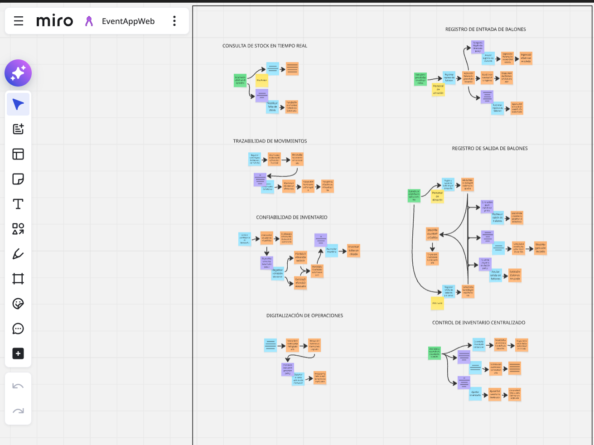

**¿Por qué lo utilizamos?**  
Lo utilizamos para crear diagramas y representar visualmente procesos o estructuras del proyecto, como flujos, mapas o diagramas de análisis.

### UXPressia

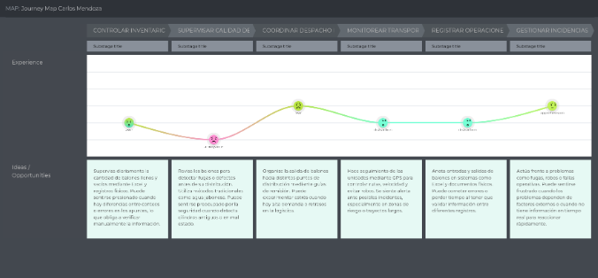

**¿Por qué lo utilizamos?**  
Usamos UXPressia porque nos permitió crear y organizar de forma visual artefactos de análisis de usuarios, como User Personas, Journey Maps e Impact Maps, facilitando que el equipo entendiera mejor a los segmentos objetivo y mantuviera una visión compartida del usuario durante el diseño del producto.

## Product UX/UI Design

### Figma

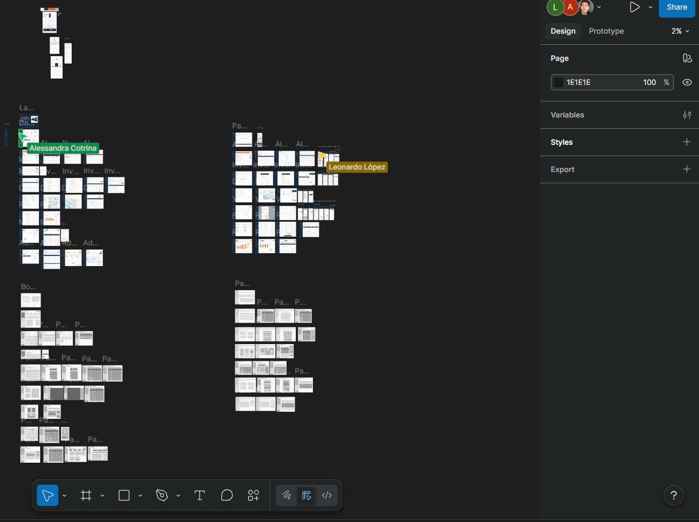

**¿Por qué lo utilizamos?**  
Lo utilizamos para crear y compartir los wireframes, mockups y propuestas visuales del producto antes de implementarlo. También ayudó a que el equipo tuviera una referencia común del diseño.

### LucidChart


**¿Por qué lo utilizamos?**  
Usamos LucidChart porque nos permitió elaborar de manera clara y colaborativa los diagramas y flujos del proyecto, ayudando al equipo a representar visualmente procesos, relaciones y estructuras necesarias para el análisis, diseño y organización de la solución.

## Software Development

### Visual Studio Code

**¿Por qué lo utilizamos?**  
Lo utilizamos como editor de código para desarrollar el Landing Page, porque permite escribir, editar y organizar archivos HTML, CSS y JavaScript de manera práctica y rápida. Además, lo utilizamos para hacer los commits.

### Google Chrome

**¿Por qué lo utilizamos?**  
Lo utilizamos para probar el funcionamiento del Landing Page, revisar la navegación y verificar cómo se veía en diferentes tamaños de pantalla usando las herramientas del navegador.

## Software Documentation

### GitHub


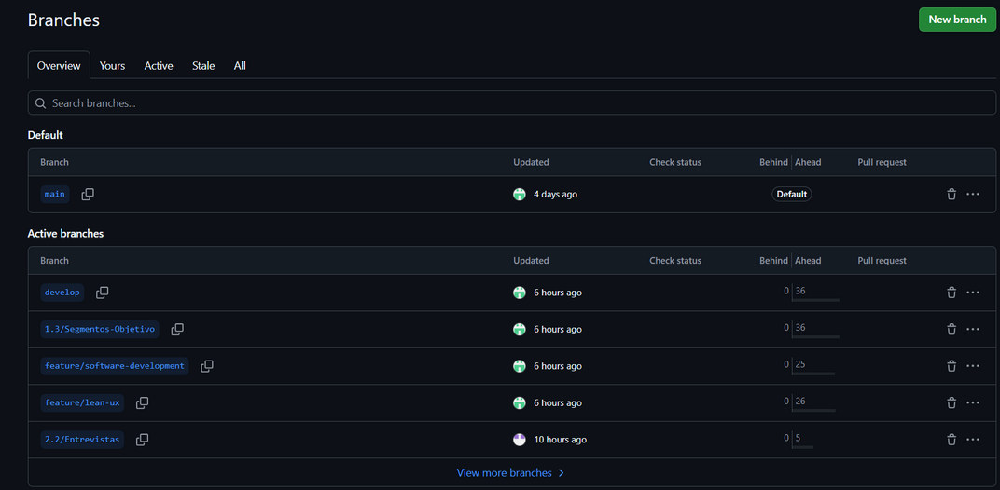
**¿Por qué lo utilizamos?**  
Lo utilizamos para guardar, organizar y controlar las versiones del código fuente del proyecto. También permitió que varios integrantes trabajaran sobre el mismo proyecto sin perder cambios, además de dejar evidencia de participación mediante commits, ramas y repositorios.

## 5.1.2. Source Code Management.

GitFlow Implementation

Para aplicar el flujo de trabajo GitFlow en nuestro control de versiones con Git, tomamos como referencia el artículo “A successful Git branching model” de Vincent Driessen. Esta fuente nos ayudó a definir las convenciones que seguiremos en la organización de ramas dentro del proyecto.


# Git Workflow Strategy

## Main branch

La rama principal del proyecto es **`main`**. En ella se mantiene la versión estable del código, es decir, la que representa el estado más confiable y listo para producción del proyecto.

**Notación:**

```text
main
```

---

## Develop branch

La rama **`develop`** contiene los cambios y avances más recientes que todavía no forman parte de la versión final en producción. Esta rama se usa para integrar, revisar y probar las nuevas modificaciones antes de incorporarlas a la rama principal.

**Notación:**

```text
develop
```

---

## Release branch

La rama **`release`** se utiliza para preparar una nueva versión del producto antes de su publicación. En esta rama se pueden realizar ajustes finales y correcciones necesarias, mientras la rama **`develop`** puede seguir recibiendo nuevos avances del proyecto.

Esta rama se crea a partir de **`develop`** y, una vez finalizada, debe fusionarse tanto con **`develop`** como con **`main`**.

**Notación:**

```text
release
```

---

## Feature branch

Las ramas **`feature`** se utilizan para desarrollar nuevas funciones o mejoras específicas del producto que se incorporarán en versiones posteriores. Cada una de estas ramas permite trabajar una característica de forma separada, sin afectar directamente la rama principal de desarrollo.

Estas ramas deben crearse a partir de **`develop`** y, cuando la funcionalidad esté terminada, deben fusionarse nuevamente en **`develop`**.

**Notación:**

```text
feature
```

---

# Convenciones de nombres

| Tipo de rama     | Convención                         |
| ---------------- | ---------------------------------- |
| Main branch      | `main`                             |
| Develop branch   | `develop`                          |
| Feature branches | `feature/<feature-name>`           |
| Release branches | `release/v<major>.<minor>.<patch>` |
| Hotfix branches  | `hotfix/<fix-name>`                |

---

# Conventional Commits

**Conventional Commits** es una convención que se usa para escribir los mensajes de commit de manera ordenada, clara y consistente. Su objetivo es que cada cambio en el código pueda entenderse rápidamente y que el historial del repositorio sea más fácil de leer y seguir.

Este enfoque también ayuda a identificar el tipo de cambio realizado, mejora la comunicación dentro del equipo y facilita el seguimiento del avance del proyecto a lo largo del tiempo.

| Tipo       | Descripción                                                   |
| ---------- | ------------------------------------------------------------- |
| `feat`     | Used to add a new feature                                     |
| `fix`      | Used to correct a bug or error                                |
| `docs`     | Used to update documentation                                  |
| `style`    | Used for formatting or style changes without affecting logic  |
| `refactor` | Used to improve code structure without changing functionality |
| `test`     | Used to add or modify tests                                   |
| `chore`    | Used for maintenance tasks or minor project changes           |
| `perf`     | Used to improve performance                                   |

---

## Repositorios del proyecto (GitHub)

El código fuente de cada producto se gestiona en repositorios independientes dentro de la organización pública del equipo en GitHub (**upc-pre-202610-1asi0730-12258-Scripters**).

| **Producto**                   | **Repositorio (URL)**                                                          |
| ------------------------------ | ------------------------------------------------------------------------------ |
| **Landing Page**               | https://github.com/upc-pre-202610-1asi0730-12258-Scripters/Regula-Web-Site.git |
| **Frontend Web Application**   | https://github.com/upc-pre-202610-1asi0730-12258-Scripters/Regula-Frontend.git |
| **Web Services (RESTful API)** | https://github.com/upc-pre-202610-1asi0730-12258-Scripters/regula-platform.git |


# 5.1.3. Source Code Style Guide & Conventions

Como regla general, todo el código fuente desarrollado durante el proyecto estará redactado en **inglés**. Esto incluye nombres de archivos, variables, funciones, clases, identificadores y comentarios cuando sean necesarios.

El propósito de esta convención es mantener un código uniforme, entendible y fácil de mantener para todos los integrantes del equipo. Además, seguir estándares comunes facilita el trabajo colaborativo y permite comprender más rápidamente la estructura del proyecto.

---

# HTML

Para el desarrollo en HTML, el equipo seguirá convenciones orientadas a mejorar la claridad, la estructura y la accesibilidad del código.

## Usar nombres de elementos en minúsculas

Las etiquetas HTML deben escribirse en minúsculas para conservar la consistencia y ajustarse a las prácticas estándar de desarrollo web.

```html
<body>
    <p>This is a paragraph</p>
</body>
```

---

## Cerrar correctamente todos los elementos HTML

Los elementos deben cerrarse de forma adecuada para mantener una estructura válida y fácil de leer.

```html
<body>
    <p>This is a paragraph</p>
    <p>This is another paragraph</p>
</body>
```

---

## Usar nombres de atributos en minúsculas

Los atributos también deben escribirse en minúsculas para mantener uniformidad en el código.

```html
<a href="https://www.w3schools.com/html/">
    Visit our HTML tutorial
</a>
```

---

## Incluir siempre el atributo `alt` y, cuando corresponda, `width` y `height`

Las imágenes deben contener un texto alternativo descriptivo mediante `alt`, mejorando la accesibilidad y proporcionando contexto cuando la imagen no pueda visualizarse.

```html

```

---

## Escribir los atributos de forma ordenada y consistente

Se debe evitar desorden o espaciado innecesario dentro de las etiquetas para conservar un código limpio y legible.

```html
<link rel="stylesheet" href="styles.css">
```

---

# CSS

Para CSS, el equipo priorizará nombres descriptivos y reglas organizadas para facilitar el mantenimiento de la interfaz.

## Usar nombres significativos para clases e identificadores

```css
#gallery {}

#login {}

.video {}
```

---

## Utilizar nombres cortos pero descriptivos

```css
#nav {}

.author {}
```

---

## Usar propiedades abreviadas cuando sea posible

```css
border-top: 0;
font: 100%/1.6 palatino, georgia, serif;
padding: 0 1em 2em;
```

---

## Evitar unidades innecesarias en valores cero

```css
margin: 0;
padding: 0;
```

---

## Mantener un orden consistente en las declaraciones

```css
background: fuchsia;
border: 1px solid;
border-radius: 4px;
color: black;
text-align: center;
text-indent: 2em;
```

---

# JavaScript

En JavaScript, el equipo adoptará convenciones que ayuden a que la lógica del programa sea clara, ordenada y fácil de mantener.

## Usar una sintaxis expandida y legible

```javascript
function myFunc() {
    console.log('Hello!');
}
```

---

## Usar `lowerCamelCase` para nombres de variables

```javascript
let playerScore = 0;
let speed = distance / time;
```

---

## Preferir `let` y `const` en lugar de `var`

```javascript
const myName = 'Chris';

console.log(myName);

let myAge = 40;

myAge++;

console.log('Happy birthday!');
```

---

## Usar `lowerCamelCase` para nombres de funciones

```javascript
function sayHello() {
    alert('Hello!');
}
```

---

# C#

Aunque el enfoque principal está puesto en el Landing Page, el equipo define desde esta etapa las convenciones que aplicará posteriormente en el desarrollo de servicios con ASP.NET Core y C# para mantener consistencia en todo el proyecto.

## Usar `PascalCase` para clases y métodos

```csharp
public class MyClass
{
    public void ExampleMethod()
    {
        // Method code
    }
}
```

---

## Usar `camelCase` para variables y parámetros

```csharp
public class MyClass
{
    public void ExampleMethod(int exampleNumber)
    {
        string exampleName = "Example";
    }
}
```

---

## Mantener una longitud razonable de línea

```csharp
public class MyClass
{
    public void ExampleMethod()
    {
        string message =
            "This is an example message that spans multiple lines " +
            "to demonstrate how to maintain a reasonable length.";

        Console.WriteLine(message);
    }
}
```

---

## Escribir comentarios claros y útiles

```csharp
public class MyClass
{
    // This method performs an addition operation and returns the result.
    public int Add(int a, int b)
    {
        return a + b;
    }
}
```

---

## Aplicar el principio de responsabilidad única

```csharp
public class MathematicalOperations
{
    public int Add(int a, int b)
    {
        return a + b;
    }

    public int Subtract(int a, int b)
    {
        return a - b;
    }
}
```

---

# Lenguaje Gherkin

Para los criterios de aceptación y la descripción de comportamientos esperados, el equipo seguirá convenciones que permitan redactar escenarios claros y fáciles de entender desde la perspectiva del negocio.

## Usar títulos descriptivos y concisos para los escenarios

```gherkin
Feature: Login

Scenario: Successful login
    Given a user is on the login page
    When they enter valid credentials
    Then they should be logged in successfully
```

---

## Mantener la estructura `Given - When - Then`

```gherkin
Scenario: Adding items to the shopping cart

Given the user is on the shopping page
When they add an item to the cart
Then the item should appear in the cart
```

---

## Usar un lenguaje entendible para el negocio

```gherkin
Scenario: Changing user settings

Given the user is logged in
When they navigate to the settings page
Then they should be able to update their profile
```

---

## Usar `Scenario Outline` cuando existan varios casos similares

```gherkin
Scenario Outline: Searching for products

Given the user is on the search page
When they search for "<product>"
Then they should see search results for "<product>"

Examples:
| product    |
| Laptop     |
| Smartphone |
```

---

## Agregar comentarios cuando se necesite contexto adicional

```gherkin
# This scenario checks the functionality of the logout feature

Scenario: User logout

Given the user is logged in
When they click on the logout button
Then they should be redirected to the login page
```
# 5.1.4. Software Deployment Configuration

Esta sección describe la configuración y los pasos necesarios para desplegar satisfactoriamente los productos digitales de la solución a partir de sus repositorios de código fuente.

Para la entrega actual, el alcance del despliegue corresponde únicamente al **Landing Page**. La configuración de despliegue de las **Frontend Web Applications** y de los **RESTful Web Services** será documentada en los Sprints en los que inicie su desarrollo.

---

# Despliegue del Landing Page (GitHub Pages + GitHub Actions)

El **Landing Page** se despliega mediante **GitHub Pages**, utilizando **GitHub Actions** para automatizar el proceso de integración y publicación continua.

## Pasos de configuración

1. **Crear el repositorio**

   Crear el repositorio del Landing Page dentro de la organización del equipo en GitHub y agregar a todos los integrantes como colaboradores.

2. **Subir el código fuente**

   Publicar el código fuente del proyecto (**HTML5**, **CSS3** y **JavaScript**) siguiendo la estrategia de ramas definida mediante **GitFlow**.

3. **Configurar GitHub Pages**

   Acceder a:

   ```text
   Settings → Pages
   ```

   y configurar:

* **Source:** `Deploy from a branch`
* **Branch:** `main`
* **Folder:** `/ (root)`

4. **Configurar GitHub Actions**

   Crear un workflow de **GitHub Actions** que publique automáticamente el sitio cada vez que se integren cambios en la rama principal.

5. **Verificar el despliegue**

   Acceder a la URL pública generada por GitHub Pages y comprobar que todas las secciones del Landing Page se carguen correctamente.

---

## Publicación continua

Una vez completada la configuración anterior, cada cambio integrado en la rama **`main`** será publicado automáticamente en la URL pública del Landing Page, eliminando la necesidad de realizar procesos manuales de despliegue.

---

# Despliegue de Frontend Web Applications y Web Services

La configuración de despliegue de la **Frontend Web Application (Vue)** y de los **RESTful Web Services (ASP.NET Core)** será definida e implementada en los Sprints correspondientes a su desarrollo.

En dichas etapas se documentarán:

* El proveedor de nube utilizado.
* Los entornos de despliegue (desarrollo, pruebas y producción).
* La estrategia de integración y entrega continua (CI/CD).
* Los pasos necesarios para la publicación de cada producto.
* La configuración específica de infraestructura y servicios asociados.

Esta documentación será incorporada conforme avance el desarrollo del proyecto.


# 5.2.1. Sprint 1

El **Sprint 1** marca el inicio del trabajo de construcción dentro del enfoque ágil del proyecto. En esta primera iteración, el equipo se centra en desarrollar las funcionalidades más importantes definidas en la planificación inicial, llevando los requerimientos a una primera versión funcional del producto.

De esta manera, se empieza a construir una base sólida de forma progresiva e incremental.

---

# 5.2.1.1. Sprint Planning 1

## Información General

| Campo             | Información                |
| ----------------- | -------------------------- |
| **Sprint #**      | Sprint 1                   |
| **Fecha**         | 2026-04-18                 |
| **Hora**          | 11:00 PM                   |
| **Ubicación**     | Microsoft Teams (Virtual)  |
| **Preparado por** | Ramos Cerdan, Elias Daniel |

### Asistentes

* Tello Palacios, Fabrizio Rafael
* Espinoza Lopez, Paul Alexandro Angel
* Ramos Cerdan, Elias Daniel
* Lopez Torres, Leonardo Gabriel
* Lopez Montalvo, Kevin Edu

---

## Sprint Review Summary

Se lograron varios de los objetivos planteados para el producto, como el desarrollo de todos los capítulos del informe, el despliegue completo del **Landing Page** y la incorporación de la mayor parte de la información requerida en el reporte.

No obstante, una de las metas más importantes que también debía cumplirse fue la entrega del informe en formatos **PDF** y **Word**.

---

## Sprint Retrospective Summary

El Sprint 1 permitió completar satisfactoriamente el trabajo planificado; sin embargo, varias mejoras y correcciones tuvieron que realizarse en los momentos finales de la entrega.

Durante la retrospectiva, el **Team Leader** identificó las siguientes oportunidades de mejora:

* Mayor compromiso por parte de todos los integrantes.
* Realizar reuniones diarias para mantener el seguimiento del avance.
* Incrementar la comunicación entre los miembros del equipo.

---

## Sprint Goal

> **Nuestro enfoque está en lograr la primera versión funcional y desplegada del Landing Page, junto con la primera versión completa del informe correspondiente a la entrega AV1.**
>
> Creemos que esto aporta una primera presentación clara, accesible y funcional de la propuesta de valor del proyecto para los visitantes y stakeholders.
>
> El objetivo se considerará cumplido cuando el Landing Page esté publicado y accesible sin inconvenientes, sus principales secciones funcionen correctamente y el informe haya sido finalizado en el formato requerido.

---

## Sprint Velocity

| Métrica                 | Valor           |
| ----------------------- | --------------- |
| **Sum of Story Points** | *(Por definir)* |

---

# 5.2.1.2. Aspect Leaders and Collaborators

| Team Member                              | GitHub        | Navigation Bar / Hero | Beneficios / ¿Cómo funciona? | Planes | FAQ / Footer | Internacionalización |
| ---------------------------------------- | ------------- | :-------------------: | :--------------------------: | :----: | :----------: | :------------------: |
| **Tello Palacios, Fabrizio Rafael**      | `F4bris`      |           C           |               L              |    L   |       C      |           C          |
| **Espinoza Lopez, Paul Alexandro Angel** | `R3memo`      |           C           |               C              |    C   |       C      |           C          |
| **Ramos Cerdan, Elias Daniel**           | `eliocerdan`  |           L           |               C              |    C   |       C      |           C          |
| **Lopez Torres, Leonardo Gabriel**       | `Deiko-138`   |           C           |               C              |    C   |       C      |           C          |
| **Lopez Montalvo, Kevin Edu**            | `Lopescamos`  |           C           |               C              |    C   |       C      |           C          |
| **David Ignacio Vivar Cesar**            | `DarkBeider2` |           C           |               C              |    C   |       L      |           L          |

> **L = Leader**
> **C = Collaborator**

---

# 5.2.1.3. Sprint Backlog 1

| User Story                            | Task                                              | Descripción                                                                     | Horas | Responsable               | Estado |
| ------------------------------------- | ------------------------------------------------- | ------------------------------------------------------------------------------- | :---: | ------------------------- |:------:|
| **US-47 Hero Visualization**          | **T01** Implementar barra de navegación           | Crear la barra superior con logo, navegación principal y botón de crear cuenta. |   1   | Fabrizio Rafael Tello     |  Done  |
|                                       | **T02** Implementar sección Hero                  | Maquetar título principal, texto descriptivo, botón CTA e imagen principal.     |   2   | Paul Alexandro Espinoza   |  Done  |
|                                       | **T03** Configurar navegación del botón principal | Redirigir correctamente el botón "Empezar Ahora".                               |   1   | Fabrizio Rafael Tello     |  Done  |
| **US-48 Features Review**             | **T04** Redactar beneficios principales           | Adaptar los textos de beneficios a la propuesta de valor.                       |   1   | Paul Alexandro Espinoza   |  Done  |
| **US-49 Revisión de características** | **T05** Implementar sección de características    | Crear tarjetas de funcionalidades de la plataforma.                             |   2   | Kevin Edu Lopez           |  Done  |
|                                       | **T06** Ajustar contenido de características      | Revisar la claridad de cada característica.                                     |   1   | Kevin Edu Lopez           |  Done  |
| **US-50 Benefits Inquiry**            | **T07** Implementar sección de planes             | Crear las tarjetas de planes.                                                   |   3   | Elias Daniel Ramos        |  Done  |
|                                       | **T08** Agregar precios y beneficios              | Incorporar precios y características por plan.                                  |   2   | Elias Daniel Ramos        |  Done  |
|                                       | **T09** Implementar selector mensual/anual        | Agregar alternancia entre modalidad mensual y anual.                            |   2   | Elias Daniel Ramos        |  Done  |
|                                       | **T10** Agregar CTA de asesoría                   | Implementar el bloque "¿No sabes qué plan elegir?".                             |   1   | Elias Daniel Ramos        |  Done  |
| **US-49 Login and Sign Up**           | **T14** Implementar sección de contacto           | Crear el bloque "Contáctanos".                                                  |   3   | David Ignacio Vivar Cesar |  Done  |
|                                       | **T15** Crear formulario de solicitud             | Agregar campos del formulario de contacto.                                      |   2   | David Ignacio Vivar Cesar |  Done  |
|                                       | **T16** Validaciones básicas                      | Verificar campos obligatorios y política de privacidad.                         |   2   | David Ignacio Vivar Cesar |  Done  |
|                                       | **T17** Implementar Footer                        | Crear el pie de página con enlaces legales.                                     |   1   | David Ignacio Vivar Cesar |  Done  |
| **US-40 Internacionalización**        | **T18** Preparar textos para internacionalización | Separar textos para futuras traducciones.                                       |   2   | David Ignacio Vivar Cesar |  Done  |
|                                       | **T19** Crear recursos español e inglés           | Definir claves de traducción para toda la landing.                              |   3   | David Ignacio Vivar Cesar |  Done  |
|                                       | **T20** Validar cambio de idioma                  | Comprobar coherencia visual al cambiar de idioma.                               |   2   | David Ignacio Vivar Cesar |  Done  |

---

## Resumen del Sprint Backlog

* **Total de User Stories:** 5
* **Total de tareas:** 16
* **Estado general:** Todas las tareas completadas.
* **Resultado:** Se alcanzó la primera versión funcional del Landing Page con soporte de internacionalización, navegación, planes, formulario de contacto y secciones principales completamente implementadas.

# 5.2.1.4. Development Evidence for Sprint Review

A continuación, se presenta el reporte de control de cambios del repositorio **Regula-website**, gestionado por el equipo **Scripters**. Este historial refleja la evolución del desarrollo del Landing Page, incluyendo la implementación inicial, la incorporación del soporte multilenguaje y las configuraciones relacionadas con la integración y despliegue continuo (CI/CD).

| **Repository**                                           | **Branch**      | **Commit ID**                              | **Commit Message**                                               | **Date** |
| -------------------------------------------------------- | --------------- | ------------------------------------------ | ---------------------------------------------------------------- | :------: |
| `upc-pre-202610-1asi0730-12258-Scripters-Regula-website` | `feature/index` | `de24ed6071c7c331fda41232b4b26eac19b03fa0` | `Add multilingual support with Spanish and English translations` |   23/04  |
| `upc-pre-202610-1asi0730-12258-Scripters-Regula-website` | `feature/index` | `d2da75d07fe0ff34723fd7f94590cbf786d1306e` | `initial commit`                                                 |   23/04  |
| `upc-pre-202610-1asi0730-12258-Scripters-Regula-website` | `develop`       | `c4d2f2b7c326eb6d035a9c2e6102ebd664b20ca3` | `ci: cambios en integración/despliegue continuo`                 |   05/05  |
| `upc-pre-202610-1asi0730-12258-Scripters-Regula-website` | `develop`       | `a79dfe35868af29907e475a3e2074747941c0315` | `Merge branch 'hotfix/workflow-deploy'`                          |   05/05  |
| `upc-pre-202610-1asi0730-12258-Scripters-Regula-website` | `develop`       | `f5e2ddd2adf6113d2ad459b94d3a0b93350cdabf` | `Merge tag 'workflow-deploy' into develop`                       |   05/05  |

---

# 5.2.1.5. Execution Evidence for Sprint Review

## Evidencia 1 – Página principal (Hero Section)
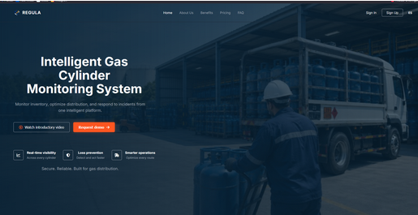


> *(Insertar captura de pantalla correspondiente.)*

La siguiente captura muestra la pantalla principal del **Landing Page de REGULA**, un sistema inteligente para el monitoreo de cilindros de gas.

El diseño incorpora un fondo con temática industrial donde se observa un operario junto a un camión de carga. Sobre este fondo destaca un título principal acompañado de dos botones de acción, uno de ellos resaltado en color naranja para solicitar una demostración del sistema.

En la parte superior se encuentra la barra de navegación con las opciones principales, mientras que en la parte inferior se presentan tres beneficios destacados junto al eslogan de la plataforma.

---

## Evidencia 2 – Sección About Us y Benefits

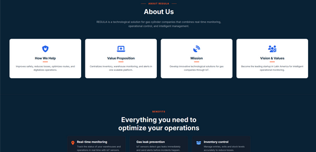

> *(Insertar captura de pantalla correspondiente.)*

Esta evidencia muestra la sección **About Us** y el inicio de la sección **Benefits**.

Sobre un fondo azul oscuro se presenta una descripción general de REGULA y, debajo, cuatro tarjetas informativas con iconografía que describen:

* Ayuda ofrecida por la plataforma.
* Propuesta de valor.
* Misión.
* Visión.

En la parte inferior comienza la sección **"Everything you need to optimize your operations"**, donde se introducen las funcionalidades principales del sistema.

---

## Evidencia 3 – Sección Benefits


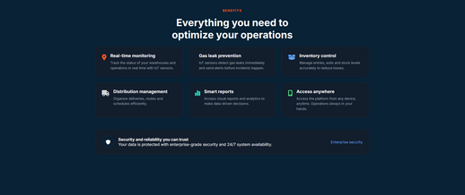
> *(Insertar captura de pantalla correspondiente.)*

La sección **Benefits** organiza las funcionalidades del sistema en una cuadrícula compuesta por seis tarjetas informativas.

Entre las principales características se encuentran:

* Monitoreo en tiempo real.
* Prevención de fugas de gas.
* Control de inventario.
* Gestión de distribución.
* Reportes inteligentes.
* Acceso desde cualquier lugar.

Finalmente, una barra inferior destaca el compromiso de la plataforma con la seguridad y confiabilidad del servicio.

---

## Evidencia 4 – Sección Plans

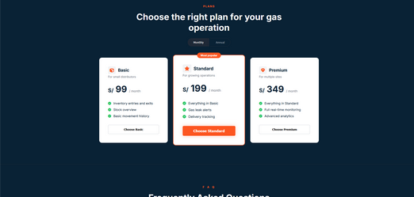

> *(Insertar captura de pantalla correspondiente.)*

La sección **Plans** presenta los distintos planes de suscripción disponibles para los clientes.

El usuario puede alternar entre modalidad **Monthly** y **Annual**, visualizando tres opciones:

| Plan                          | Precio     |
| ----------------------------- | ---------- |
| **Basic**                     | **S/ 99**  |
| **Standard** *(Most Popular)* | **S/ 199** |
| **Premium**                   | **S/ 349** |

Cada plan incluye una lista de beneficios específicos y un botón para seleccionar la suscripción correspondiente.

---

## Evidencia 5 – FAQ y Footer

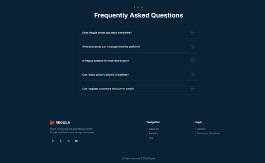


La última evidencia muestra la sección **Frequently Asked Questions (FAQ)** y el **Footer** del Landing Page.

La sección FAQ está implementada mediante componentes tipo acordeón que responden preguntas frecuentes relacionadas con el funcionamiento del sistema.

El pie de página incluye:

* Logo de REGULA.
* Descripción breve de la plataforma.
* Enlaces a redes sociales.
* Navegación hacia las principales secciones del sitio.
* Enlaces legales y de contacto.

---

## Video Demostrativo

| Elemento       |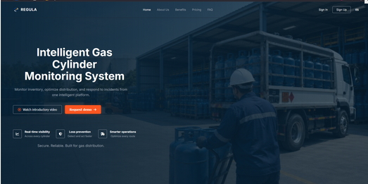                                                                                                                                                                                                                                                                                                           |
| -------------- |--------------------------------------------------------------------------------------------------------------------------------------------------------------------------------------------------------------------------------------------------------------------------------------------------------------------------|
| **Demo Video** | https://upcedupe-my.sharepoint.com/:v:/g/personal/u20241a649_upc_edu_pe/IQAN0X585uvtQLbH5jFztyF9AQn7ygXYVZpqNAE-Og3lHe4?nav=eyJyZWZlcnJhbEluZm8iOnsicmVmZXJyYWxBcHAiOiJTdHJlYW1XZWJBcHAiLCJyZWZlcnJhbFZpZXciOiJTaGFyZURpYWxvZy1MaW5rIiwicmVmZXJyYWxBcHBQbGF0Zm9ybSI6IldlYiIsInJlZmVycmFsTW9kZSI6InZpZXcifX0%3D&e=Y6vHjB  |
| **Duración**   | **00:28**                                                                                                                                                                                                                                                                                                                |

> El video demuestra el funcionamiento general del Landing Page, recorriendo las principales secciones implementadas durante el Sprint 1 y verificando su correcto comportamiento e integración.


# 5.2.1.6. Services Documentation Evidence for Sprint Review

El alcance de implementación definido para el **Sprint 1** comprendió exclusivamente el desarrollo y despliegue del **Landing Page de Regula**, por lo que no se contempló la construcción de **Web Services** durante esta iteración.

En consecuencia, **no se diseñó ni implementó ningún endpoint RESTful API**, motivo por el cual no existe documentación de servicios basada en **OpenAPI/Swagger** para presentar en esta sección.

La construcción del **RESTful API**, junto con su documentación técnica correspondiente, está prevista para los Sprints en los que se desarrolle la capa de servicios, de acuerdo con la priorización establecida en el **Product Backlog**.

En futuras iteraciones, esta sección incluirá:

* Tabla de endpoints implementados.
* Método HTTP correspondiente.
* Parámetros de entrada.
* Códigos de respuesta.
* Ejemplos de requests y responses.
* Documentación generada mediante OpenAPI/Swagger.
* Capturas de evidencia y enlaces al servicio publicado.

---

## Estado de la documentación de servicios

| Componente              | Estado                     |
| ----------------------- | -------------------------- |
| RESTful API             | ⏳ No implementado          |
| OpenAPI / Swagger       | ⏳ No disponible            |
| Endpoints documentados  | 0                          |
| Evidencias de servicios | No aplica para el Sprint 1 |

---

# 5.2.1.7. Software Deployment Evidence for Sprint Review

Durante el **Sprint 1**, las actividades de despliegue estuvieron enfocadas en publicar la primera versión funcional del **Landing Page de Regula**, en concordancia con el **Sprint Goal** y el alcance definido para esta iteración.


El proceso de despliegue comprendió la configuración de la organización del equipo en GitHub, la habilitación del servicio de hosting mediante **GitHub Pages** y la automatización del proceso de publicación utilizando **GitHub Actions**.

---

## Creación de la organización y repositorio

El equipo configuró la organización pública:

```text
upc-pre-202610-1asi0730-12258-Scripters
```

Dentro de esta organización se creó el repositorio correspondiente al Landing Page y se agregaron todos los integrantes del equipo como colaboradores, permitiendo registrar de forma transparente la participación de cada miembro durante el desarrollo.


---

## Configuración del hosting mediante GitHub Pages

Se habilitó **GitHub Pages** como plataforma de hosting estático para el Landing Page.

La configuración utilizada fue la siguiente:

| Configuración | Valor                |
| ------------- | -------------------- |
| **Source**    | Deploy from a branch |
| **Branch**    | `main`               |
| **Folder**    | `/ (root)`           |


Gracias a esta configuración, el sitio queda publicado automáticamente en una URL pública accesible desde cualquier navegador web.

---

## Automatización del despliegue (CI/CD)

Con el objetivo de eliminar procesos manuales de publicación, el equipo configuró un **workflow de GitHub Actions** encargado de desplegar automáticamente el Landing Page cada vez que se integran cambios en la rama principal.

La evidencia de esta automatización puede observarse en los commits registrados durante el Sprint, incluyendo:

```text
ci: cambios en integración/despliegue continuo
```


Esta estrategia garantiza una integración continua (CI) y una entrega continua (CD), reduciendo errores durante el proceso de publicación.

---

## Verificación del despliegue

Como resultado del Sprint 1, el Landing Page quedó correctamente desplegado y disponible de forma pública.

### URL del proyecto

```text
https://upc-pre-202610-1asi0730-scripters.github.io/upc-pre-202610-1asi0730-12258-Scripters-Regula-website/
```

La validación del despliegue consistió en acceder al sitio desde distintos navegadores y verificar el correcto funcionamiento de todas las secciones implementadas.


Se comprobó el correcto funcionamiento de:
*  Hero Section
*  About Us
*  Benefits
*  Plans
*  FAQ
*  Footer
*  Cambio de idioma (Español / Inglés)

---

## Estado del despliegue por producto

| Producto                     | Estado                                      |
| ---------------------------- | ------------------------------------------- |
| **Landing Page**             | Desplegado y verificado mediante GitHub Pages |
| **Frontend Web Application** | Fuera del alcance del Sprint 1              |
| **RESTful Web Services**     | Fuera del alcance del Sprint 1              |

---


# 5.2.1.8. Team Collaboration Insights during Sprint

Durante el **Sprint 1**, las actividades de implementación se desarrollaron de forma colaborativa sobre el repositorio del **Landing Page (Regula-website)**, siguiendo la estrategia de trabajo basada en **GitFlow** definida por el equipo.

Cada integrante desarrolló sus tareas en ramas de tipo **`feature`**, correspondientes a las secciones del Landing Page asignadas en la matriz de líderes y colaboradores (Sección **5.2.1.2**). Posteriormente, los cambios fueron integrados a la rama **`develop`** mediante **Pull Requests**, utilizando la convención **Conventional Commits** para mantener un historial de cambios claro y organizado.

Gracias a este flujo de trabajo, el equipo logró mantener la trazabilidad del desarrollo mediante ramas, commits y revisiones de código, evidenciando la participación individual de cada integrante.

---

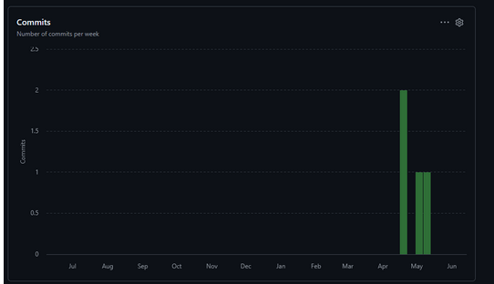
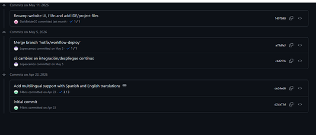
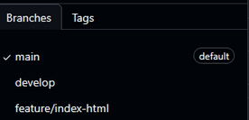

## Herramientas de colaboración

Durante el Sprint se utilizaron las siguientes herramientas para coordinar el trabajo del equipo:

| Herramienta         | Propósito                                                                                 |
| ------------------- | ----------------------------------------------------------------------------------------- |
| **GitHub**          | Control de versiones, gestión de ramas, Pull Requests y evidencia técnica del desarrollo. |
| **Trello**          | Planificación, asignación y seguimiento de tareas del Sprint.                             |
| **Microsoft Teams** | Reuniones de coordinación y seguimiento del avance del proyecto.                          |

---

## Flujo de trabajo aplicado

```text
feature/* 
      │
      ▼
Pull Request
      │
      ▼
develop
      │
      ▼
main
```

Cada funcionalidad fue desarrollada de manera independiente antes de ser integrada a la rama principal de desarrollo, reduciendo conflictos y facilitando la revisión del código.

---

## Evidencia de colaboración

A continuación, se presentan las capturas correspondientes a los analíticos de colaboración y al historial de commits del repositorio, las cuales evidencian el aporte realizado por cada integrante durante el Sprint.

### Analytics del repositorio

> *(Insertar captura de GitHub Insights - Contributors)*

---

### Historial de commits

> *(Insertar captura del historial de commits del repositorio)*

---

### Pull Requests y ramas

> *(Insertar captura de Pull Requests o Branches del repositorio)*

---

# Resumen de participación por integrante

| Integrante                               | Usuario de GitHub | Producto implementado | Aporte principal                                                      |
| ---------------------------------------- | ----------------- | --------------------- | --------------------------------------------------------------------- |
| **Tello Palacios, Fabrizio Rafael**      | `F4bris`          | Landing Page          | Barra de navegación, Hero y sección de planes.                        |
| **Espinoza Lopez, Paul Alexandro Angel** | `R3memo`          | Landing Page          | Implementación de la sección Hero y beneficios principales.           |
| **Ramos Cerdan, Elias Daniel**           | `eliocerdan`      | Landing Page          | Barra de navegación, Hero y sección de planes.                        |
| **Lopez Torres, Leonardo Gabriel**       | `Deiko-138`       | Landing Page          | Desarrollo de secciones de contenido y revisión general.              |
| **Lopez Montalvo, Kevin Edu**            | `Lopescamos`      | Landing Page          | Implementación de la sección de características y revisión funcional. |
| **David Ignacio Vivar Cesar**            | `DarkBeider2`     | Landing Page          | Desarrollo del FAQ, Footer e internacionalización del sitio.          |

---

## Participación por producto

| Producto                     | Estado de colaboración                          |
| ---------------------------- | ----------------------------------------------- |
| **Landing Page**             |  Implementado colaborativamente por todo el equipo. |
| **Frontend Web Application** | Fuera del alcance del Sprint 1.                 |
| **RESTful Web Services**     | Fuera del alcance del Sprint 1.                 |

---
# 5.2.2. Sprint 2

El **Sprint 2** representa la segunda iteración del proyecto y tiene como objetivo principal continuar con el desarrollo incremental de la solución, incorporando la primera versión funcional de la **Frontend Web Application de Regula** y mejorando el Landing Page desarrollado durante el Sprint anterior.

Durante esta iteración, el equipo se enfoca en implementar las funcionalidades esenciales que permitirán a los usuarios autenticarse en la plataforma y registrar digitalmente las operaciones de entrada y salida de balones de gas, sentando las bases para la digitalización de los procesos operativos de los distribuidores.

---

# 5.2.2.1. Sprint Planning 2

El **Sprint Planning 2** marca el inicio de la segunda iteración del proyecto. En esta reunión, el equipo revisó los resultados obtenidos en el Sprint anterior, analizó la retrospectiva realizada y definió el objetivo principal de la nueva iteración junto con los **User Stories** seleccionados para su implementación.

El foco del Sprint está orientado a entregar la **primera versión funcional y desplegada de la Frontend Web Application de Regula**, además de incorporar mejoras al Landing Page existente.

## Información General

| Campo           | Valor                            |
| --------------- | -------------------------------- |
| **Sprint #**    | Sprint 2                         |
| **Date**        | 2026-05-09                       |
| **Time**        | 11:00 PM                         |
| **Location**    | Google Meet                      |
| **Prepared By** | Kevin Lopez                      |
| **Attendees**   | Todos los integrantes del equipo |

---

## Sprint 1 Review Summary

Se alcanzó satisfactoriamente el objetivo principal del Sprint 1, logrando implementar y desplegar la primera versión funcional del **Landing Page** mediante GitHub Pages.

Las secciones **Hero, About Us, Benefits, Plans, FAQ y Footer** quedaron completamente operativas, incluyendo soporte de internacionalización.

Asimismo, se completó la primera versión del informe correspondiente a la entrega académica.

Como punto de mejora, parte del trabajo requirió correcciones durante la etapa final del Sprint.

---

## Sprint 1 Retrospective Summary

El equipo considera que el Sprint 1 fue productivo y permitió alcanzar los objetivos planteados.

Sin embargo, durante la retrospectiva se identificaron oportunidades de mejora:

* Incrementar el compromiso de todos los integrantes.
* Realizar reuniones de seguimiento con mayor frecuencia.
* Mantener una comunicación más constante entre los miembros del equipo.
* Reducir la carga de trabajo concentrada en los últimos días del Sprint.

---

## Sprint 2 Goal

> Nuestro enfoque está en ofrecer a las empresas y distribuidores de gas la **primera versión funcional y desplegada de la Frontend Web Application de Regula**, permitiéndoles acceder a la plataforma y registrar digitalmente las operaciones de entrada y salida de balones.
>
> Creemos que esta funcionalidad proporciona un reemplazo confiable para los registros manuales en papel y mejora significativamente el control operativo del inventario.
>
> El objetivo se considerará alcanzado cuando los usuarios puedan autenticarse en la aplicación web y registrar correctamente las operaciones de entrada y salida, visualizando el inventario actualizado en tiempo real.

---

## Sprint Velocity

| Métrica                 |  Valor |
| ----------------------- | :----: |
| **Sprint Velocity**     | **50** |
| **Sum of Story Points** | **70** |

---

# 5.2.2.2. Aspect Leaders and Collaborators

Durante el Sprint 2, la organización del trabajo se realizó tomando como referencia los **Bounded Contexts** definidos durante el diseño de la arquitectura de la solución.

Cada integrante asumió el rol de **Leader (L)** de uno o más bounded contexts específicos y colaboró como **Collaborator (C)** en otros módulos mediante revisiones de código y apoyo en el desarrollo.

Esta distribución favorece una mejor organización del trabajo y mantiene una relación directa con la asignación de tareas presentada en el Sprint Backlog.

## Leadership and Collaboration Matrix (LACX)

| Team Member                              | GitHub        | Distribution | Commercial Management | Report Analytics | Report Graphics | Inventory & Cylinder Tracking | Operational Analytics | Security & Alert Management |
| ---------------------------------------- | ------------- | :----------: | :-------------------: | :--------------: | :-------------: | :---------------------------: | :-------------------: | :-------------------------: |
| **Lopez Torres, Leonardo Gabriel**       | `Deiko-138`   |     **L**    |         **C**         |         -        |        -        |             **C**             |           -           |              -              |
| **Ramos Cerdan, Elias Daniel**           | `eliocerdan`  |     **C**    |         **L**         |         -        |        -        |               -               |           -           |              -              |
| **Tello Palacios, Fabrizio Rafael**      | `F4bris`      |       -      |           -           |       **L**      |      **C**      |               -               |         **C**         |              -              |
| **Lopez Montalvo, Kevin Edu**            | `Lopescamos`  |       -      |           -           |       **C**      |      **L**      |             **L**             |           -           |              -              |
| **Espinoza Lopez, Paul Alexandro Angel** | `R3memo`      |       -      |           -           |         -        |        -        |             **C**             |         **L**         |              -              |
| **David Ignacio Vivar Cesar**            | `DarkBeider2` |     **C**    |         **C**         |         -        |        -        |               -               |           -           |              -              |

> **L = Leader**
> **C = Collaborator**

---

La organización presentada en esta matriz guarda relación directa con la selección de tareas del **Sprint Backlog 2**, donde cada integrante lidera la implementación del bounded context bajo su responsabilidad y brinda apoyo en los módulos asignados como colaborador.

---

# 5.2.2.3. Sprint Backlog 2

El objetivo principal del **Sprint 2** es entregar la primera versión funcional y desplegada de la **Frontend Web Application de Regula**, permitiendo a los usuarios autenticarse y registrar digitalmente las operaciones de entrada y salida de balones de gas, junto con una versión mejorada del Landing Page.

Para lograr este objetivo, el equipo descompuso los **User Stories** priorizados en un conjunto de **Work Items / Tasks**, asignando cada uno según el bounded context liderado por cada integrante.

---

## Tablero de Sprint (Trello)

### Captura del tablero

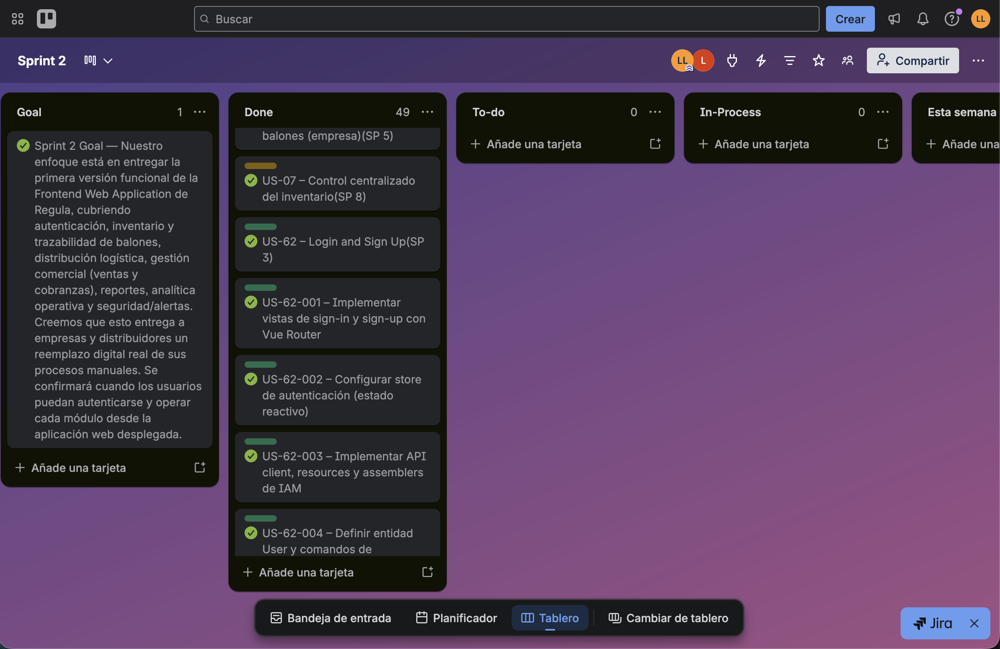
---

### URL pública del tablero

```text
https://trello.com/invite/b/68463601cda325ff0368125a/ATTIc7b4c3f9952980aa5b47d7f492e7ebab4EF89533/sprint-2
```

---

## Sprint Backlog 2 — Tabla de Work Items / Tasks

| User Story | Task | Descripción | Horas | Responsable | Estado |
| -------------------------------------------- | -------------------------------------------------- | --------------------------------------------------------------------------------------------- | :---: | ---------------------------------- | :----: |
| **US-49 Login and Sign Up** | **T01** Implementar vista Sign-In | Crear formulario de inicio de sesión con validaciones e integración con Vue Router. | 3 | Tello Palacios, Fabrizio Rafael | Done |
| | **T02** Implementar vista Sign-Up | Crear formulario de registro de usuario con campos requeridos. | 3 | Tello Palacios, Fabrizio Rafael | Done |
| | **T03** Configurar store de autenticación | Implementar store Pinia para el manejo reactivo del estado de autenticación. | 2 | Tello Palacios, Fabrizio Rafael | Done |
| | **T04** Implementar cliente API de IAM | Desarrollar API client, recursos y data assemblers para la capa de infraestructura IAM. | 3 | Tello Palacios, Fabrizio Rafael | Done |
| | **T05** Definir entidad User y comandos de autenticación | Crear la entidad de dominio User con los comandos de autenticación correspondientes. | 2 | Tello Palacios, Fabrizio Rafael | Done |
| **US-03 Record Gas Cylinder Entries** | **T06** Implementar panel de registro de entradas (empresa) | Crear formulario de registro de cilindros entrantes para el perfil empresa. | 3 | Lopez Torres, Leonardo Gabriel | Done |
| **US-04 Record Gas Cylinder Outputs** | **T07** Implementar panel de registro de salidas (empresa) | Crear formulario de registro de cilindros salientes para el perfil empresa. | 3 | Lopez Torres, Leonardo Gabriel | Done |
| **US-05 Consult Cylinder Movement History** | **T08** Implementar historial de movimientos y auditoría (empresa) | Desarrollar paneles de historial de movimientos y registro de auditoría para la empresa. | 3 | Lopez Torres, Leonardo Gabriel | Done |
| **US-29 Real-Time Stock Availability** | **T09** Implementar vista de inventario empresa | Crear tablero de inventario con paneles de stock, entradas, salidas e historial. | 4 | Lopez Torres, Leonardo Gabriel | Done |
| | **T10** Implementar inventory store y API | Desarrollar store Pinia, Inventory API y InventoryStockAssembler para manejo de estado. | 3 | Lopez Torres, Leonardo Gabriel | Done |
| **US-25 Distributor Inventory Entries** | **T11** Implementar panel de registro de entradas (distribuidor) | Crear componente de registro de entradas de balones para el perfil distribuidor. | 3 | Lopez Montalvo, Kevin Edu | Done |
| **US-26 Distributor Inventory Outputs** | **T12** Implementar panel de registro de salidas (distribuidor) | Crear componente de registro de salidas de balones para el perfil distribuidor. | 3 | Lopez Montalvo, Kevin Edu | Done |
| **US-27 Distributor Transaction History** | **T13** Implementar historial y selector de tipo de cilindro (distribuidor) | Desarrollar cylinder type picker e historial de movimientos para el distribuidor. | 3 | Lopez Montalvo, Kevin Edu | Done |
| **US-41 Daily Sales Record** | **T14** Implementar vista de ventas del distribuidor | Crear tabla de ventas, diálogo de registro de venta y panel resumen de ventas. | 4 | Ramos Cerdan, Elias Daniel | Done |
| **US-42 Customer Credit Registration** | **T15** Implementar vista de deudas del distribuidor | Crear vistas de registro de deuda, panel de deudas pendientes e historial comercial. | 4 | Ramos Cerdan, Elias Daniel | Done |
| **US-43 Customer Payment Registration** | **T16** Implementar panel de registro de pago | Desarrollar panel de registro de pagos de clientes con actualización automática de saldos. | 3 | Ramos Cerdan, Elias Daniel | Done |
| | **T17** Implementar entidades, assemblers y API comercial | Crear entidades Sale, DebtMovement, Client y CylinderType con sus assemblers y API client. | 3 | Ramos Cerdan, Elias Daniel | Done |
| **US-07 Assigned Distribution Information** | **T18** Implementar entidades Delivery y Deliverer | Desarrollar las entidades de dominio y lógica de gestión de distribución logística. | 3 | Lopez Torres, Leonardo Gabriel | Done |
| **US-38 Delivery Status Tracking** | **T19** Implementar vistas de distribución (empresa) | Crear vistas y rutas de gestión de distribución para el perfil empresa. | 3 | Lopez Torres, Leonardo Gabriel | Done |
| **US-01 Real-Time Gas Leak Monitoring** | **T20** Implementar vistas de seguridad operativa y alertas | Crear vistas de gestión de seguridad, alertas de empresa y estado de almacenes. | 4 | Espinoza Lopez, Paul Alexandro | Done |
| **US-11 Prioritization of Critical Alerts** | **T21** Implementar security hub con rutas anidadas | Configurar el security hub container con rutas secundarias para los módulos de seguridad. | 2 | Espinoza Lopez, Paul Alexandro | Done |
| **US-12 Real-Time Warehouse Status Inquiry** | **T22** Implementar vistas de estado de almacén y alertas de empresa | Desarrollar vistas de estado de almacén y alertas por empresa/almacén. | 3 | Espinoza Lopez, Paul Alexandro | Done |
| | **T23** Implementar security API, assemblers y store | Crear cliente API de seguridad, assemblers y store Pinia para el módulo de alertas. | 3 | Espinoza Lopez, Paul Alexandro | Done |
| **US-20 Generation of Operational Reports** | **T24** Implementar vista de generación de reportes | Crear vista de generación de reportes con soporte de localización. | 3 | Tello Palacios, Fabrizio Rafael | Done |
| **US-17 Alert and Incident Trends Visualization** | **T25** Implementar analytics store y lógica de reportes | Desarrollar analytics store y mejorar la lógica de generación y exportación de reportes. | 3 | Tello Palacios, Fabrizio Rafael | Done |
| | **T26** Agregar utilidades CSV y print | Implementar helper de descarga CSV e impresión HTML para reportes. | 2 | Lopez Montalvo, Kevin Edu | Done |
| **General / Infrastructure** | **T27** Configurar app shell layout | Implementar shell de aplicación con navbar y sidebar responsivos para ambos roles. | 3 | David Ignacio Vivar Cesar | Done |
| | **T28** Implementar presets de navegación por rol | Crear presets de navegación diferenciados para empresa y distribuidor. | 2 | David Ignacio Vivar Cesar | Done |
| | **T29** Configurar i18n en todos los módulos | Extender soporte de internacionalización (EN/ES) a todos los bounded contexts. | 3 | David Ignacio Vivar Cesar | Done |
| | **T30** Configurar json-server como mock API | Ajustar json-server y crear scripts seed para datos de inventario y movimientos. | 2 | Lopez Montalvo, Kevin Edu | Done |

---

## Resumen del Sprint Backlog 2

* **Total de User Stories:** 14
* **Total de tareas:** 30
* **Story Points completados:** 70
* **Estado general:** Todas las tareas completadas satisfactoriamente.
* **Resultado:** Se entregó la primera versión funcional y desplegada de la Frontend Web Application de Regula, cubriendo los módulos de autenticación, inventario (empresa y distribuidor), gestión comercial, distribución logística, seguridad y alertas, y reportes analíticos.

---

# 5.2.2.4. Development Evidence for Sprint Review.

|**Repository**|**Branch**|**Commit ID**|**Commit Message**|**Fecha**|
| :- | :- | :- | :- | :- |
|Regula-Frontend|feature/security-and-alert-management|121dbe56440d98269bdfeb86ef9459dc6681b2dc|feat(security): refactor alert and warehouse entity constructors for improved readability and consistency|03/06/2026|
|Regula-Frontend|feature/security-and-alert-management|40bb661ad3367482e90d8e1bf6cfdda0850a2b4f|feat: add warehouse and company alert history|29/05/2026|
|Regula-Frontend|feature/security-and-alert-management|1fcd6ca7348155ab5051cb7a48c429c31fffd1c8|feat(security): add company alerts and warehouse status management views|28/05/2026|
|Regula-Frontend|feature/security-and-alert-management|a8e0924eda9ef72a95621ba9534db7ee1fa24220|feat(security): implement i18n for active alerts and history views|11/05/2026|
|Regula-Frontend|feature/security-and-alert-management|2c7bd6f7fd20bae74c15ec07e6bf492ce7a9a29e|feat(i18n): config translation support|11/05/2026|
|Regula-Frontend|feature/security-and-alert-management|ccce051d019f4253881550070b8523f121777fb7|feat(i18n): add translation support for navbar labels|11/05/2026|
|Regula-Frontend|feature/security-and-alert-management|75ad61e674ff95816c5f74bda127a653705a8053|feat(routing): add security hub container with nested child routes|11/05/2026|
|Regula-Frontend|feature/security-and-alert-management|9e4b33dba08a4a4e1f838c71080b703624ca23ce|feat(presentation): add operational security management views|11/05/2026|
|Regula-Frontend|feature/security-and-alert-management|94eba50508b10eeb34191d272254cc2a3393b4a2|feat(presentation): add security routes for operational security|11/05/2026|
|Regula-Frontend|feature/security-and-alert-management|288754dd874dd91665ec8477f79466b6a93c1d16|feat(infrastructure): add security API and assemblers|11/05/2026|
|Regula-Frontend|feature/security-and-alert-management|df807758e72edc22b61beeb55bb553b7c475eeb6|feat(domain): add operational-security domain entities|11/05/2026|
|Regula-Frontend|feature/security-and-alert-management|7f32e16b78e75e7d076ee5783ac1e30cb5f60ccb|feat(store): add Pinia security store for operations|11/05/2026|
|Regula-Frontend|feature/security-and-alert-management|20480336b0020b1d6cb1628bf18c5ac852da2f2f|chore(config): update json server|11/05/2026|
|Regula-Frontend|feature/security-and-alert-management|3efb97d4e674c1e9a3ce7d48bec9d832fc9c8f79|fix: json-server; update lockfile & remove BOM|<p>11/05/2026</p><p><br></p>|
|Regula-Frontend|develop|5bcc81ac7ebe226771e367e66cd96200493a7112|Merge branch 'feature/inventory-management' into develop|10/05/2026|
|Regula-Frontend|feature/inventory-management|c0d738970db2a5137993abaf06a14922a623d943|chore: delete i18n in public.|10/05/2026|
|Regula-Frontend|feature/inventory-management|f671e693b6b21c23f65c1dc2f4edbaa5e49985aa|feat(view): update enterprise inventory view with new components and data handling|10/05/2026|
|Regula-Frontend|feature/inventory-management|2ee4da13542be733048791796f72f935b8f3d94d|feat(seed): create seed script for inventory history with enterprise and distributor movements|10/05/2026|
|Regula-Frontend|feature/inventory-management|945539241c98c9ae8dae5e9003f2faf2dbf6a4b6|feat(deps): add json-server to dependencies and create seed script for inventory history|10/05/2026|
|Regula-Frontend|feature/inventory-management|59686a0e62ffdec2bc21137c3917186d7ecbad84|feat(store): add inventory UI store for managing section keys|10/05/2026|
|Regula-Frontend|feature/inventory-management|909517758a896341b35ab42f5a632b56167e305e|feat(store): implement inventory store with stock and movement fetching|10/05/2026|
|Regula-Frontend|feature/inventory-management|745da975894d0fe1d193ff4c065b3ed309a49667|feat(config): add alias for src directory and set server port in vite.config.js|10/05/2026|
|Regula-Frontend|feature/inventory-management|ccb6d2e0b7d1136d6c1ff252e4c45fe56a09c5be|feat(deps): move json-server to devDependencies in package.json|10/05/2026|
|Regula-Frontend|feature/inventory-management|ed4ec6518fb732069bc035f88c5cd2b8d0cbfab7|feat(ui): add inventory stock table and placeholder components|10/05/2026|
|Regula-Frontend|feature/inventory-management|8368e5f0cf0f7e3ccb15142267286924ec3c1306|feat(ui): implement navigation presets for enterprise and distributor roles|10/05/2026|
|Regula-Frontend|feature/inventory-management|3cab083dac76610c0ec3eb2ec343762bbc2b1402|feat(ui): enhance app navbar and sidebar with inventory management features|10/05/2026|
|Regula-Frontend|feature/inventory-management|8f6763ef86225c779cb8211d40bf610d06704b8d|feat(ui): integrate PrimeVue with toast and tooltip services in main.js|10/05/2026|
|Regula-Frontend|feature/inventory-management|13ce0319c19fa2dc5ee8a07b821639738b026686|feat(ui): update index.html and add base styles for Regula app|10/05/2026|
|Regula-Frontend|feature/inventory-management|e2bae69a36c7ee8dbe682af3042f74544752f7d6|feat(ui): add toast notification component to app layout|10/05/2026|
|Regula-Frontend|feature/inventory-management|ce439beac79bade9f46cf2fa8882547bef07d3a9|feat(ui): add role selection view for enterprise and distributor interfaces|10/05/2026|
|Regula-Frontend|feature/inventory-management|9ee4dd3bc794a85d46533d6ec65cd5b8b0f5b18e|feat(layout): implement app shell layout with responsive navbar and sidebar|10/05/2026|
|Regula-Frontend|feature/inventory-management|837d76f691d23e871a7aa754e37438ddd0697086|feat(ui): add enterprise inventory view with stock, entry, exit, and history panels|10/05/2026|
|Regula-Frontend|feature/inventory-management|195c2b451d1b03decbaf91fc800f70442451ff45|feat(ui): add distributor inventory view with stock, entry, exit, and history panels|10/05/2026|
|Regula-Frontend|feature/inventory-management|a5e747ea8ab23e90bc559054365592e649add8aa|feat(ui): add inventory shell tabs and stock card components|10/05/2026|
|Regula-Frontend|feature/inventory-management|98bf67a74dbbd4b53a98a787aaee57862a2d3283|feat(ui): add inventory distributor and enterprise stock panels|10/05/2026|
|Regula-Frontend|feature/inventory-management|b473399cc4864887ba603be5610920198463d247|feat(ui): add enterprise register entry and exit panel components|10/05/2026|
|Regula-Frontend|feature/inventory-management|70d429d80a1cc1de0b96cded7c3c04e2e7daa8d6|feat(ui): add enterprise audit and movement history panel components|10/05/2026|
|Regula-Frontend|feature/inventory-management|be253cc19d08fe45060a0b0bd935239448881cf8|feat(ui): add distributor register entry and exit panel components|10/05/2026|
|Regula-Frontend|feature/inventory-management|4796d53b8de17372bc47662118a87b74402e48a0|feat(ui): add cylinder type picker and distributor movement history panel components|10/05/2026|
|Regula-Frontend|feature/inventory-management|95eebd10373f5a20fb59c90c320c1abc6f578ce5|feat(styles): add Regula design tokens and tooltip styles for consistent UI|10/05/2026|
|Regula-Frontend|feature/inventory-management|d5d9a9f378999ecd25c6baa499ee51f31f70e086|feat(shell): add shell presets utility for enhanced shell configuration|10/05/2026|
|Regula-Frontend|feature/inventory-management|970b44764c9becb2fbdd01147b196b6258f3e99f|feat(ui): add basic structure for app navbar and sidebar components|10/05/2026|
|Regula-Frontend|feature/inventory-management|5541d24cb20c7367aa2f262da536bfc76f4c0faa|feat(store): create inventory store for state management|10/05/2026|
|Regula-Frontend|feature/inventory-management|010715caa87e302287c6d03157cf5a8e2d31b486|feat(ui): add inventory UI store for state management|10/05/2026|
|Regula-Frontend|feature/inventory-management|6fb9ed0f85846a7c7e6061cf4492969b72c6d347|feat(helper): add CSV download and HTML print utilities|10/05/2026|
|Regula-Frontend|feature/inventory-management|9d97d55846e5f082dba66589c435afe5d9ba88d1|feat(api): implement InventoryApi and InventoryStockAssembler for inventory management|10/05/2026|
|Regula-Frontend|feature/inventory-management|035ae0d44012cf5b0b96b8b3e3657894d040e5a5|feat(domain): add DistributorStockCard and GasCylinderStockRow entities|10/05/2026|
|Regula-Frontend|feature/inventory-management|885e1a9cdcddf22f983fee81df094abb973d1c2e|chore: implement base API and router setup for inventory management|10/05/2026|
|Regula-Frontend|feature/inventory-management|d9ca4ba621d32f063ba772c7fac72cd92f8151b5|chore: implement base API and router setup for inventory management|10/05/2026|
|Regula-Frontend|feature/inventory-management|57a8550a97e80f4fd73110b207260b1b0153b526|chore: add content translate.|10/05/2026|
|Regula-Frontend|feature/inventory-management|8eed5a198b48495aac186af0f2772ac7428578aa|chore: add base API and endpoint files|10/05/2026|
|Regula-Frontend|feature/inventory-management|f48408ba6e5979f1e3f41df0189c90e2f9428088|chore: add localization files for English and Spanish|10/05/2026|
|Regula-Frontend|feature/inventory-management|26440c798c81f915f2f5d45c85f4758da65059e5|chore: correction.|08/05/2026|
|Regula-Frontend|feature/inventory-management|b220aadf8e26fa2e0be27de8ee8c3b1a7c7891c9|chore: initial commit.|08/05/2026|

|**Repository**|**Branch**|**Commit ID**|**Commit Message**|**Fecha**|
| :- | :- | :- | :- | :- |
|Regula-Frontend|feature/security-and-alert-management|121dbe56440d98269bdfeb86ef9459dc6681b2dc|feat(security): refactor alert and warehouse entity constructors for improved readability and consistency|03/06/2026|
|Regula-Frontend|feature/security-and-alert-management|40bb661|feat: add warehouse and company alert history|29/05/2026|
|Regula-Frontend|feature/security-and-alert-management|1fcd6ca|feat(security): add company alerts and warehouse status management views|28/05/2026|
|Regula-Frontend|feature/security-and-alert-management|a8e0924|feat(security): implement i18n for active alerts and history views|11/05/2026|
|Regula-Frontend|feature/security-and-alert-management|2c7bd6f|feat(i18n): config translation support|11/05/2026|
|Regula-Frontend|feature/security-and-alert-management|ccce051|feat(i18n): add translation support for navbar labels|11/05/2026|
|Regula-Frontend|feature/security-and-alert-management|75ad61e|feat(routing): add security hub container with nested child routes|11/05/2026|
|Regula-Frontend|feature/security-and-alert-management|9e4b33d|feat(presentation): add operational security management views|11/05/2026|
|Regula-Frontend|feature/security-and-alert-management|94eba50|feat(presentation): add security routes for operational security|11/05/2026|
|Regula-Frontend|feature/security-and-alert-management|288754d|feat(infrastructure): add security API and assemblers|11/05/2026|
|Regula-Frontend|feature/security-and-alert-management|dfb0775|feat(domain): add operational-security domain entities|11/05/2026|
|Regula-Frontend|feature/security-and-alert-management|7f32e16|feat(store): add Pinia security store for operations|11/05/2026|
|Regula-Frontend|feature/security-and-alert-management|2048033|chore(config): update json server|11/05/2026|
|Regula-Frontend|feature/security-and-alert-management|3efb97d|fix: json-server; update lockfile & remove BOM|11/05/2026|
|Regula-Frontend|feature/security-and-alert-management|5bcc81ac7ebe226771e367e66cd96200493a7112|Merge branch 'feature/inventory-management' into develop|10/05/2026|
|Regula-Frontend|feature/security-and-alert-management|c0d738970db2a5137993abaf06a14922a623d943|chore: delete i18n in public.|10/05/2026|
|Regula-Frontend|feature/security-and-alert-management|f671e693b6b21c23f65c1dc2f4edbaa5e49985aa|feat(view): update enterprise inventory view with new components and data handling|10/05/2026|
|Regula-Frontend|feature/security-and-alert-management|2ee4da13542be733048791796f72f935b8f3d94d|feat(seed): create seed script for inventory history with enterprise and distributor movements|10/05/2026|
|Regula-Frontend|feature/security-and-alert-management|945539241c98c9ae8dae5e9003f2faf2dbf6a4b6|feat(deps): add json-server to dependencies and create seed script for inventory history|10/05/2026|
|Regula-Frontend|feature/security-and-alert-management|59686a0e62ffdec2bc21137c3917186d7ecbad84|feat(store): add inventory UI store for managing section keys|10/05/2026|
|Regula-Frontend|feature/security-and-alert-management|909517758a896341b35ab42f5a632b56167e305e|feat(store): implement inventory store with stock and movement fetching|10/05/2026|
|Regula-Frontend|feature/security-and-alert-management|745da975894d0fe1d193ff4c065b3ed309a49667|feat(config): add alias for src directory and set server port in vite.config.js|10/05/2026|
|Regula-Frontend|feature/security-and-alert-management|ccb6d2e0b7d1136d6c1ff252e4c45fe56a09c5be|feat(deps): move json-server to devDependencies in package.json|10/05/2026|
|Regula-Frontend|feature/security-and-alert-management|ed4ec6518fb732069bc035f88c5cd2b8d0cbfab7|feat(ui): add inventory stock table and placeholder components|10/05/2026|
|Regula-Frontend|feature/security-and-alert-management|8368e5f0cf0f7e3ccb15142267286924ec3c1306|feat(ui): implement navigation presets for enterprise and distributor roles|10/05/2026|
|Regula-Frontend|feature/security-and-alert-management|3cab083dac76610c0ec3eb2ec343762bbc2b1402|feat(ui): enhance app navbar and sidebar with inventory management features|10/05/2026|
|Regula-Frontend|feature/security-and-alert-management|8f6763ef86225c779cb8211d40bf610d06704b8d|feat(ui): integrate PrimeVue with toast and tooltip services in main.js|10/05/2026|
|Regula-Frontend|feature/security-and-alert-management|13ce0319c19fa2dc5ee8a07b821639738b026686|feat(ui): update index.html and add base styles for Regula app|10/05/2026|
|Regula-Frontend|feature/security-and-alert-management|e2bae69a36c7ee8dbe682af3042f74544752f7d6|feat(ui): add toast notification component to app layout|10/05/2026|
|Regula-Frontend|feature/security-and-alert-management|ce439beac79bade9f46cf2fa8882547bef07d3a9|feat(ui): add role selection view for enterprise and distributor interfaces|10/05/2026|
|Regula-Frontend|feature/security-and-alert-management|9ee4dd3bc794a85d46533d6ec65cd5b8b0f5b18e|feat(layout): implement app shell layout with responsive navbar and sidebar|10/05/2026|
|Regula-Frontend|feature/security-and-alert-management|837d76f691d23e871a7aa754e37438ddd0697086|feat(ui): add enterprise inventory view with stock, entry, exit, and history panels|10/05/2026|
|Regula-Frontend|feature/security-and-alert-management|195c2b451d1b03decbaf91fc800f70442451ff45|feat(ui): add distributor inventory view with stock, entry, exit, and history panels|10/05/2026|
|Regula-Frontend|feature/security-and-alert-management|a5e747ea8ab23e90bc559054365592e649add8aa|feat(ui): add inventory shell tabs and stock card components|10/05/2026|
|Regula-Frontend|feature/security-and-alert-management|98bf67a74dbbd4b53a98a787aaee57862a2d3283|feat(ui): add inventory distributor and enterprise stock panels|10/05/2026|
|Regula-Frontend|feature/security-and-alert-management|b473399cc4864887ba603be5610920198463d247|feat(ui): add enterprise register entry and exit panel components|10/05/2026|
|Regula-Frontend|feature/security-and-alert-management|70d429d80a1cc1de0b96cded7c3c04e2e7daa8d6|feat(ui): add enterprise audit and movement history panel components|10/05/2026|
|Regula-Frontend|feature/security-and-alert-management|be253cc19d08fe45060a0b0bd935239448881cf8|feat(ui): add distributor register entry and exit panel components|10/05/2026|
|Regula-Frontend|feature/security-and-alert-management|4796d53b8de17372bc47662118a87b74402e48a0|feat(ui): add cylinder type picker and distributor movement history panel components|10/05/2026|
|Regula-Frontend|feature/security-and-alert-management|95eebd10373f5a20fb59c90c320c1abc6f578ce5|feat(styles): add Regula design tokens and tooltip styles for consistent UI|10/05/2026|
|Regula-Frontend|feature/security-and-alert-management|d5d9a9f378999ecd25c6baa499ee51f31f70e086|feat(shell): add shell presets utility for enhanced shell configuration|10/05/2026|
|Regula-Frontend|feature/security-and-alert-management|970b44764c9becb2fbdd01147b196b6258f3e99f|feat(ui): add basic structure for app navbar and sidebar components|10/05/2026|
|Regula-Frontend|feature/security-and-alert-management|5541d24cb20c7367aa2f262da536bfc76f4c0faa|feat(store): create inventory store for state management|10/05/2026|
|Regula-Frontend|feature/security-and-alert-management|010715caa87e302287c6d03157cf5a8e2d31b486|feat(ui): add inventory UI store for state management|10/05/2026|
|Regula-Frontend|feature/security-and-alert-management|6fb9ed0f85846a7c7e6061cf4492969b72c6d347|feat(helper): add CSV download and HTML print utilities|10/05/2026|
|Regula-Frontend|feature/security-and-alert-management|9d97d55846e5f082dba66589c435afe5d9ba88d1|feat(api): implement InventoryApi and InventoryStockAssembler for inventory management|10/05/2026|
|Regula-Frontend|feature/security-and-alert-management|035ae0d44012cf5b0b96b8b3e3657894d040e5a5|feat(domain): add DistributorStockCard and GasCylinderStockRow entities|10/05/2026|
|Regula-Frontend|feature/security-and-alert-management|885e1a9cdcddf22f983fee81df094abb973d1c2e|chore: implement base API and router setup for inventory management|10/05/2026|
|Regula-Frontend|feature/security-and-alert-management|d9ca4ba621d32f063ba772c7fac72cd92f8151b5|chore: implement base API and router setup for inventory management|10/05/2026|
|Regula-Frontend|feature/security-and-alert-management|57a8550a97e80f4fd73110b207260b1b0153b526|chore: add content translate.|10/05/2026|
|Regula-Frontend|feature/security-and-alert-management|8eed5a198b48495aac186af0f2772ac7428578aa|chore: add base API and endpoint files|10/05/2026|
|Regula-Frontend|feature/security-and-alert-management|f48408ba6e5979f1e3f41df0189c90e2f9428088|chore: add localization files for English and Spanish|10/05/2026|
|Regula-Frontend|feature/security-and-alert-management|26440c798c81f915f2f5d45c85f4758da65059e5|chore: correction.|08/05/2026|
|Regula-Frontend|feature/security-and-alert-management|b220aadf8e26fa2e0be27de8ee8c3b1a7c7891c9|chore: initial commit.|08/05/2026|

|**Repository**|**Branch**|**Commit ID**|**Commit Message**|**Fecha**|
| :- | :- | :- | :- | :- |
|Regula-Frontend|feature/commercial-management-distributor|fb2f06866ec3d9e1aa6c090af0d088bcbffcbb34|chore(commercial): remove unused gitkeep files|03/06/2026|
|Regula-Frontend|feature/commercial-management-distributor|9f63eec68110eaa21fd55381a163565c15c2d5db|feat(assets): add commercial cylinder icon|03/06/2026|
|Regula-Frontend|feature/commercial-management-distributor|87a1cc8f74b1b323c63dd78b20e3853cba1df122|chore(dependencies): sync package lock|03/06/2026|
|Regula-Frontend|feature/commercial-management-distributor|afc26fabdc069a5fac63cb018b681638e46089b6|chore(data): update sales and debts data|03/06/2026|
|Regula-Frontend|feature/commercial-management-distributor|0b41f0d64c6ea34bcf63f68adf70394c68c2d2be|feat(commercial): add distributor sales view|03/06/2026|
|Regula-Frontend|feature/commercial-management-distributor|efbdcc653ddce6362a1c63d8758ac2463eaa09d4|feat(commercial): add distributor debts view|03/06/2026|
|Regula-Frontend|feature/commercial-management-distributor|76c3805262b077c06cb0330df39ba237513729d0|feat(commercial): add sales table|03/06/2026|
|Regula-Frontend|feature/commercial-management-distributor|21e3313f0b1f2a8e7c5da7c8e6b5821d160a0daf|feat(commercial): add sales summary panel|03/06/2026|
|Regula-Frontend|feature/commercial-management-distributor|19f9325e3c0c446d64c190915dffc720e6a38e1e|feat(commercial): update register sale dialog|03/06/2026|
|Regula-Frontend|feature/commercial-management-distributor|633672322ce40bf4198d4a5f87d2f0f31bb47c00|feat(commercial): update register payment panel|03/06/2026|
|Regula-Frontend|feature/commercial-management-distributor|91b8e18159097bfbdb7bce0fc3e52f4845beaf8e|feat(commercial): update register debt panel|03/06/2026|
|Regula-Frontend|feature/commercial-management-distributor|4640f16f5cb255d20a6a2e1eb24f387484edca8f|feat(commercial): update pending debts panel|03/06/2026|
|Regula-Frontend|feature/commercial-management-distributor|fcbbedc76294c30bbcba6d9293b9fc6ff924bb68|feat(commercial): add commercial history panel|03/06/2026|
|Regula-Frontend|feature/commercial-management-distributor|ea56810050ce7a102decb3ce1a50d8cf9b83f238|feat(commercial): update commercial store for sale and debts|03/06/2026|
|Regula-Frontend|feature/commercial-management-distributor|d0e1d72f471a19016f28f0af125b0205823f7a94|feat(commercial): update commercial api|03/06/2026|
|Regula-Frontend|feature/commercial-management-distributor|b508f724e9441d4fcab25dd683dfca64b3206241|feat(commercial): add cylinder type assembler|03/06/2026|
|Regula-Frontend|feature/commercial-management-distributor|dfcf51e5b33643e7b630f91ea4b83e334c7a6992|feat(commercial): add debt movement assembler|03/06/2026|
|Regula-Frontend|feature/commercial-management-distributor|d300b1fe753b1d74be2ef14ce1e8f69379a193da|feat(commercial): add client assembler|03/06/2026|
|Regula-Frontend|feature/commercial-management-distributor|f87d7935fe320c8e0e0e1f5ee1352575c1f3eb89|feat(commercial): add sale assembler|03/06/2026|
|Regula-Frontend|feature/commercial-management-distributor|b5ad2d818bd2c9d6fd75832402ea84a2f056817e|feat(commercial): add sale entity|03/06/2026|
|Regula-Frontend|feature/commercial-management-distributor|da5f341a04dfdb39a744b50b979b98226ac165d6|feat(commercial): add debt movement entity|03/06/2026|
|Regula-Frontend|feature/commercial-management-distributor|c30ecfbd2e96373efc6282ea7a5f83b1b7b401b3|feat(commercial): add cylinder type entity|03/06/2026|
|Regula-Frontend|feature/commercial-management-distributor|8078b691ea601bd6c8384beaf18fc9f5c0ee1ab6|feat(commercial): add client entity|03/06/2026|
|Regula-Frontend|feature/commercial-management-distributor|43ea797c474ec919fb6d20ba32aa1118b6dacdc7|feat(navigation): update debt management navigation|03/06/2026|
|Regula-Frontend|feature/commercial-management-distributor|f2b2e52498d940f0a5ec72e9aa356499dd89248c|feat: update debt management routes|03/06/2026|
|Regula-Frontend|feature/commercial-management-distributor|cfda3dffa3682928c5f245171c628abb5edcac85|feat: add distributor commercial sales module|03/06/2026|
|Regula-Frontend|feature/commercial-management-distributor|856e709a09f99a2053f60cd40acca852d7c3604a|refactor(main): simplify import paths for i18n, pinia, and router modules|24/05/2026|
|Regula-Frontend|feature/commercial-management-distributor|2c8704b24794f7ce241a4c7a52883d8fa2ae013b|feat(styles): add Regula brand tokens and typography styles to enhance UI consistency|24/05/2026|
|Regula-Frontend|feature/commercial-management-distributor|f848e45a9ebb71b4ed62145531108d64947fc377|feat(navbar): simplify app-navbar and enhance navigation for enterprise and distributor roles|24/05/2026|
|Regula-Frontend|feature/commercial-management-distributor|0717c639adf3f2133b0e925c6d1f20515005e38b|refactor(i18n): update import paths for localization files|24/05/2026|
|Regula-Frontend|feature/commercial-management-distributor|314a7061e38822e67c188e2368733d8732bfaa8b|refactor(pinia): move pinia.js to root directory for improved structure|24/05/2026|
|Regula-Frontend|feature/commercial-management-distributor|f416863010055ea06418868cab9e6585f5078787|feat(router): add main router configuration with inventory routes and role selection|24/05/2026|
|Regula-Frontend|feature/commercial-management-distributor|7eb357f04a3b98a9876b701a03df606d69c05905|feat(routes): add inventory route definitions for enterprise and distributor views|24/05/2026|
|Regula-Frontend|feature/commercial-management-distributor|151a801f04ea81d8a16a206f41a035e021a6a2b6|feat(inventory): refactor inventory store usage and enhance data fetching in panels|24/05/2026|
|Regula-Frontend|feature/commercial-management-distributor|e24f9e54af16ca3d248c59cb49648553ba8cc082|feat(distributor): refactor inventory store usage in distributor panels|24/05/2026|
|Regula-Frontend|feature/commercial-management-distributor|b0cbb31791561ec267c644d2f3dd3ddfe4fcb106|feat(store): enhance inventory store with additional data handling for origins, providers, and stock kg maps|24/05/2026|
|Regula-Frontend|feature/commercial-management-distributor|476784f0adcae7b2501231d15332fb867f3ee66c|feat(api): add summary documentation for inventory API service|24/05/2026|
|Regula-Frontend|feature/commercial-management-distributor|fd5355152ec186b1a4413728198e38e8644e4824|feat(assembler): add inventory, origin, provider, and stock kg map assemblers for resource transformation|24/05/2026|
|Regula-Frontend|feature/commercial-management-distributor|68bc03008b266f70684087e2948ca3229b11cfc9|feat(entity): add new entity classes for audit logs, distributor movements, inventory movements, and related models|24/05/2026|
|Regula-Frontend|feature/commercial-management-distributor|58b6771b17373854955053dd771b719e4cab457f|fix(deps): downgrade json-server to version 0.17.4|23/05/2026|
|Regula-Frontend|feature/commercial-management-distributor|c0d738970db2a5137993abaf06a14922a623d943|chore: delete i18n in public.|10/05/2026|
|Regula-Frontend|feature/commercial-management-distributor|5bcc81ac7ebe226771e367e66cd96200493a7112|Merge branch 'feature/inventory-management' into develop|10/05/2026|
|Regula-Frontend|feature/commercial-management-distributor|f671e693b6b21c23f65c1dc2f4edbaa5e49985aa|feat(view): update enterprise inventory view with new components and data handling|10/05/2026|
|Regula-Frontend|feature/commercial-management-distributor|2ee4da13542be733048791796f72f935b8f3d94d|feat(seed): create seed script for inventory history with enterprise and distributor movements|10/05/2026|
|Regula-Frontend|feature/commercial-management-distributor|945539241c98c9ae8dae5e9003f2faf2dbf6a4b6|feat(deps): add json-server to dependencies and create seed script for inventory history|10/05/2026|
|Regula-Frontend|feature/commercial-management-distributor|59686a0e62ffdec2bc21137c3917186d7ecbad84|feat(store): add inventory UI store for managing section keys|10/05/2026|
|Regula-Frontend|feature/commercial-management-distributor|909517758a896341b35ab42f5a632b56167e305e|feat(store): implement inventory store with stock and movement fetching|10/05/2026|
|Regula-Frontend|feature/commercial-management-distributor|745da975894d0fe1d193ff4c065b3ed309a49667|feat(config): add alias for src directory and set server port in vite.config.js|10/05/2026|
|Regula-Frontend|feature/commercial-management-distributor|ccb6d2e0b7d1136d6c1ff252e4c45fe56a09c5be|feat(deps): move json-server to devDependencies in package.json|10/05/2026|
|Regula-Frontend|feature/commercial-management-distributor|ed4ec6518fb732069bc035f88c5cd2b8d0cbfab7|feat(ui): add inventory stock table and placeholder components|10/05/2026|
|Regula-Frontend|feature/commercial-management-distributor|8368e5f0cf0f7e3ccb15142267286924ec3c1306|feat(ui): implement navigation presets for enterprise and distributor roles|10/05/2026|
|Regula-Frontend|feature/commercial-management-distributor|3cab083dac76610c0ec3eb2ec343762bbc2b1402|feat(ui): enhance app navbar and sidebar with inventory management features|10/05/2026|
|Regula-Frontend|feature/commercial-management-distributor|8f6763ef86225c779cb8211d40bf610d06704b8d|feat(ui): integrate PrimeVue with toast and tooltip services in main.js|10/05/2026|
|Regula-Frontend|feature/commercial-management-distributor|13ce0319c19fa2dc5ee8a07b821639738b026686|feat(ui): update index.html and add base styles for Regula app|10/05/2026|
|Regula-Frontend|feature/commercial-management-distributor|e2bae69a36c7ee8dbe682af3042f74544752f7d6|feat(ui): add toast notification component to app layout|10/05/2026|
|Regula-Frontend|feature/commercial-management-distributor|ce439beac79bade9f46cf2fa8882547bef07d3a9|feat(ui): add role selection view for enterprise and distributor interfaces|10/05/2026|
|Regula-Frontend|feature/commercial-management-distributor|9ee4dd3bc794a85d46533d6ec65cd5b8b0f5b18e|feat(layout): implement app shell layout with responsive navbar and sidebar|10/05/2026|
|Regula-Frontend|feature/commercial-management-distributor|837d76f691d23e871a7aa754e37438ddd0697086|feat(ui): add enterprise inventory view with stock, entry, exit, and history panels|10/05/2026|
|Regula-Frontend|feature/commercial-management-distributor|195c2b451d1b03decbaf91fc800f70442451ff45|feat(ui): add distributor inventory view with stock, entry, exit, and history panels|10/05/2026|
|Regula-Frontend|feature/commercial-management-distributor|a5e747ea8ab23e90bc559054365592e649add8aa|feat(ui): add inventory shell tabs and stock card components|10/05/2026|
|Regula-Frontend|feature/commercial-management-distributor|98bf67a74dbbd4b53a98a787aaee57862a2d3283|feat(ui): add inventory distributor and enterprise stock panels|10/05/2026|
|Regula-Frontend|feature/commercial-management-distributor|b473399cc4864887ba603be5610920198463d247|feat(ui): add enterprise register entry and exit panel components|10/05/2026|
|Regula-Frontend|feature/commercial-management-distributor|70d429d80a1cc1de0b96cded7c3c04e2e7daa8d6|feat(ui): add enterprise audit and movement history panel components|10/05/2026|
|Regula-Frontend|feature/commercial-management-distributor|be253cc19d08fe45060a0b0bd935239448881cf8|feat(ui): add distributor register entry and exit panel components|10/05/2026|
|Regula-Frontend|feature/commercial-management-distributor|4796d53b8de17372bc47662118a87b74402e48a0|feat(ui): add cylinder type picker and distributor movement history panel components|10/05/2026|
|Regula-Frontend|feature/commercial-management-distributor|95eebd10373f5a20fb59c90c320c1abc6f578ce5|feat(styles): add Regula design tokens and tooltip styles for consistent UI|10/05/2026|
|Regula-Frontend|feature/commercial-management-distributor|d5d9a9f378999ecd25c6baa499ee51f31f70e086|feat(shell): add shell presets utility for enhanced shell configuration|10/05/2026|
|Regula-Frontend|feature/commercial-management-distributor|970b44764c9becb2fbdd01147b196b6258f3e99f|feat(ui): add basic structure for app navbar and sidebar components|10/05/2026|
|Regula-Frontend|feature/commercial-management-distributor|5541d24cb20c7367aa2f262da536bfc76f4c0faa|feat(store): create inventory store for state management|10/05/2026|
|Regula-Frontend|feature/commercial-management-distributor|010715caa87e302287c6d03157cf5a8e2d31b486|feat(ui): add inventory UI store for state management|10/05/2026|
|Regula-Frontend|feature/commercial-management-distributor|6fb9ed0f85846a7c7e6061cf4492969b72c6d347|feat(helper): add CSV download and HTML print utilities|10/05/2026|
|Regula-Frontend|feature/commercial-management-distributor|9d97d55846e5f082dba66589c435afe5d9ba88d1|feat(api): implement InventoryApi and InventoryStockAssembler for inventory management|10/05/2026|
|Regula-Frontend|feature/commercial-management-distributor|035ae0d44012cf5b0b96b8b3e3657894d040e5a5|feat(domain): add DistributorStockCard and GasCylinderStockRow entities|10/05/2026|
|Regula-Frontend|feature/commercial-management-distributor|885e1a9cdcddf22f983fee81df094abb973d1c2e|chore: implement base API and router setup for inventory management|10/05/2026|
|Regula-Frontend|feature/commercial-management-distributor|d9ca4ba621d32f063ba772c7fac72cd92f8151b5|chore: implement base API and router setup for inventory management|10/05/2026|
|Regula-Frontend|feature/commercial-management-distributor|57a8550a97e80f4fd73110b207260b1b0153b526|chore: add content translate.|10/05/2026|
|Regula-Frontend|feature/commercial-management-distributor|8eed5a198b48495aac186af0f2772ac7428578aa|chore: add base API and endpoint files|10/05/2026|
|Regula-Frontend|feature/commercial-management-distributor|f48408ba6e5979f1e3f41df0189c90e2f9428088|chore: add localization files for English and Spanish|10/05/2026|
|Regula-Frontend|feature/commercial-management-distributor|26440c798c81f915f2f5d45c85f4758da65059e5|chore: correction.|08/05/2026|
|Regula-Frontend|feature/commercial-management-distributor|b220aadf8e26fa2e0be27de8ee8c3b1a7c7891c9|chore: initial commit.|08/05/2026|

|**Repository**|**Branch**|**Commit ID**|**Commit Message**|**Fecha**|
| :- | :- | :- | :- | :- |
|Regula-Frontend|feature/iam|856e709a09f99a2053f60cd40acca852d7c3604a|refactor(main): simplify import paths for i18n, pinia, and router modules|24/05/2026|
|Regula-Frontend|feature/iam|2c8704b24794f7ce241a4c7a52883d8fa2ae013b|feat(styles): add Regula brand tokens and typography styles to enhance UI consistency|24/05/2026|
|Regula-Frontend|feature/iam|f848e45a9ebb71b4ed62145531108d64947fc377|feat(navbar): simplify app-navbar and enhance navigation for enterprise and distributor roles|24/05/2026|
|Regula-Frontend|feature/iam|0717c639adf3f2133b0e925c6d1f20515005e38b|refactor(i18n): update import paths for localization files|24/05/2026|
|Regula-Frontend|feature/iam|314a7061e38822e67c188e2368733d8732bfaa8b|refactor(pinia): move pinia.js to root directory for improved structure|24/05/2026|
|Regula-Frontend|feature/iam|f416863010055ea06418868cab9e6585f5078787|feat(router): add main router configuration with inventory routes and role selection|24/05/2026|
|Regula-Frontend|feature/iam|7eb357f04a3b98a9876b701a03df606d69c05905|feat(routes): add inventory route definitions for enterprise and distributor views|24/05/2026|
|Regula-Frontend|feature/iam|151a801f04ea81d8a16a206f41a035e021a6a2b6|feat(inventory): refactor inventory store usage and enhance data fetching in panels|24/05/2026|
|Regula-Frontend|feature/iam|e24f9e54af16ca3d248c59cb49648553ba8cc082|feat(distributor): refactor inventory store usage in distributor panels|24/05/2026|
|Regula-Frontend|feature/iam|b0cbb31791561ec267c644d2f3dd3ddfe4fcb106|feat(store): enhance inventory store with additional data handling for origins, providers, and stock kg maps|24/05/2026|
|Regula-Frontend|feature/iam|476784f0adcae7b2501231d15332fb867f3ee66c|feat(api): add summary documentation for inventory API service|24/05/2026|
|Regula-Frontend|feature/iam|fd5355152ec186b1a4413728198e38e8644e4824|feat(assembler): add inventory, origin, provider, and stock kg map assemblers for resource transformation|24/05/2026|
|Regula-Frontend|feature/iam|68bc03008b266f70684087e2948ca3229b11cfc9|feat(entity): add new entity classes for audit logs, distributor movements, inventory movements, and related models|24/05/2026|
|Regula-Frontend|feature/iam|58b6771b17373854955053dd771b719e4cab457f|fix(deps): downgrade json-server to version 0.17.4|23/05/2026|
|Regula-Frontend|feature/iam|c0d738970db2a5137993abaf06a14922a623d943|chore: delete i18n in public.|10/05/2026|
|Regula-Frontend|feature/iam|5bcc81ac7ebe226771e367e66cd96200493a7112|Merge branch 'feature/inventory-management' into develop|10/05/2026|
|Regula-Frontend|feature/iam|f671e693b6b21c23f65c1dc2f4edbaa5e49985aa|feat(view): update enterprise inventory view with new components and data handling|10/05/2026|
|Regula-Frontend|feature/iam|2ee4da13542be733048791796f72f935b8f3d94d|feat(seed): create seed script for inventory history with enterprise and distributor movements|10/05/2026|
|Regula-Frontend|feature/iam|945539241c98c9ae8dae5e9003f2faf2dbf6a4b6|feat(deps): add json-server to dependencies and create seed script for inventory history|10/05/2026|
|Regula-Frontend|feature/iam|59686a0e62ffdec2bc21137c3917186d7ecbad84|feat(store): add inventory UI store for managing section keys|10/05/2026|
|Regula-Frontend|feature/iam|909517758a896341b35ab42f5a632b56167e305e|feat(store): implement inventory store with stock and movement fetching|10/05/2026|
|Regula-Frontend|feature/iam|745da975894d0fe1d193ff4c065b3ed309a49667|feat(config): add alias for src directory and set server port in vite.config.js|10/05/2026|
|Regula-Frontend|feature/iam|ccb6d2e0b7d1136d6c1ff252e4c45fe56a09c5be|feat(deps): move json-server to devDependencies in package.json|10/05/2026|
|Regula-Frontend|feature/iam|ed4ec6518fb732069bc035f88c5cd2b8d0cbfab7|feat(ui): add inventory stock table and placeholder components|10/05/2026|
|Regula-Frontend|feature/iam|8368e5f0cf0f7e3ccb15142267286924ec3c1306|feat(ui): implement navigation presets for enterprise and distributor roles|10/05/2026|
|Regula-Frontend|feature/iam|3cab083dac76610c0ec3eb2ec343762bbc2b1402|feat(ui): enhance app navbar and sidebar with inventory management features|10/05/2026|
|Regula-Frontend|feature/iam|8f6763ef86225c779cb8211d40bf610d06704b8d|feat(ui): integrate PrimeVue with toast and tooltip services in main.js|10/05/2026|
|Regula-Frontend|feature/iam|13ce0319c19fa2dc5ee8a07b821639738b026686|feat(ui): update index.html and add base styles for Regula app|10/05/2026|
|Regula-Frontend|feature/iam|e2bae69a36c7ee8dbe682af3042f74544752f7d6|feat(ui): add toast notification component to app layout|10/05/2026|
|Regula-Frontend|feature/iam|ce439beac79bade9f46cf2fa8882547bef07d3a9|feat(ui): add role selection view for enterprise and distributor interfaces|10/05/2026|
|Regula-Frontend|feature/iam|9ee4dd3bc794a85d46533d6ec65cd5b8b0f5b18e|feat(layout): implement app shell layout with responsive navbar and sidebar|10/05/2026|
|Regula-Frontend|feature/iam|837d76f691d23e871a7aa754e37438ddd0697086|feat(ui): add enterprise inventory view with stock, entry, exit, and history panels|10/05/2026|
|Regula-Frontend|feature/iam|195c2b451d1b03decbaf91fc800f70442451ff45|feat(ui): add distributor inventory view with stock, entry, exit, and history panels|10/05/2026|
|Regula-Frontend|feature/iam|a5e747ea8ab23e90bc559054365592e649add8aa|feat(ui): add inventory shell tabs and stock card components|10/05/2026|
|Regula-Frontend|feature/iam|98bf67a74dbbd4b53a98a787aaee57862a2d3283|feat(ui): add inventory distributor and enterprise stock panels|10/05/2026|
|Regula-Frontend|feature/iam|b473399cc4864887ba603be5610920198463d247|feat(ui): add enterprise register entry and exit panel components|10/05/2026|
|Regula-Frontend|feature/iam|70d429d80a1cc1de0b96cded7c3c04e2e7daa8d6|feat(ui): add enterprise audit and movement history panel components|10/05/2026|
|Regula-Frontend|feature/iam|be253cc19d08fe45060a0b0bd935239448881cf8|feat(ui): add distributor register entry and exit panel components|10/05/2026|
|Regula-Frontend|feature/iam|4796d53b8de17372bc47662118a87b74402e48a0|feat(ui): add cylinder type picker and distributor movement history panel components|10/05/2026|
|Regula-Frontend|feature/iam|95eebd10373f5a20fb59c90c320c1abc6f578ce5|feat(styles): add Regula design tokens and tooltip styles for consistent UI|10/05/2026|
|Regula-Frontend|feature/iam|d5d9a9f378999ecd25c6baa499ee51f31f70e086|feat(shell): add shell presets utility for enhanced shell configuration|10/05/2026|
|Regula-Frontend|feature/iam|970b44764c9becb2fbdd01147b196b6258f3e99f|feat(ui): add basic structure for app navbar and sidebar components|10/05/2026|
|Regula-Frontend|feature/iam|5541d24cb20c7367aa2f262da536bfc76f4c0faa|feat(store): create inventory store for state management|10/05/2026|
|Regula-Frontend|feature/iam|010715caa87e302287c6d03157cf5a8e2d31b486|feat(ui): add inventory UI store for state management|10/05/2026|
|Regula-Frontend|feature/iam|6fb9ed0f85846a7c7e6061cf4492969b72c6d347|feat(helper): add CSV download and HTML print utilities|10/05/2026|
|Regula-Frontend|feature/iam|9d97d55846e5f082dba66589c435afe5d9ba88d1|feat(api): implement InventoryApi and InventoryStockAssembler for inventory management|10/05/2026|
|Regula-Frontend|feature/iam|035ae0d44012cf5b0b96b8b3e3657894d040e5a5|feat(domain): add DistributorStockCard and GasCylinderStockRow entities|10/05/2026|
|Regula-Frontend|feature/iam|885e1a9cdcddf22f983fee81df094abb973d1c2e|chore: implement base API and router setup for inventory management|10/05/2026|
|Regula-Frontend|feature/iam|d9ca4ba621d32f063ba772c7fac72cd92f8151b5|chore: implement base API and router setup for inventory management|10/05/2026|
|Regula-Frontend|feature/iam|57a8550a97e80f4fd73110b207260b1b0153b526|chore: add content translate.|10/05/2026|
|Regula-Frontend|feature/iam|8eed5a198b48495aac186af0f2772ac7428578aa|chore: add base API and endpoint files|10/05/2026|
|Regula-Frontend|feature/iam|f48408ba6e5979f1e3f41df0189c90e2f9428088|chore: add localization files for English and Spanish|10/05/2026|
|Regula-Frontend|feature/iam|26440c798c81f915f2f5d45c85f4758da65059e5|chore: correction.|08/05/2026|
|Regula-Frontend|feature/iam|b220aadf8e26fa2e0be27de8ee8c3b1a7c7891c9|chore: initial commit.|08/05/2026|

|**Repository**|**Branch**|**Commit ID**|**Commit Message**|**Fecha**|
| :- | :- | :- | :- | :- |
|Regula-Frontend|feature/iam-authentication|846b5bbe3a4fc470763faf4ba2b7e32a16abb72b|feat(iam): build sign-in and sign-up views integrated with vue router.|30/05/2026|
|Regula-Frontend|feature/iam-authentication|c3972aa14595f88eb3f9da14694bb62639a7b6da|feat(iam): configure state management store for reactive authentication tracking.|30/05/2026|
|Regula-Frontend|feature/iam-authentication|914fb00b33a97b735d34d2dbbf577a6ebde77616|refactor(iam): relocate data assemblers from shared to iam infrastructure layer.|30/05/2026|
|Regula-Frontend|feature/iam-authentication|581b7dacc08af9cd2aee8ee0c7443bbe12b58c51|feat(iam): implement infrastructure api client, resources and data assemblers.|30/05/2026|
|Regula-Frontend|feature/iam-authentication|e4dc1d399094dd0ceecceb33b728ebcd51dc94e3|feat(iam): define user core entity and authentication domain commands.|30/05/2026|
|Regula-Frontend|feature/iam-authentication|856e709a09f99a2053f60cd40acca852d7c3604a|refactor(main): simplify import paths for i18n, pinia, and router modules|24/05/2026|
|Regula-Frontend|feature/iam-authentication|2c8704b24794f7ce241a4c7a52883d8fa2ae013b|feat(styles): add Regula brand tokens and typography styles to enhance UI consistency|24/05/2026|
|Regula-Frontend|feature/iam-authentication|f848e45a9ebb71b4ed62145531108d64947fc377|feat(navbar): simplify app-navbar and enhance navigation for enterprise and distributor roles|24/05/2026|
|Regula-Frontend|feature/iam-authentication|0717c639adf3f2133b0e925c6d1f20515005e38b|refactor(i18n): update import paths for localization files|24/05/2026|
|Regula-Frontend|feature/iam-authentication|314a7061e38822e67c188e2368733d8732bfaa8b|refactor(pinia): move pinia.js to root directory for improved structure|24/05/2026|
|Regula-Frontend|feature/iam-authentication|f416863010055ea06418868cab9e6585f5078787|feat(router): add main router configuration with inventory routes and role selection|24/05/2026|
|Regula-Frontend|feature/iam-authentication|7eb357f04a3b98a9876b701a03df606d69c05905|feat(routes): add inventory route definitions for enterprise and distributor views|24/05/2026|
|Regula-Frontend|feature/iam-authentication|151a801f04ea81d8a16a206f41a035e021a6a2b6|feat(inventory): refactor inventory store usage and enhance data fetching in panels|24/05/2026|
|Regula-Frontend|feature/iam-authentication|e24f9e54af16ca3d248c59cb49648553ba8cc082|feat(distributor): refactor inventory store usage in distributor panels|24/05/2026|
|Regula-Frontend|feature/iam-authentication|b0cbb31791561ec267c644d2f3dd3ddfe4fcb106|feat(store): enhance inventory store with additional data handling for origins, providers, and stock kg maps|24/05/2026|
|Regula-Frontend|feature/iam-authentication|476784f0adcae7b2501231d15332fb867f3ee66c|feat(api): add summary documentation for inventory API service|24/05/2026|
|Regula-Frontend|feature/iam-authentication|fd5355152ec186b1a4413728198e38e8644e4824|feat(assembler): add inventory, origin, provider, and stock kg map assemblers for resource transformation|24/05/2026|
|Regula-Frontend|feature/iam-authentication|68bc03008b266f70684087e2948ca3229b11cfc9|feat(entity): add new entity classes for audit logs, distributor movements, inventory movements, and related models|24/05/2026|
|Regula-Frontend|feature/iam-authentication|58b6771b17373854955053dd771b719e4cab457f|fix(deps): downgrade json-server to version 0.17.4|23/05/2026|
|Regula-Frontend|feature/iam-authentication|c0d738970db2a5137993abaf06a14922a623d943|chore: delete i18n in public.|10/05/2026|
|Regula-Frontend|feature/iam-authentication|5bcc81ac7ebe226771e367e66cd96200493a7112|Merge branch 'feature/inventory-management' into develop|10/05/2026|
|Regula-Frontend|feature/iam-authentication|f671e693b6b21c23f65c1dc2f4edbaa5e49985aa|feat(view): update enterprise inventory view with new components and data handling|10/05/2026|
|Regula-Frontend|feature/iam-authentication|2ee4da13542be733048791796f72f935b8f3d94d|feat(seed): create seed script for inventory history with enterprise and distributor movements|10/05/2026|
|Regula-Frontend|feature/iam-authentication|945539241c98c9ae8dae5e9003f2faf2dbf6a4b6|feat(deps): add json-server to dependencies and create seed script for inventory history|10/05/2026|
|Regula-Frontend|feature/iam-authentication|59686a0e62ffdec2bc21137c3917186d7ecbad84|feat(store): add inventory UI store for managing section keys|10/05/2026|
|Regula-Frontend|feature/iam-authentication|909517758a896341b35ab42f5a632b56167e305e|feat(store): implement inventory store with stock and movement fetching|10/05/2026|
|Regula-Frontend|feature/iam-authentication|745da975894d0fe1d193ff4c065b3ed309a49667|feat(config): add alias for src directory and set server port in vite.config.js|10/05/2026|
|Regula-Frontend|feature/iam-authentication|ccb6d2e0b7d1136d6c1ff252e4c45fe56a09c5be|feat(deps): move json-server to devDependencies in package.json|10/05/2026|
|Regula-Frontend|feature/iam-authentication|ed4ec6518fb732069bc035f88c5cd2b8d0cbfab7|feat(ui): add inventory stock table and placeholder components|10/05/2026|
|Regula-Frontend|feature/iam-authentication|8368e5f0cf0f7e3ccb15142267286924ec3c1306|feat(ui): implement navigation presets for enterprise and distributor roles|10/05/2026|
|Regula-Frontend|feature/iam-authentication|3cab083dac76610c0ec3eb2ec343762bbc2b1402|feat(ui): enhance app navbar and sidebar with inventory management features|10/05/2026|
|Regula-Frontend|feature/iam-authentication|8f6763ef86225c779cb8211d40bf610d06704b8d|feat(ui): integrate PrimeVue with toast and tooltip services in main.js|10/05/2026|
|Regula-Frontend|feature/iam-authentication|13ce0319c19fa2dc5ee8a07b821639738b026686|feat(ui): update index.html and add base styles for Regula app|10/05/2026|
|Regula-Frontend|feature/iam-authentication|e2bae69a36c7ee8dbe682af3042f74544752f7d6|feat(ui): add toast notification component to app layout|10/05/2026|
|Regula-Frontend|feature/iam-authentication|ce439beac79bade9f46cf2fa8882547bef07d3a9|feat(ui): add role selection view for enterprise and distributor interfaces|10/05/2026|
|Regula-Frontend|feature/iam-authentication|9ee4dd3bc794a85d46533d6ec65cd5b8b0f5b18e|feat(layout): implement app shell layout with responsive navbar and sidebar|10/05/2026|
|Regula-Frontend|feature/iam-authentication|837d76f691d23e871a7aa754e37438ddd0697086|feat(ui): add enterprise inventory view with stock, entry, exit, and history panels|10/05/2026|
|Regula-Frontend|feature/iam-authentication|195c2b451d1b03decbaf91fc800f70442451ff45|feat(ui): add distributor inventory view with stock, entry, exit, and history panels|10/05/2026|
|Regula-Frontend|feature/iam-authentication|a5e747ea8ab23e90bc559054365592e649add8aa|feat(ui): add inventory shell tabs and stock card components|10/05/2026|
|Regula-Frontend|feature/iam-authentication|98bf67a74dbbd4b53a98a787aaee57862a2d3283|feat(ui): add inventory distributor and enterprise stock panels|10/05/2026|
|Regula-Frontend|feature/iam-authentication|b473399cc4864887ba603be5610920198463d247|feat(ui): add enterprise register entry and exit panel components|10/05/2026|
|Regula-Frontend|feature/iam-authentication|70d429d80a1cc1de0b96cded7c3c04e2e7daa8d6|feat(ui): add enterprise audit and movement history panel components|10/05/2026|
|Regula-Frontend|feature/iam-authentication|be253cc19d08fe45060a0b0bd935239448881cf8|feat(ui): add distributor register entry and exit panel components|10/05/2026|
|Regula-Frontend|feature/iam-authentication|4796d53b8de17372bc47662118a87b74402e48a0|feat(ui): add cylinder type picker and distributor movement history panel components|10/05/2026|
|Regula-Frontend|feature/iam-authentication|95eebd10373f5a20fb59c90c320c1abc6f578ce5|feat(styles): add Regula design tokens and tooltip styles for consistent UI|10/05/2026|
|Regula-Frontend|feature/iam-authentication|d5d9a9f378999ecd25c6baa499ee51f31f70e086|feat(shell): add shell presets utility for enhanced shell configuration|10/05/2026|
|Regula-Frontend|feature/iam-authentication|970b44764c9becb2fbdd01147b196b6258f3e99f|feat(ui): add basic structure for app navbar and sidebar components|10/05/2026|
|Regula-Frontend|feature/iam-authentication|5541d24cb20c7367aa2f262da536bfc76f4c0faa|feat(store): create inventory store for state management|10/05/2026|
|Regula-Frontend|feature/iam-authentication|010715caa87e302287c6d03157cf5a8e2d31b486|feat(ui): add inventory UI store for state management|10/05/2026|
|Regula-Frontend|feature/iam-authentication|6fb9ed0f85846a7c7e6061cf4492969b72c6d347|feat(helper): add CSV download and HTML print utilities|10/05/2026|
|Regula-Frontend|feature/iam-authentication|9d97d55846e5f082dba66589c435afe5d9ba88d1|feat(api): implement InventoryApi and InventoryStockAssembler for inventory management|10/05/2026|
|Regula-Frontend|feature/iam-authentication|035ae0d44012cf5b0b96b8b3e3657894d040e5a5|feat(domain): add DistributorStockCard and GasCylinderStockRow entities|10/05/2026|
|Regula-Frontend|feature/iam-authentication|885e1a9cdcddf22f983fee81df094abb973d1c2e|chore: implement base API and router setup for inventory management|10/05/2026|
|Regula-Frontend|feature/iam-authentication|d9ca4ba621d32f063ba772c7fac72cd92f8151b5|chore: implement base API and router setup for inventory management|10/05/2026|
|Regula-Frontend|feature/iam-authentication|57a8550a97e80f4fd73110b207260b1b0153b526|chore: add content translate.|10/05/2026|
|Regula-Frontend|feature/iam-authentication|8eed5a198b48495aac186af0f2772ac7428578aa|chore: add base API and endpoint files|10/05/2026|
|Regula-Frontend|feature/iam-authentication|f48408ba6e5979f1e3f41df0189c90e2f9428088|chore: add localization files for English and Spanish|10/05/2026|
|Regula-Frontend|feature/iam-authentication|26440c798c81f915f2f5d45c85f4758da65059e5|chore: correction.|08/05/2026|
|Regula-Frontend|feature/iam-authentication|b220aadf8e26fa2e0be27de8ee8c3b1a7c7891c9|chore: initial commit.|08/05/2026|

|**Repository**|**Branch**|**Commit ID**|**Commit Message**|**Fecha**|
| :- | :- | :- | :- | :- |
|Regula-Frontend|feature/distribution|3a83d71184901b44c6e7d8142d70e5f27ba2640a|feat: add enterprise distribution management views and routes for application|29/05/2026|
|Regula-Frontend|feature/distribution|eefd6fbb4e9dc6479f1e1f30ff6fdfa76e83b117|feat: implement distribution logistics management with delivery and deliverer entities|27/05/2026|
|Regula-Frontend|feature/distribution|07de9472b791b5f9ac1d5d226980059ab176d198|feat: implement distribution logistics management with delivery and deliverer entities|27/05/2026|
|Regula-Frontend|feature/distribution|c55cf2331175879c9cc8f09c014da4cac96a3501|feat: add commercial management bounded context|13/05/2026|
|Regula-Frontend|feature/distribution|5916838bcaa0e619eb810ce568d688bba728771b|feat: add operational analytics reports bounded context|13/05/2026|
|Regula-Frontend|feature/distribution|f4536d8bfa9507847c6abdf6c3d1e935c203f438|feat: add english debt management translations|12/05/2026|
|Regula-Frontend|feature/distribution|3ac06db7acc7c6668fc17194b784b48c67577de3|feat: add spanish debt management translations|12/05/2026|
|Regula-Frontend|feature/distribution|642a39cbd7e3f389fb63486442316577bf48acae|feat: add i18n to debt management view|12/05/2026|
|Regula-Frontend|feature/distribution|c796961c9d2d7644ed3385166bcb77c8c2b6e716|feat: update debt management routes|12/05/2026|
|Regula-Frontend|feature/distribution|d5e018d51db426876b6fd7365e729391bc9c16db|feat: update debt management navigation|12/05/2026|
|Regula-Frontend|feature/distribution|498d5c326d5046ffb518a85e4a237a2361f3afa6|feat: add distributor sales view|12/05/2026|
|Regula-Frontend|feature/distribution|dfd877265fb82572c4ded515e61351fba0ee05fc|feat: add distributor debts view|12/05/2026|
|Regula-Frontend|feature/distribution|b527d838430eb7972ccf8035432a8726523110a3|feat: add register sale dialog|12/05/2026|
|Regula-Frontend|feature/distribution|69406922cd3b3a8257da4c24a2a3b97fb2fdc880|feat: add register payment panel|12/05/2026|
|Regula-Frontend|feature/distribution|d12ef3fe37e446c827b3f407020ac22fe2f5b3d7|feat: add register debt panel|12/05/2026|
|Regula-Frontend|feature/distribution|399e990ed5cd676273e87fbef8734d424f352eaa|feat: add pending debts panel|12/05/2026|
|Regula-Frontend|feature/distribution|d39ea5f5894eede9736451c6bb920df84936e1c8|feat: add commercial history panel|12/05/2026|
|Regula-Frontend|feature/distribution|bb9b5643c6bd6f0c3bd04d73034dad961512fc9b|feat: update commercial store|12/05/2026|
|Regula-Frontend|feature/distribution|b37899e6d7717cbe629d4baa5accc5b61bdd7c04|feat: update commercial api|12/05/2026|
|Regula-Frontend|feature/distribution|b2bb6e42350f5cd70699dc3ff7c0aa7b95f86e11|feat: add commercial assembler|12/05/2026|
|Regula-Frontend|feature/distribution|5d893d79d6d4d45821b27ac9314d15e3f6cd5107|feat: add sale entity|12/05/2026|
|Regula-Frontend|feature/distribution|280fc4d0a74a6b94822b68bb4e597a90f27ed461|feat: add debt movement entity|12/05/2026|
|Regula-Frontend|feature/distribution|9db813ec4328e9c1d5fdb17f82f2f6a66a5f3e4b|feat: add cylinder type entity|12/05/2026|
|Regula-Frontend|feature/distribution|5afac19e3e6d9053f5fe329fedca1cd3e7e304c4|feat: add client entity|12/05/2026|
|Regula-Frontend|feature/distribution|9193c33a463911e2aaaf68086aa4b895ca250ca6|feat(reports): implement analytics store and enhance report generation logic|12/05/2026|
|Regula-Frontend|feature/distribution|b1ecd1915a6113b451429df58ff006adf3ce1491|feat: add distributor sales and debt management views|12/05/2026|
|Regula-Frontend|feature/distribution|0277fc7026362af42ee401630a4d6e5e64de9213|feat(reports): improve code readability in generate report view|12/05/2026|
|Regula-Frontend|feature/distribution|64c502c98bd627b14ad0904950aa43dfb72a3286|feat(reports): add generate report view and localization support|12/05/2026|
|Regula-Frontend|feature/distribution|e539cb3bf3a909e61b5180899a4a1483a9ea6845|feat: add distributor commercial sales module|12/05/2026|
|Regula-Frontend|feature/distribution|a8e0924eda9ef72a95621ba9534db7ee1fa24220|feat(security): implement i18n for active alerts and history views|11/05/2026|
|Regula-Frontend|feature/distribution|2c7bd6f7fd20bae74c15ec07e6bf492ce7a9a29e|feat(i18n): config translation support|11/05/2026|
|Regula-Frontend|feature/distribution|ccce051d019f4253881550070b8523f121777fb7|feat(i18n): add translation support for navbar labels|11/05/2026|
|Regula-Frontend|feature/distribution|75ad61e674ff95816c5f74bda127a653705a8053|feat(routing): add security hub container with nested child routes|11/05/2026|
|Regula-Frontend|feature/distribution|9e4b33dba08a4a4e1f838c71080b703624ca23ce|feat(presentation): add operational security management views|11/05/2026|
|Regula-Frontend|feature/distribution|94eba50508b10eeb34191d272254cc2a3393b4a2|feat(presentation): add security routes for operational security|11/05/2026|
|Regula-Frontend|feature/distribution|288754dd874dd91665ec8477f79466b6a93c1d16|feat(infrastructure): add security API and assemblers|11/05/2026|
|Regula-Frontend|feature/distribution|df807758e72edc22b61beeb55bb553b7c475eeb6|feat(domain): add operational-security domain entities|11/05/2026|
|Regula-Frontend|feature/distribution|7f32e16b78e75e7d076ee5783ac1e30cb5f60ccb|feat(store): add Pinia security store for operations|11/05/2026|
|Regula-Frontend|feature/distribution|20480336b0020b1d6cb1628bf18c5ac852da2f2f|chore(config): update json server|11/05/2026|
|Regula-Frontend|feature/distribution|3efb97d4e674c1e9a3ce7d48bec9d832fc9c8f79|fix: json-server; update lockfile & remove BOM|11/05/2026|
|Regula-Frontend|feature/distribution|c0d738970db2a5137993abaf06a14922a623d943|chore: delete i18n in public.|10/05/2026|
|Regula-Frontend|feature/distribution|5bcc81ac7ebe226771e367e66cd96200493a7112|Merge branch 'feature/inventory-management' into develop|10/05/2026|
|Regula-Frontend|feature/distribution|f671e693b6b21c23f65c1dc2f4edbaa5e49985aa|feat(view): update enterprise inventory view with new components and data handling|10/05/2026|
|Regula-Frontend|feature/distribution|2ee4da13542be733048791796f72f935b8f3d94d|feat(seed): create seed script for inventory history with enterprise and distributor movements|10/05/2026|
|Regula-Frontend|feature/distribution|945539241c98c9ae8dae5e9003f2faf2dbf6a4b6|feat(deps): add json-server to dependencies and create seed script for inventory history|10/05/2026|
|Regula-Frontend|feature/distribution|59686a0e62ffdec2bc21137c3917186d7ecbad84|feat(store): add inventory UI store for managing section keys|10/05/2026|
|Regula-Frontend|feature/distribution|909517758a896341b35ab42f5a632b56167e305e|feat(store): implement inventory store with stock and movement fetching|10/05/2026|
|Regula-Frontend|feature/distribution|745da975894d0fe1d193ff4c065b3ed309a49667|feat(config): add alias for src directory and set server port in vite.config.js|10/05/2026|
|Regula-Frontend|feature/distribution|ccb6d2e0b7d1136d6c1ff252e4c45fe56a09c5be|feat(deps): move json-server to devDependencies in package.json|10/05/2026|
|Regula-Frontend|feature/distribution|ed4ec6518fb732069bc035f88c5cd2b8d0cbfab7|feat(ui): add inventory stock table and placeholder components|10/05/2026|
|Regula-Frontend|feature/distribution|8368e5f0cf0f7e3ccb15142267286924ec3c1306|feat(ui): implement navigation presets for enterprise and distributor roles|10/05/2026|
|Regula-Frontend|feature/distribution|3cab083dac76610c0ec3eb2ec343762bbc2b1402|feat(ui): enhance app navbar and sidebar with inventory management features|10/05/2026|
|Regula-Frontend|feature/distribution|8f6763ef86225c779cb8211d40bf610d06704b8d|feat(ui): integrate PrimeVue with toast and tooltip services in main.js|10/05/2026|
|Regula-Frontend|feature/distribution|13ce0319c19fa2dc5ee8a07b821639738b026686|feat(ui): update index.html and add base styles for Regula app|10/05/2026|
|Regula-Frontend|feature/distribution|e2bae69a36c7ee8dbe682af3042f74544752f7d6|feat(ui): add toast notification component to app layout|10/05/2026|
|Regula-Frontend|feature/distribution|ce439beac79bade9f46cf2fa8882547bef07d3a9|feat(ui): add role selection view for enterprise and distributor interfaces|10/05/2026|
|Regula-Frontend|feature/distribution|9ee4dd3bc794a85d46533d6ec65cd5b8b0f5b18e|feat(layout): implement app shell layout with responsive navbar and sidebar|10/05/2026|
|Regula-Frontend|feature/distribution|837d76f691d23e871a7aa754e37438ddd0697086|feat(ui): add enterprise inventory view with stock, entry, exit, and history panels|10/05/2026|
|Regula-Frontend|feature/distribution|195c2b451d1b03decbaf91fc800f70442451ff45|feat(ui): add distributor inventory view with stock, entry, exit, and history panels|10/05/2026|
|Regula-Frontend|feature/distribution|a5e747ea8ab23e90bc559054365592e649add8aa|feat(ui): add inventory shell tabs and stock card components|10/05/2026|
|Regula-Frontend|feature/distribution|98bf67a74dbbd4b53a98a787aaee57862a2d3283|feat(ui): add inventory distributor and enterprise stock panels|10/05/2026|
|Regula-Frontend|feature/distribution|b473399cc4864887ba603be5610920198463d247|feat(ui): add enterprise register entry and exit panel components|10/05/2026|
|Regula-Frontend|feature/distribution|70d429d80a1cc1de0b96cded7c3c04e2e7daa8d6|feat(ui): add enterprise audit and movement history panel components|10/05/2026|
|Regula-Frontend|feature/distribution|be253cc19d08fe45060a0b0bd935239448881cf8|feat(ui): add distributor register entry and exit panel components|10/05/2026|
|Regula-Frontend|feature/distribution|4796d53b8de17372bc47662118a87b74402e48a0|feat(ui): add cylinder type picker and distributor movement history panel components|10/05/2026|
|Regula-Frontend|feature/distribution|95eebd10373f5a20fb59c90c320c1abc6f578ce5|feat(styles): add Regula design tokens and tooltip styles for consistent UI|10/05/2026|
|Regula-Frontend|feature/distribution|d5d9a9f378999ecd25c6baa499ee51f31f70e086|feat(shell): add shell presets utility for enhanced shell configuration|10/05/2026|
|Regula-Frontend|feature/distribution|970b44764c9becb2fbdd01147b196b6258f3e99f|feat(ui): add basic structure for app navbar and sidebar components|10/05/2026|
|Regula-Frontend|feature/distribution|5541d24cb20c7367aa2f262da536bfc76f4c0faa|feat(store): create inventory store for state management|10/05/2026|
|Regula-Frontend|feature/distribution|010715caa87e302287c6d03157cf5a8e2d31b486|feat(ui): add inventory UI store for state management|10/05/2026|
|Regula-Frontend|feature/distribution|6fb9ed0f85846a7c7e6061cf4492969b72c6d347|feat(helper): add CSV download and HTML print utilities|10/05/2026|
|Regula-Frontend|feature/distribution|9d97d55846e5f082dba66589c435afe5d9ba88d1|feat(api): implement InventoryApi and InventoryStockAssembler for inventory management|10/05/2026|
|Regula-Frontend|feature/distribution|035ae0d44012cf5b0b96b8b3e3657894d040e5a5|feat(domain): add DistributorStockCard and GasCylinderStockRow entities|10/05/2026|
|Regula-Frontend|feature/distribution|885e1a9cdcddf22f983fee81df094abb973d1c2e|chore: implement base API and router setup for inventory management|10/05/2026|
|Regula-Frontend|feature/distribution|d9ca4ba621d32f063ba772c7fac72cd92f8151b5|chore: implement base API and router setup for inventory management|10/05/2026|
|Regula-Frontend|feature/distribution|57a8550a97e80f4fd73110b207260b1b0153b526|chore: add content translate.|10/05/2026|
|Regula-Frontend|feature/distribution|8eed5a198b48495aac186af0f2772ac7428578aa|chore: add base API and endpoint files|10/05/2026|
|Regula-Frontend|feature/distribution|f48408ba6e5979f1e3f41df0189c90e2f9428088|chore: add localization files for English and Spanish|10/05/2026|
|Regula-Frontend|feature/distribution|26440c798c81f915f2f5d45c85f4758da65059e5|chore: correction.|08/05/2026|
|Regula-Frontend|feature/distribution|b220aadf8e26fa2e0be27de8ee8c3b1a7c7891c9|chore: initial commit.|08/05/2026|

|**Repository**|**Branch**|**Commit ID**|**Commit Message**|**Fecha**|
| :- | :- | :- | :- | :- |
|Regula-Frontend|feature/report-graphics|b0cbb31791561ec267c644d2f3dd3ddfe4fcb106|feat(store): enhance inventory store with additional data handling for origins, providers, and stock kg maps|24/05/2026|
|Regula-Frontend|feature/report-graphics|476784f0adcae7b2501231d15332fb867f3ee66c|feat(api): add summary documentation for inventory API service|24/05/2026|
|Regula-Frontend|feature/report-graphics|fd5355152ec186b1a4413728198e38e8644e4824|feat(assembler): add inventory, origin, provider, and stock kg map assemblers for resource transformation|24/05/2026|
|Regula-Frontend|feature/report-graphics|68bc03008b266f70684087e2948ca3229b11cfc9|feat(entity): add new entity classes for audit logs, distributor movements, inventory movements, and related models|24/05/2026|
|Regula-Frontend|feature/report-graphics|d999b27988e7fede64721005a98c912d36cb9d00|Merge branch 'refs/heads/develop' into feature/report-graphics|23/05/2026|
|Regula-Frontend|feature/report-graphics|58b6771b17373854955053dd771b719e4cab457f|fix(deps): downgrade json-server to version 0.17.4|23/05/2026|
|Regula-Frontend|feature/report-graphics|9193c33a463911e2aaaf68086aa4b895ca250ca6|feat(reports): implement analytics store and enhance report generation logic|12/05/2026|
|Regula-Frontend|feature/report-graphics|0277fc7026362af42ee401630a4d6e5e64de9213|feat(reports): improve code readability in generate report view|12/05/2026|
|Regula-Frontend|feature/report-graphics|64c502c98bd627b14ad0904950aa43dfb72a3286|feat(reports): add generate report view and localization support|12/05/2026|
|Regula-Frontend|feature/report-graphics|c0d738970db2a5137993abaf06a14922a623d943|chore: delete i18n in public.|10/05/2026|
|Regula-Frontend|feature/report-graphics|5bcc81ac7ebe226771e367e66cd96200493a7112|Merge branch 'feature/inventory-management' into develop|10/05/2026|
|Regula-Frontend|feature/report-graphics|f671e693b6b21c23f65c1dc2f4edbaa5e49985aa|feat(view): update enterprise inventory view with new components and data handling|10/05/2026|
|Regula-Frontend|feature/report-graphics|2ee4da13542be733048791796f72f935b8f3d94d|feat(seed): create seed script for inventory history with enterprise and distributor movements|10/05/2026|
|Regula-Frontend|feature/report-graphics|945539241c98c9ae8dae5e9003f2faf2dbf6a4b6|feat(deps): add json-server to dependencies and create seed script for inventory history|10/05/2026|
|Regula-Frontend|feature/report-graphics|59686a0e62ffdec2bc21137c3917186d7ecbad84|feat(store): add inventory UI store for managing section keys|10/05/2026|
|Regula-Frontend|feature/report-graphics|909517758a896341b35ab42f5a632b56167e305e|feat(store): implement inventory store with stock and movement fetching|10/05/2026|
|Regula-Frontend|feature/report-graphics|745da975894d0fe1d193ff4c065b3ed309a49667|feat(config): add alias for src directory and set server port in vite.config.js|10/05/2026|
|Regula-Frontend|feature/report-graphics|ccb6d2e0b7d1136d6c1ff252e4c45fe56a09c5be|feat(deps): move json-server to devDependencies in package.json|10/05/2026|
|Regula-Frontend|feature/report-graphics|ed4ec6518fb732069bc035f88c5cd2b8d0cbfab7|feat(ui): add inventory stock table and placeholder components|10/05/2026|
|Regula-Frontend|feature/report-graphics|8368e5f0cf0f7e3ccb15142267286924ec3c1306|feat(ui): implement navigation presets for enterprise and distributor roles|10/05/2026|
|Regula-Frontend|feature/report-graphics|3cab083dac76610c0ec3eb2ec343762bbc2b1402|feat(ui): enhance app navbar and sidebar with inventory management features|10/05/2026|
|Regula-Frontend|feature/report-graphics|8f6763ef86225c779cb8211d40bf610d06704b8d|feat(ui): integrate PrimeVue with toast and tooltip services in main.js|10/05/2026|
|Regula-Frontend|feature/report-graphics|13ce0319c19fa2dc5ee8a07b821639738b026686|feat(ui): update index.html and add base styles for Regula app|10/05/2026|
|Regula-Frontend|feature/report-graphics|e2bae69a36c7ee8dbe682af3042f74544752f7d6|feat(ui): add toast notification component to app layout|10/05/2026|
|Regula-Frontend|feature/report-graphics|ce439beac79bade9f46cf2fa8882547bef07d3a9|feat(ui): add role selection view for enterprise and distributor interfaces|10/05/2026|
|Regula-Frontend|feature/report-graphics|9ee4dd3bc794a85d46533d6ec65cd5b8b0f5b18e|feat(layout): implement app shell layout with responsive navbar and sidebar|10/05/2026|
|Regula-Frontend|feature/report-graphics|837d76f691d23e871a7aa754e37438ddd0697086|feat(ui): add enterprise inventory view with stock, entry, exit, and history panels|10/05/2026|
|Regula-Frontend|feature/report-graphics|195c2b451d1b03decbaf91fc800f70442451ff45|feat(ui): add distributor inventory view with stock, entry, exit, and history panels|10/05/2026|
|Regula-Frontend|feature/report-graphics|a5e747ea8ab23e90bc559054365592e649add8aa|feat(ui): add inventory shell tabs and stock card components|10/05/2026|
|Regula-Frontend|feature/report-graphics|98bf67a74dbbd4b53a98a787aaee57862a2d3283|feat(ui): add inventory distributor and enterprise stock panels|10/05/2026|
|Regula-Frontend|feature/report-graphics|b473399cc4864887ba603be5610920198463d247|feat(ui): add enterprise register entry and exit panel components|10/05/2026|
|Regula-Frontend|feature/report-graphics|70d429d80a1cc1de0b96cded7c3c04e2e7daa8d6|feat(ui): add enterprise audit and movement history panel components|10/05/2026|
|Regula-Frontend|feature/report-graphics|be253cc19d08fe45060a0b0bd935239448881cf8|feat(ui): add distributor register entry and exit panel components|10/05/2026|
|Regula-Frontend|feature/report-graphics|4796d53b8de17372bc47662118a87b74402e48a0|feat(ui): add cylinder type picker and distributor movement history panel components|10/05/2026|
|Regula-Frontend|feature/report-graphics|95eebd10373f5a20fb59c90c320c1abc6f578ce5|feat(styles): add Regula design tokens and tooltip styles for consistent UI|10/05/2026|
|Regula-Frontend|feature/report-graphics|d5d9a9f378999ecd25c6baa499ee51f31f70e086|feat(shell): add shell presets utility for enhanced shell configuration|10/05/2026|
|Regula-Frontend|feature/report-graphics|970b44764c9becb2fbdd01147b196b6258f3e99f|feat(ui): add basic structure for app navbar and sidebar components|10/05/2026|
|Regula-Frontend|feature/report-graphics|5541d24cb20c7367aa2f262da536bfc76f4c0faa|feat(store): create inventory store for state management|10/05/2026|
|Regula-Frontend|feature/report-graphics|010715caa87e302287c6d03157cf5a8e2d31b486|feat(ui): add inventory UI store for state management|10/05/2026|
|Regula-Frontend|feature/report-graphics|6fb9ed0f85846a7c7e6061cf4492969b72c6d347|feat(helper): add CSV download and HTML print utilities|10/05/2026|
|Regula-Frontend|feature/report-graphics|9d97d55846e5f082dba66589c435afe5d9ba88d1|feat(api): implement InventoryApi and InventoryStockAssembler for inventory management|10/05/2026|
|Regula-Frontend|feature/report-graphics|035ae0d44012cf5b0b96b8b3e3657894d040e5a5|feat(domain): add DistributorStockCard and GasCylinderStockRow entities|10/05/2026|
|Regula-Frontend|feature/report-graphics|885e1a9cdcddf22f983fee81df094abb973d1c2e|chore: implement base API and router setup for inventory management|10/05/2026|
|Regula-Frontend|feature/report-graphics|d9ca4ba621d32f063ba772c7fac72cd92f8151b5|chore: implement base API and router setup for inventory management|10/05/2026|
|Regula-Frontend|feature/report-graphics|57a8550a97e80f4fd73110b207260b1b0153b526|chore: add content translate.|10/05/2026|
|Regula-Frontend|feature/report-graphics|8eed5a198b48495aac186af0f2772ac7428578aa|chore: add base API and endpoint files|10/05/2026|
|Regula-Frontend|feature/report-graphics|f48408ba6e5979f1e3f41df0189c90e2f9428088|chore: add localization files for English and Spanish|10/05/2026|
|Regula-Frontend|feature/report-graphics|26440c798c81f915f2f5d45c85f4758da65059e5|chore: correction.|08/05/2026|
|Regula-Frontend|feature/report-graphics|b220aadf8e26fa2e0be27de8ee8c3b1a7c7891c9|chore: initial commit.|08/05/2026|

|**Repository**|**Branch**|**Commit ID**|**Commit Message**|**Fecha**|
| :- | :- | :- | :- | :- |
|Regula-Frontend|feature/inventory-and-cylinder-tracking|856e709a09f99a2053f60cd40acca852d7c3604a|refactor(main): simplify import paths for i18n, pinia, and router modules|24/05/2026|
|Regula-Frontend|feature/inventory-and-cylinder-tracking|2c8704b24794f7ce241a4c7a52883d8fa2ae013b|feat(styles): add Regula brand tokens and typography styles to enhance UI consistency|24/05/2026|
|Regula-Frontend|feature/inventory-and-cylinder-tracking|f848e45a9ebb71b4ed62145531108d64947fc377|feat(navbar): simplify app-navbar and enhance navigation for enterprise and distributor roles|24/05/2026|
|Regula-Frontend|feature/inventory-and-cylinder-tracking|0717c639adf3f2133b0e925c6d1f20515005e38b|refactor(i18n): update import paths for localization files|24/05/2026|
|Regula-Frontend|feature/inventory-and-cylinder-tracking|314a7061e38822e67c188e2368733d8732bfaa8b|refactor(pinia): move pinia.js to root directory for improved structure|24/05/2026|
|Regula-Frontend|feature/inventory-and-cylinder-tracking|f416863010055ea06418868cab9e6585f5078787|feat(router): add main router configuration with inventory routes and role selection|24/05/2026|
|Regula-Frontend|feature/inventory-and-cylinder-tracking|7eb357f04a3b98a9876b701a03df606d69c05905|feat(routes): add inventory route definitions for enterprise and distributor views|24/05/2026|
|Regula-Frontend|feature/inventory-and-cylinder-tracking|151a801f04ea81d8a16a206f41a035e021a6a2b6|feat(inventory): refactor inventory store usage and enhance data fetching in panels|24/05/2026|
|Regula-Frontend|feature/inventory-and-cylinder-tracking|e24f9e54af16ca3d248c59cb49648553ba8cc082|feat(distributor): refactor inventory store usage in distributor panels|24/05/2026|
|Regula-Frontend|feature/inventory-and-cylinder-tracking|b0cbb31791561ec267c644d2f3dd3ddfe4fcb106|feat(store): enhance inventory store with additional data handling for origins, providers, and stock kg maps|24/05/2026|
|Regula-Frontend|feature/inventory-and-cylinder-tracking|476784f0adcae7b2501231d15332fb867f3ee66c|feat(api): add summary documentation for inventory API service|24/05/2026|
|Regula-Frontend|feature/inventory-and-cylinder-tracking|fd5355152ec186b1a4413728198e38e8644e4824|feat(assembler): add inventory, origin, provider, and stock kg map assemblers for resource transformation|24/05/2026|
|Regula-Frontend|feature/inventory-and-cylinder-tracking|68bc03008b266f70684087e2948ca3229b11cfc9|feat(entity): add new entity classes for audit logs, distributor movements, inventory movements, and related models|24/05/2026|
|Regula-Frontend|feature/inventory-and-cylinder-tracking|58b6771b17373854955053dd771b719e4cab457f|fix(deps): downgrade json-server to version 0.17.4|23/05/2026|
|Regula-Frontend|feature/inventory-and-cylinder-tracking|c0d738970db2a5137993abaf06a14922a623d943|chore: delete i18n in public.|10/05/2026|
|Regula-Frontend|feature/inventory-and-cylinder-tracking|5bcc81ac7ebe226771e367e66cd96200493a7112|Merge branch 'feature/inventory-management' into develop|10/05/2026|
|Regula-Frontend|feature/inventory-and-cylinder-tracking|f671e693b6b21c23f65c1dc2f4edbaa5e49985aa|feat(view): update enterprise inventory view with new components and data handling|10/05/2026|
|Regula-Frontend|feature/inventory-and-cylinder-tracking|2ee4da13542be733048791796f72f935b8f3d94d|feat(seed): create seed script for inventory history with enterprise and distributor movements|10/05/2026|
|Regula-Frontend|feature/inventory-and-cylinder-tracking|945539241c98c9ae8dae5e9003f2faf2dbf6a4b6|feat(deps): add json-server to dependencies and create seed script for inventory history|10/05/2026|
|Regula-Frontend|feature/inventory-and-cylinder-tracking|59686a0e62ffdec2bc21137c3917186d7ecbad84|feat(store): add inventory UI store for managing section keys|10/05/2026|
|Regula-Frontend|feature/inventory-and-cylinder-tracking|909517758a896341b35ab42f5a632b56167e305e|feat(store): implement inventory store with stock and movement fetching|10/05/2026|
|Regula-Frontend|feature/inventory-and-cylinder-tracking|745da975894d0fe1d193ff4c065b3ed309a49667|feat(config): add alias for src directory and set server port in vite.config.js|10/05/2026|
|Regula-Frontend|feature/inventory-and-cylinder-tracking|ccb6d2e0b7d1136d6c1ff252e4c45fe56a09c5be|feat(deps): move json-server to devDependencies in package.json|10/05/2026|
|Regula-Frontend|feature/inventory-and-cylinder-tracking|ed4ec6518fb732069bc035f88c5cd2b8d0cbfab7|feat(ui): add inventory stock table and placeholder components|10/05/2026|
|Regula-Frontend|feature/inventory-and-cylinder-tracking|8368e5f0cf0f7e3ccb15142267286924ec3c1306|feat(ui): implement navigation presets for enterprise and distributor roles|10/05/2026|
|Regula-Frontend|feature/inventory-and-cylinder-tracking|3cab083dac76610c0ec3eb2ec343762bbc2b1402|feat(ui): enhance app navbar and sidebar with inventory management features|10/05/2026|
|Regula-Frontend|feature/inventory-and-cylinder-tracking|8f6763ef86225c779cb8211d40bf610d06704b8d|feat(ui): integrate PrimeVue with toast and tooltip services in main.js|10/05/2026|
|Regula-Frontend|feature/inventory-and-cylinder-tracking|13ce0319c19fa2dc5ee8a07b821639738b026686|feat(ui): update index.html and add base styles for Regula app|10/05/2026|
|Regula-Frontend|feature/inventory-and-cylinder-tracking|e2bae69a36c7ee8dbe682af3042f74544752f7d6|feat(ui): add toast notification component to app layout|10/05/2026|
|Regula-Frontend|feature/inventory-and-cylinder-tracking|ce439beac79bade9f46cf2fa8882547bef07d3a9|feat(ui): add role selection view for enterprise and distributor interfaces|10/05/2026|
|Regula-Frontend|feature/inventory-and-cylinder-tracking|9ee4dd3bc794a85d46533d6ec65cd5b8b0f5b18e|feat(layout): implement app shell layout with responsive navbar and sidebar|10/05/2026|
|Regula-Frontend|feature/inventory-and-cylinder-tracking|837d76f691d23e871a7aa754e37438ddd0697086|feat(ui): add enterprise inventory view with stock, entry, exit, and history panels|10/05/2026|
|Regula-Frontend|feature/inventory-and-cylinder-tracking|195c2b451d1b03decbaf91fc800f70442451ff45|feat(ui): add distributor inventory view with stock, entry, exit, and history panels|10/05/2026|
|Regula-Frontend|feature/inventory-and-cylinder-tracking|a5e747ea8ab23e90bc559054365592e649add8aa|feat(ui): add inventory shell tabs and stock card components|10/05/2026|
|Regula-Frontend|feature/inventory-and-cylinder-tracking|98bf67a74dbbd4b53a98a787aaee57862a2d3283|feat(ui): add inventory distributor and enterprise stock panels|10/05/2026|
|Regula-Frontend|feature/inventory-and-cylinder-tracking|b473399cc4864887ba603be5610920198463d247|feat(ui): add enterprise register entry and exit panel components|10/05/2026|
|Regula-Frontend|feature/inventory-and-cylinder-tracking|70d429d80a1cc1de0b96cded7c3c04e2e7daa8d6|feat(ui): add enterprise audit and movement history panel components|10/05/2026|
|Regula-Frontend|feature/inventory-and-cylinder-tracking|be253cc19d08fe45060a0b0bd935239448881cf8|feat(ui): add distributor register entry and exit panel components|10/05/2026|
|Regula-Frontend|feature/inventory-and-cylinder-tracking|4796d53b8de17372bc47662118a87b74402e48a0|feat(ui): add cylinder type picker and distributor movement history panel components|10/05/2026|
|Regula-Frontend|feature/inventory-and-cylinder-tracking|95eebd10373f5a20fb59c90c320c1abc6f578ce5|feat(styles): add Regula design tokens and tooltip styles for consistent UI|10/05/2026|
|Regula-Frontend|feature/inventory-and-cylinder-tracking|d5d9a9f378999ecd25c6baa499ee51f31f70e086|feat(shell): add shell presets utility for enhanced shell configuration|10/05/2026|
|Regula-Frontend|feature/inventory-and-cylinder-tracking|970b44764c9becb2fbdd01147b196b6258f3e99f|feat(ui): add basic structure for app navbar and sidebar components|10/05/2026|
|Regula-Frontend|feature/inventory-and-cylinder-tracking|5541d24cb20c7367aa2f262da536bfc76f4c0faa|feat(store): create inventory store for state management|10/05/2026|
|Regula-Frontend|feature/inventory-and-cylinder-tracking|010715caa87e302287c6d03157cf5a8e2d31b486|feat(ui): add inventory UI store for state management|10/05/2026|
|Regula-Frontend|feature/inventory-and-cylinder-tracking|6fb9ed0f85846a7c7e6061cf4492969b72c6d347|feat(helper): add CSV download and HTML print utilities|10/05/2026|
|Regula-Frontend|feature/inventory-and-cylinder-tracking|9d97d55846e5f082dba66589c435afe5d9ba88d1|feat(api): implement InventoryApi and InventoryStockAssembler for inventory management|10/05/2026|
|Regula-Frontend|feature/inventory-and-cylinder-tracking|035ae0d44012cf5b0b96b8b3e3657894d040e5a5|feat(domain): add DistributorStockCard and GasCylinderStockRow entities|10/05/2026|
|Regula-Frontend|feature/inventory-and-cylinder-tracking|885e1a9cdcddf22f983fee81df094abb973d1c2e|chore: implement base API and router setup for inventory management|10/05/2026|
|Regula-Frontend|feature/inventory-and-cylinder-tracking|d9ca4ba621d32f063ba772c7fac72cd92f8151b5|chore: implement base API and router setup for inventory management|10/05/2026|
|Regula-Frontend|feature/inventory-and-cylinder-tracking|57a8550a97e80f4fd73110b207260b1b0153b526|chore: add content translate.|10/05/2026|
|Regula-Frontend|feature/inventory-and-cylinder-tracking|8eed5a198b48495aac186af0f2772ac7428578aa|chore: add base API and endpoint files|10/05/2026|
|Regula-Frontend|feature/inventory-and-cylinder-tracking|f48408ba6e5979f1e3f41df0189c90e2f9428088|chore: add localization files for English and Spanish|10/05/2026|
|Regula-Frontend|feature/inventory-and-cylinder-tracking|26440c798c81f915f2f5d45c85f4758da65059e5|chore: correction.|08/05/2026|
|Regula-Frontend|feature/inventory-and-cylinder-tracking|b220aadf8e26fa2e0be27de8ee8c3b1a7c7891c9|chore: initial commit.|08/05/2026|

|**Repository**|**Branch**|**Commit ID**|**Commit Message**|**Fecha**|
| :- | :- | :- | :- | :- |
|Regula-Frontend|feature/operational-analytics|c0d738970db2a5137993abaf06a14922a623d943|chore: delete i18n in public.|10/05/2026|
|Regula-Frontend|feature/operational-analytics|5bcc81ac7ebe226771e367e66cd96200493a7112|Merge branch 'feature/inventory-management' into develop|10/05/2026|
|Regula-Frontend|feature/operational-analytics|f671e693b6b21c23f65c1dc2f4edbaa5e49985aa|feat(view): update enterprise inventory view with new components and data handling|10/05/2026|
|Regula-Frontend|feature/operational-analytics|2ee4da13542be733048791796f72f935b8f3d94d|feat(seed): create seed script for inventory history with enterprise and distributor movements|10/05/2026|
|Regula-Frontend|feature/operational-analytics|945539241c98c9ae8dae5e9003f2faf2dbf6a4b6|feat(deps): add json-server to dependencies and create seed script for inventory history|10/05/2026|
|Regula-Frontend|feature/operational-analytics|59686a0e62ffdec2bc21137c3917186d7ecbad84|feat(store): add inventory UI store for managing section keys|10/05/2026|
|Regula-Frontend|feature/operational-analytics|909517758a896341b35ab42f5a632b56167e305e|feat(store): implement inventory store with stock and movement fetching|10/05/2026|
|Regula-Frontend|feature/operational-analytics|745da975894d0fe1d193ff4c065b3ed309a49667|feat(config): add alias for src directory and set server port in vite.config.js|10/05/2026|
|Regula-Frontend|feature/operational-analytics|ccb6d2e0b7d1136d6c1ff252e4c45fe56a09c5be|feat(deps): move json-server to devDependencies in package.json|10/05/2026|
|Regula-Frontend|feature/operational-analytics|ed4ec6518fb732069bc035f88c5cd2b8d0cbfab7|feat(ui): add inventory stock table and placeholder components|10/05/2026|
|Regula-Frontend|feature/operational-analytics|8368e5f0cf0f7e3ccb15142267286924ec3c1306|feat(ui): implement navigation presets for enterprise and distributor roles|10/05/2026|
|Regula-Frontend|feature/operational-analytics|3cab083dac76610c0ec3eb2ec343762bbc2b1402|feat(ui): enhance app navbar and sidebar with inventory management features|10/05/2026|
|Regula-Frontend|feature/operational-analytics|8f6763ef86225c779cb8211d40bf610d06704b8d|feat(ui): integrate PrimeVue with toast and tooltip services in main.js|10/05/2026|
|Regula-Frontend|feature/operational-analytics|13ce0319c19fa2dc5ee8a07b821639738b026686|feat(ui): update index.html and add base styles for Regula app|10/05/2026|
|Regula-Frontend|feature/operational-analytics|e2bae69a36c7ee8dbe682af3042f74544752f7d6|feat(ui): add toast notification component to app layout|10/05/2026|
|Regula-Frontend|feature/operational-analytics|ce439beac79bade9f46cf2fa8882547bef07d3a9|feat(ui): add role selection view for enterprise and distributor interfaces|10/05/2026|
|Regula-Frontend|feature/operational-analytics|9ee4dd3bc794a85d46533d6ec65cd5b8b0f5b18e|feat(layout): implement app shell layout with responsive navbar and sidebar|10/05/2026|
|Regula-Frontend|feature/operational-analytics|837d76f691d23e871a7aa754e37438ddd0697086|feat(ui): add enterprise inventory view with stock, entry, exit, and history panels|10/05/2026|
|Regula-Frontend|feature/operational-analytics|195c2b451d1b03decbaf91fc800f70442451ff45|feat(ui): add distributor inventory view with stock, entry, exit, and history panels|10/05/2026|
|Regula-Frontend|feature/operational-analytics|a5e747ea8ab23e90bc559054365592e649add8aa|feat(ui): add inventory shell tabs and stock card components|10/05/2026|
|Regula-Frontend|feature/operational-analytics|98bf67a74dbbd4b53a98a787aaee57862a2d3283|feat(ui): add inventory distributor and enterprise stock panels|10/05/2026|
|Regula-Frontend|feature/operational-analytics|b473399cc4864887ba603be5610920198463d247|feat(ui): add enterprise register entry and exit panel components|10/05/2026|
|Regula-Frontend|feature/operational-analytics|70d429d80a1cc1de0b96cded7c3c04e2e7daa8d6|feat(ui): add enterprise audit and movement history panel components|10/05/2026|
|Regula-Frontend|feature/operational-analytics|be253cc19d08fe45060a0b0bd935239448881cf8|feat(ui): add distributor register entry and exit panel components|10/05/2026|
|Regula-Frontend|feature/operational-analytics|4796d53b8de17372bc47662118a87b74402e48a0|feat(ui): add cylinder type picker and distributor movement history panel components|10/05/2026|
|Regula-Frontend|feature/operational-analytics|95eebd10373f5a20fb59c90c320c1abc6f578ce5|feat(styles): add Regula design tokens and tooltip styles for consistent UI|10/05/2026|
|Regula-Frontend|feature/operational-analytics|d5d9a9f378999ecd25c6baa499ee51f31f70e086|feat(shell): add shell presets utility for enhanced shell configuration|10/05/2026|
|Regula-Frontend|feature/operational-analytics|970b44764c9becb2fbdd01147b196b6258f3e99f|feat(ui): add basic structure for app navbar and sidebar components|10/05/2026|
|Regula-Frontend|feature/operational-analytics|5541d24cb20c7367aa2f262da536bfc76f4c0faa|feat(store): create inventory store for state management|10/05/2026|
|Regula-Frontend|feature/operational-analytics|010715caa87e302287c6d03157cf5a8e2d31b486|feat(ui): add inventory UI store for state management|10/05/2026|
|Regula-Frontend|feature/operational-analytics|6fb9ed0f85846a7c7e6061cf4492969b72c6d347|feat(helper): add CSV download and HTML print utilities|10/05/2026|
|Regula-Frontend|feature/operational-analytics|9d97d55846e5f082dba66589c435afe5d9ba88d1|feat(api): implement InventoryApi and InventoryStockAssembler for inventory management|10/05/2026|
|Regula-Frontend|feature/operational-analytics|035ae0d44012cf5b0b96b8b3e3657894d040e5a5|feat(domain): add DistributorStockCard and GasCylinderStockRow entities|10/05/2026|
|Regula-Frontend|feature/operational-analytics|885e1a9cdcddf22f983fee81df094abb973d1c2e|chore: implement base API and router setup for inventory management|10/05/2026|
|Regula-Frontend|feature/operational-analytics|d9ca4ba621d32f063ba772c7fac72cd92f8151b5|chore: implement base API and router setup for inventory management|10/05/2026|
|Regula-Frontend|feature/operational-analytics|57a8550a97e80f4fd73110b207260b1b0153b526|chore: add content translate.|10/05/2026|
|Regula-Frontend|feature/operational-analytics|8eed5a198b48495aac186af0f2772ac7428578aa|chore: add base API and endpoint files|10/05/2026|
|Regula-Frontend|feature/operational-analytics|f48408ba6e5979f1e3f41df0189c90e2f9428088|chore: add localization files for English and Spanish|10/05/2026|
|Regula-Frontend|feature/operational-analytics|26440c798c81f915f2f5d45c85f4758da65059e5|chore: correction.|08/05/2026|
|Regula-Frontend|feature/operational-analytics|b220aadf8e26fa2e0be27de8ee8c3b1a7c7891c9|chore: initial commit.|08/05/2026|

## 5.2.2.5. Execution Evidence for Sprint Review
Durante el Sprint 2, el equipo logró desplegar y dejar operativas las principales vistas de la Web Application de Regula, integradas con los Web Services internos y con experiencia consistente entre el Landing Page y la aplicación. La navegación parte de la selección de rol (empresa / distribuidor) y del flujo de autenticación (sign-in / sign-up), y desde allí el usuario accede a los módulos funcionales construidos en este Sprint: gestión de inventario, gestión comercial (ventas y deudas), logística de distribución, seguridad y alertas, y reportes/analytics. Todas las vistas aplican responsive web design, internacionalización (English / Latin American Spanish) y atributos ARIA para accesibilidad. A continuación se presentan los screenshots de las vistas más representativas junto con su explicación, y al final el enlace al video de navegación del producto.


# Execution Evidence for Sprint Review

## 1. Role Selection View

Vista inicial donde el visitante elige el tipo de perfil (**Enterprise** / **Distributor**), que condiciona la navegación y los módulos disponibles.

> **Capturas de pantalla:**


---

## 2. Sign-in / Sign-up (IAM)

Vistas de autenticación integradas con **Vue Router** y el store de estado de autenticación. Permiten el acceso seguro a la aplicación.

> **Capturas de pantalla:**


---

## 3. Enterprise Inventory View

Tablero de inventario para la empresa, con paneles de stock, entradas, salidas e historial de movimientos, además del registro de auditoría.

> **Capturas de pantalla:**


---

## 4. Distributor Inventory View

Vista equivalente para el distribuidor, con stock por tipo de balón (**cylinder type**), registro de entradas/salidas e historial de movimientos.

> **Capturas de pantalla:**


---

## 5. Commercial Management (Sales & Debts)

Vistas de ventas y deudas del distribuidor: tabla de ventas, panel resumen de ventas, diálogo de registro de venta, panel de registro de pago, registro de deuda, deudas pendientes e historial comercial.

> **Capturas de pantalla:**


## 6. Distribution Logistics

Vistas de gestión de distribución (**delivery** y **deliverer**), que soportan la operación logística de entrega.

> **Capturas de pantalla:**


---

## 7. Operational Security & Alerts

Vistas de gestión de seguridad operativa, alertas de empresa, estado de almacenes e historial de alertas.

> **Capturas de pantalla:**


---

## 8. Reports & Analytics

Vista de generación de reportes y tablero de analytics (incluyendo **security trends**), con soporte de descarga (**CSV**) e impresión.

> **Capturas de pantalla:**


---

# Video de navegación (Execution Evidence)

A continuación se incluye el screenshot del video y el enlace en el que se demuestra y explica la visualización y navegación logradas durante el Sprint 2.

| Elemento       | Información            |
|----------------|------------------------|
| imagen            |  |
| **Archivo**    | https://upcedupe-my.sharepoint.com/:v:/g/personal/u20241a649_upc_edu_pe/IQDVSGZAIa-8RoS6LXjGdbn9AQTJOE-z0Eoldx9MYBHf-7I?e=hJiTo5&nav=eyJyZWZlcnJhbEluZm8iOnsicmVmZXJyYWxBcHAiOiJTdHJlYW1XZWJBcHAiLCJyZWZlcnJhbFZpZXciOiJTaGFyZURpYWxvZy1MaW5rIiwicmVmZXJyYWxBcHBQbGF0Zm9ybSI6IldlYiIsInJlZmVycmFsTW9kZSI6InZpZXcifX0%3D   |
| **Plataforma** | Microsoft Stream       |
| **Duración**   | **2:42**               |

---

# 5.2.2.6. Services Documentation Evidence for Sprint Review

Durante el **Sprint 2**, el equipo implementó la primera versión funcional de la **Frontend Web Application de Regula** conectada a una capa de servicios internos simulada mediante **json-server**, utilizada como mock API durante el desarrollo local. Esta decisión permitió avanzar en la construcción de la interfaz sin depender de la implementación del backend, reduciendo el riesgo técnico y manteniendo el ritmo de desarrollo del sprint.

Los endpoints simulados por json-server cubrieron los recursos principales requeridos por los módulos implementados en este sprint. A continuación se presentan los recursos REST expuestos durante el Sprint 2:

---

## Recursos del Mock API (json-server)

| Recurso (endpoint) | Método HTTP | Descripción |
| :--- | :---: | :--- |
| `/inventoryMovements` | GET, POST | Consulta y registro de movimientos de inventario (entradas y salidas). |
| `/distributorMovements` | GET, POST | Consulta y registro de movimientos de inventario del distribuidor. |
| `/stockKgMaps` | GET | Consulta del stock actual por tipo de cilindro y unidad (kg). |
| `/origins` | GET | Consulta de orígenes de movimientos de inventario. |
| `/providers` | GET | Consulta de proveedores asociados al inventario. |
| `/auditLogs` | GET, POST | Consulta y generación de registros de auditoría operativa. |
| `/sales` | GET, POST | Consulta y registro de ventas del distribuidor. |
| `/debtMovements` | GET, POST | Consulta y registro de movimientos de deuda de clientes. |
| `/clients` | GET | Consulta del listado de clientes del distribuidor. |
| `/cylinderTypes` | GET | Consulta de los tipos de balones de gas disponibles. |
| `/deliveries` | GET, POST | Consulta y registro de entregas logísticas. |
| `/deliverers` | GET | Consulta del listado de repartidores asignados. |
| `/alerts` | GET, PUT | Consulta y modificación del estado de alertas operativas. |
| `/warehouseStatus` | GET | Consulta del estado actual de almacenes. |
| `/alertHistory` | GET | Consulta del historial de alertas. |

---

## Estado de la documentación de servicios

| Componente | Estado |
| :--- | :--- |
| Mock API (json-server) | ✅ Operativo durante el desarrollo del Sprint 2 |
| RESTful API (ASP.NET Core) | ⏳ Pendiente de implementación en sprint posterior |
| OpenAPI / Swagger | ⏳ Pendiente — se documentará junto con la implementación del backend |
| Endpoints documentados (reales) | 0 |

---

La construcción del **RESTful Web Service** con **ASP.NET Core** está prevista para el sprint en el que se inicie el desarrollo del backend. En dicha etapa, esta sección será actualizada con la documentación formal de los endpoints reales, incluyendo métodos HTTP, parámetros de entrada, códigos de respuesta, cuerpos de solicitud y respuesta, y capturas de Swagger/OpenAPI.

---

# 5.2.2.7. Software Deployment Evidence for Sprint Review

Durante el **Sprint 2**, las actividades de despliegue estuvieron enfocadas en publicar la primera versión funcional y accesible de la **Frontend Web Application de Regula**, construida con **Vue 3** y empaquetada mediante **Vite**.

El despliegue se realizó siguiendo el mismo enfoque de integración y entrega continua (CI/CD) empleado durante el Sprint 1, extendiendo la configuración a los repositorios del frontend.

---

## Organización y repositorios del equipo

El equipo continuó trabajando bajo la organización pública:

```text
upc-pre-202610-1asi0730-12258-Scripters
```

Los repositorios involucrados en el despliegue del Sprint 2 fueron:

| Producto | Repositorio |
| :--- | :--- |
| **Landing Page** | `Regula-Web-Site` (previamente desplegado en Sprint 1) |
| **Frontend Web Application** | `Regula-Frontend` |

---

## Estrategia de despliegue del Frontend Web Application

La **Frontend Web Application** fue desplegada mediante **GitHub Pages**, configurada para publicar desde la rama `develop` una vez consolidados los cambios de las ramas `feature/*` mediante Pull Requests.

### Pasos de configuración aplicados

1. **Creación del repositorio `Regula-Frontend`**

   El repositorio fue creado dentro de la organización del equipo en GitHub y todos los integrantes fueron agregados como colaboradores.

2. **Implementación por bounded contexts en ramas feature**

   Cada bounded context fue desarrollado en una rama de tipo `feature/` independiente:

   | Bounded Context | Rama |
      | :--- | :--- |
   | Inventory Management | `feature/inventory-management` |
   | Inventory & Cylinder Tracking | `feature/inventory-and-cylinder-tracking` |
   | Commercial Management (Distributor) | `feature/commercial-management-distributor` |
   | Distribution Logistics | `feature/distribution` |
   | Security & Alert Management | `feature/security-and-alert-management` |
   | Report Graphics | `feature/report-graphics` |
   | Operational Analytics | `feature/operational-analytics` |
   | IAM (Authentication) | `feature/iam-authentication` |

3. **Integración a `develop` mediante Pull Requests**

   Una vez concluido el desarrollo de cada módulo, los cambios fueron integrados a la rama `develop` mediante Pull Requests, siguiendo el flujo GitFlow establecido.

4. **Build y publicación**

   La aplicación Vue fue compilada con `vite build`, generando los artefactos estáticos necesarios para el despliegue. El workflow de GitHub Actions automatizó el proceso de build y publicación.

5. **Verificación del despliegue**

   Se accedió a la URL pública de la aplicación desde distintos navegadores y se verificó el correcto funcionamiento de todos los módulos implementados durante el sprint.

---

## Estado del despliegue por producto

| Producto | Estado                                                  |
| :--- |:--------------------------------------------------------|
| **Landing Page** |  Desplegado y operativo desde el Sprint 1 (GitHub Pages)|
| **Frontend Web Application** | Primera versión desplegada durante el Sprint 2          |
| **RESTful Web Services (ASP.NET Core)** | -                                                       |

---

# 5.2.2.8. Team Collaboration Insights during Sprint

Durante el **Sprint 2**, las actividades de implementación se desarrollaron de forma distribuida sobre el repositorio **Regula-Frontend**, respetando la estrategia de trabajo basada en **GitFlow** y la organización por **bounded contexts** definida en la matriz de líderes y colaboradores (Sección **5.2.2.2**).

Cada integrante desarrolló su módulo asignado en una rama `feature/` independiente y, al concluir, integró sus cambios a la rama `develop` mediante **Pull Requests**, garantizando la revisión del código antes de cada integración.

---

## Herramientas de colaboración

Durante el Sprint se utilizaron las siguientes herramientas para coordinar el trabajo del equipo:

| Herramienta | Propósito |
| :--- | :--- |
| **GitHub** | Control de versiones, gestión de ramas, Pull Requests y evidencia técnica del desarrollo. |
| **Trello** | Planificación, asignación y seguimiento de tareas del Sprint. |
| **Google Meet** | Reuniones de coordinación, sprint planning y seguimiento del avance. |

---

## Flujo de trabajo aplicado

```text
feature/<bounded-context>
        │
        ▼
   Pull Request
        │
        ▼
     develop
        │
        ▼
       main
```

Cada bounded context fue desarrollado de manera independiente antes de integrarse a la rama de desarrollo principal, permitiendo revisiones focalizadas y reduciendo la aparición de conflictos de código.

---

## Resumen de participación por integrante

| Integrante | Usuario de GitHub | Bounded Context liderado | Aporte principal |
| :--- | :--- | :--- | :--- |
| **Lopez Torres, Leonardo Gabriel** | `Deiko-138` | Distribution | Vistas y entidades de gestión de distribución logística (Delivery, Deliverer). Paneles de inventario empresa (entradas, salidas, auditoría). |
| **Ramos Cerdan, Elias Daniel** | `eliocerdan` | Commercial Management | Vistas de ventas y deudas del distribuidor, entidades Sale/Debt/Client, assemblers y API comercial. |
| **Tello Palacios, Fabrizio Rafael** | `F4bris` | Report Analytics | Vistas de generación de reportes, analytics store, soporte de localización en módulos de reporte. Módulo IAM (Sign-In / Sign-Up). |
| **Lopez Montalvo, Kevin Edu** | `Lopescamos` | Report Graphics / Inventory & Cylinder Tracking | Panel de inventario distribuidor, cylinder type picker, historial de movimientos y utilidades CSV/print. |
| **Espinoza Lopez, Paul Alexandro Angel** | `R3memo` | Operational Analytics | Vistas de seguridad operativa, alertas empresa y almacén, historial de alertas, security API y Pinia store. |
| **David Ignacio Vivar Cesar** | `DarkBeider2` | General / Infrastructure | App shell layout, presets de navegación por rol, configuración i18n en módulos, integración con json-server. |

---

## Participación por producto

| Producto | Estado de colaboración                                                             |
| :--- |:-----------------------------------------------------------------------------------|
| **Landing Page** | Mantenido y operativo desde el Sprint 1.                                           |
| **Frontend Web Application** | Implementada colaborativamente por todo el equipo, organizada por bounded contexts.|
| **RESTful Web Services** |
---

# 5.2.3. Sprint 3

El **Sprint 3** representa la tercera iteración del proyecto y tiene como objetivo principal implementar la primera versión funcional de los **RESTful Web Services de Regula**, construidos con **ASP.NET Core (.NET 10)**, integrando los bounded contexts de **IAM**, **Commercial Management** y **Delivery Tracking** con base de datos **MySQL** y autenticación basada en **JWT**. Adicionalmente, se incorporó la configuración de infraestructura necesaria para el despliegue en contenedor Docker.

---

5\.2.3.1. Spring Planning 3.

El Sprint Planning 3 marca el inicio de la tercera iteración del proyecto. En esta reunión, el equipo revisó los resultados y la retrospectiva del Sprint 2, definió el objetivo del Sprint 3 y seleccionó los User Stories y Technical Stories a abordar. El foco de esta iteración se orienta a entregar la primera versión desplegada de los RESTful Web Services de Regula e integrarlos con la aplicación web, junto con una nueva versión del Landing Page y de la Frontend Web Application.

|**Campo**|**Qué poner**|
| :- | :- |
|Sprint #|Sprint 3|
|Date|2026-06-06 *(ajustar a la fecha real del planning)*|
|Time|*(hora real)*|
|Location|Meet|
|Prepared By|Kevin Lopez|
|Attendees|Todos los integrantes|
|Sprint 2 Review Summary|Se logró el objetivo principal del Sprint 2: se implementó y desplegó la primera versión de la Frontend Web Application de Regula, con los bounded contexts de Inventory & Cylinder Tracking, Commercial Management, Distribution, Security & Alert Management, Report Analytics, Report Graphics y Operational Analytics, además de la autenticación (IAM) y la selección de rol empresa/distribuidor. La aplicación operó sobre un servidor de datos simulado (json-server) y se desplegó una versión mejorada del Landing Page. Como observación, la lógica de negocio aún residía en datos simulados, por lo que la persistencia real quedó pendiente para el siguiente Sprint.|
|Sprint 2 Retrospective Summary|El equipo considera que el Sprint 2 fue productivo y permitió cubrir gran parte del alcance funcional del frontend. Los principales puntos de mejora identificados fueron: reforzar la coordinación al integrar trabajo de distintos bounded contexts en develop, anticipar la definición de contratos de API para evitar retrabajo, y mantener un ritmo de commits más constante en lugar de concentrar la integración al cierre del Sprint.|
|Sprint 3 Goal|Nuestro enfoque está en entregar a las empresas y distribuidores de gas la primera versión desplegada de los Web Services (RESTful API) de Regula e integrarla con la aplicación web, reemplazando el servidor de datos simulado por servicios reales con persistencia y autenticación. Creemos que esto entrega a los usuarios una plataforma confiable en la que sus operaciones (autenticación, inventario, ventas, alertas) se guardan y consultan de forma persistente y segura. Esto se confirmará cuando los usuarios puedan iniciar sesión contra el API real y registrar y consultar operaciones a través de los endpoints desplegados y documentados con OpenAPI, sin depender del servidor simulado.|
|Sprint 3 Velocity|*70*|
|Sum of Story Points|*70*|

5\.2.3.2. Aspect Leaders and Collaborators.

En el Sprint 3, el equipo organizó el trabajo tomando como aspectos los bounded contexts del RESTful API y los aspectos transversales de arquitectura, despliegue e integración. Cada integrante asumió el liderazgo (Leader) del aspecto correspondiente al bounded context que ya venía desarrollando en el frontend, encargándose ahora de su implementación en el backend y de la integración del frontend con el API real, y colaboró (Collaborator) en los aspectos de sus compañeros mediante revisiones de Pull Requests y apoyo puntual. A continuación se presenta la Leadership-and-Collaboration Matrix (LACX) del Sprint 3:

|**Team Member (Last Name, First Name)**|**GitHub Username**|**IAM & Authentication (API)**|**Inventory & Cylinder Tracking (API)**|**Commercial Management (API)**|**Distribution (API)**|**Security & Alerts (API)**|**Analytics & Reports (API)**|**Architecture, Deployment & CI/CD**|
| :- | :- | :- | :- | :- | :- | :- | :- | :- |
|Lopez Torres, Leonardo Gabriel|Deiko-138|C|||L|C||C|
|Ramos Cerdan, Elias Daniel|eliocerdan||C|L||||C|
|Tello Palacios, Fabrizio Rafael|F4bris||||C|C|L||
|Lopez Montalvo, Kevin Edu|Lopescamos|C|L||||C|L|
|Espinoza Lopez, Paul Alexandro Angel|R3memo||C|||L||C|
|David Ignacio Vivar Cesar|DarkBeider2|L||C|C|||C|

(L = Leader, C = Collaborator)

5\.2.3.3. Sprint Backlog 3.	 

El objetivo principal del Sprint 3 es entregar e integrar la primera versión del RESTful API de Regula, conectando la aplicación web a servicios reales con persistencia y autenticación, en reemplazo del servidor de datos simulado (json-server) utilizado en el Sprint 2. Para esta iteración, el equipo seleccionó —respetando el orden por valor de negocio del Product Backlog— las stories cuyo valor se concreta al contar con backend real: el core de seguridad y alertas (US-01, US-02, US-16, las de mayor prioridad del backlog), la gestión de usuarios y roles (US-17), y las Technical Stories que constituyen la base del API (arquitectura de datos, API RESTful documentada con OpenAPI, autenticación JWT, control de acceso por roles y despliegue). Cada story se descompuso en Work-items/Tasks asignados a cada integrante según el aspecto que lidera (sección 5.2.3.2). A continuación se presenta el board del Sprint en Trello, su URL público y la tabla de control de estado de las tareas.


<https://trello.com/invite/b/6a17284b7a7e83fc7be841c5/ATTI3b3d84a1662468c5c9ff8ee232103d691714FF13/spring03> 


|**User Story Id**|**User Story Title**|**Task Id**|**Task Title**|**Description**|**Estimation (Hours)**|**Assigned To**|**Status (To-do / In-Process / To-Review / Done)**|
| :- | :- | :- | :- | :- | :- | :- | :- |
|TS-04|Implementación y documentación de la API RESTful base|TS-04-001|Configurar solución ASP.NET Core y versionado del API|Crear la solución base del RESTful API con C#/ASP.NET Core y el esquema de versionado.|5|*(asignar)*|` `Done|
|TS-04|Implementación y documentación de la API RESTful base|TS-04-002|Integrar OpenAPI/Swagger|Configurar Swagger y publicar la documentación interactiva de los endpoints.|4|*(asignar)*|Done|
|TS-03|Diseño del modelo de datos y configuración de la base de datos|TS-03-001|Definir modelo entidad-relación|Diseñar el modelo relacional de los bounded contexts del Sprint.|5|*(asignar)*|Done|
|TS-03|Diseño del modelo de datos y configuración de la base de datos|TS-03-002|Configurar BD y migraciones|Configurar la base de datos y ejecutar las migraciones con sus constraints.|4|*(asignar)*|Done|
|TS-05|Implementación de autenticación y gestión de sesiones|TS-05-001|Endpoints de autenticación con JWT|Implementar sign-in/sign-up con emisión y validación de tokens.|6|*(asignar)*|Done|
|TS-05|Implementación de autenticación y gestión de sesiones|TS-05-002|Integración del store de auth del frontend|Conectar el flujo de login/registro de la Web App con el API real.|4|*(asignar)*|Done|
|TS-06|Control de acceso basado en roles (RBAC)|TS-06-001|RBAC en el backend|Implementar policies/middleware de autorización por rol y registro de accesos.|5|*(asignar)*|Done|
|US-17|Gestión de usuarios con roles y permisos diferenciados|US-17-001|Endpoints CRUD de usuarios|Crear, editar, desactivar y eliminar usuarios con asignación de rol.|6|*(asignar)*|Done|
|US-17|Gestión de usuarios con roles y permisos diferenciados|US-17-002|Integrar vista de gestión de usuarios|Conectar la vista de usuarios del frontend con el API.|4|*(asignar)*|Done|
|US-01|Monitoreo de fugas de gas en tiempo real|US-01-001|Persistencia y endpoint de alertas activas|Persistir lecturas/alertas y exponer el endpoint de alertas activas.|6|*(asignar)*|Done|
|US-01|Monitoreo de fugas de gas en tiempo real|US-01-002|Integrar panel de alertas|Conectar el panel de alertas (pendiente/atendida) con el API.|4|*(asignar)*|Done|
|US-02|Recepción de alertas automáticas de riesgo|US-02-001|Endpoint de generación de alertas por umbral|Generar alertas según umbral con su criticidad y estado.|5|*(asignar)*|Done|
|US-16|Consulta del estado en tiempo real de los almacenes|US-16-001|Endpoint de estado de almacenes|Exponer estado normal/alerta/sin señal por almacén.|4|*(asignar)*|Done|
|US-16|Consulta del estado en tiempo real de los almacenes|US-16-002|Integrar vista “Estado de Almacenes”|Conectar la vista con el API real.|3|*(asignar)*|Done|
|TS-18|Despliegue en la nube e infraestructura de monitoreo|TS-18-001|Configurar recursos en cloud provider|Configurar el hosting del API y la base de datos.|5|*(asignar)*|Done|
|TS-18|Despliegue en la nube e infraestructura de monitoreo|TS-18-002|Desplegar API e integrar Web App|Publicar el API e integrar la aplicación web contra el API desplegado.|5|*(asignar)*|Done|


## 5.2.3.4. Development Evidence for Sprint Review.

|**Repository**|**Branch**|**Commit id**|**Commit Message**|**Commit Message Body**|**Commited on (Date)**|
| :-: | :-: | :-: | :-: | :-: | :-: |
|https://github.com/upc-pre-202610-1asi0730-12258-Scripters/regula-platform.git|feature/create-daily-sale|19efc41406b1|fix(database)|regenerate initial migration with delivery tracking|Jun 16, 2026|
|https://github.com/upc-pre-202610-1asi0730-12258-Scripters/regula-platform.git|feature/create-daily-sale|acf33cdf8771|fix(database)|keep migrations on startup|Jun 16, 2026|
|https://github.com/upc-pre-202610-1asi0730-12258-Scripters/regula-platform.git|feature/create-daily-sale|1f204fd72009|fix(delivery)|allow pending to on route transition|Jun 16, 2026|
|https://github.com/upc-pre-202610-1asi0730-12258-Scripters/regula-platform.git|feature/create-daily-sale|3f1ff2d59291|merge|sync daily sale feature with master|Jun 16, 2026|
|https://github.com/upc-pre-202610-1asi0730-12258-Scripters/regula-platform.git|feature/create-daily-sale|62ffcc7a33fd|fix(database)|regenerate initial migration with daily sales|Jun 16, 2026|
|https://github.com/upc-pre-202610-1asi0730-12258-Scripters/regula-platform.git|feature/create-daily-sale|7ab5c09e25bc|fix(database)|use migrations instead of ensure created|Jun 16, 2026|
|https://github.com/upc-pre-202610-1asi0730-12258-Scripters/regula-platform.git|feature/create-daily-sale|0b46f3ca7fed|feat(DeliveryTracking)|add delivery tracking extensions with status management and command service|Jun 16, 2026|
|https://github.com/upc-pre-202610-1asi0730-12258-Scripters/regula-platform.git|feature/create-daily-sale|b777cca1faa2|feat(DeliveryUpdate)|add delivery tracking extensions and update delivery status management|Jun 16, 2026|
|https://github.com/upc-pre-202610-1asi0730-12258-Scripters/regula-platform.git|feature/create-daily-sale|5aee2e5d7497|feat(DeliveryTracking)|implement delivery tracking with responsible and vehicle entities|Jun 16, 2026|
|https://github.com/upc-pre-202610-1asi0730-12258-Scripters/regula-platform.git|feature/create-daily-sale|8f0fe24447e2|feat(DeliveryTracking)|implement delivery management features with responsible and vehicle details|Jun 16, 2026|
|https://github.com/upc-pre-202610-1asi0730-12258-Scripters/regula-platform.git|feature/create-daily-sale|32123f275e17|merge|sync feature create daily sale with master migrations|Jun 16, 2026|
|https://github.com/upc-pre-202610-1asi0730-12258-Scripters/regula-platform.git|feature/create-daily-sale|7b5a5db7cd51|feat(commercial-management)|register daily sale dependencies|Jun 16, 2026|
|https://github.com/upc-pre-202610-1asi0730-12258-Scripters/regula-platform.git|feature/create-daily-sale|2eb063aea4fc|feat(commercial-management)|register daily sale db set|Jun 16, 2026|
|https://github.com/upc-pre-202610-1asi0730-12258-Scripters/regula-platform.git|feature/create-daily-sale|da2ef37f3b63|feat(commercial-management)|add daily sale resource assemblers|Jun 16, 2026|
|https://github.com/upc-pre-202610-1asi0730-12258-Scripters/regula-platform.git|feature/create-daily-sale|b890aa4252e7|feat(commercial-management)|add daily sale rest resources|Jun 16, 2026|
|https://github.com/upc-pre-202610-1asi0730-12258-Scripters/regula-platform.git|feature/create-daily-sale|679423f6c167|feat(commercial-management)|add daily sales controller|Jun 16, 2026|
|https://github.com/upc-pre-202610-1asi0730-12258-Scripters/regula-platform.git|feature/create-daily-sale|dc046aa9cd97|feat(commercial-management)|configure daily sale entity mapping|Jun 16, 2026|
|https://github.com/upc-pre-202610-1asi0730-12258-Scripters/regula-platform.git|feature/create-daily-sale|d0fbbf2d77bc|feat(commercial-management)|add daily sale ef repository|Jun 16, 2026|
|https://github.com/upc-pre-202610-1asi0730-12258-Scripters/regula-platform.git|feature/create-daily-sale|17bf3567d143|feat(commercial-management)|add daily sale domain errors|Jun 16, 2026|
|https://github.com/upc-pre-202610-1asi0730-12258-Scripters/regula-platform.git|feature/create-daily-sale|407ef9b1d9ae|feat(commercial-management)|add daily sale repository contract|Jun 16, 2026|
|https://github.com/upc-pre-202610-1asi0730-12258-Scripters/regula-platform.git|feature/create-daily-sale|5b5398171b98|feat(commercial-management)|add daily sale value objects|Jun 16, 2026|
|https://github.com/upc-pre-202610-1asi0730-12258-Scripters/regula-platform.git|feature/create-daily-sale|3a4f58039915|feat(commercial-management)|add commercial daily sale entity|Jun 16, 2026|
|https://github.com/upc-pre-202610-1asi0730-12258-Scripters/regula-platform.git|feature/create-daily-sale|741441c7776d|feat(commercial-management)|add create daily sale command|Jun 16, 2026|
|https://github.com/upc-pre-202610-1asi0730-12258-Scripters/regula-platform.git|feature/create-daily-sale|5f8c4296af73|feat(commercial-management)|implement daily sale command service|Jun 16, 2026|
|https://github.com/upc-pre-202610-1asi0730-12258-Scripters/regula-platform.git|feature/create-daily-sale|deec57c8780d|feat(commercial-management)|add daily sale command service contract|Jun 16, 2026|
|https://github.com/upc-pre-202610-1asi0730-12258-Scripters/regula-platform.git|feature/create-daily-sale|7ef462cf7696|feat(UpdateGpsCoordinate)|create database with Gps|Jun 15, 2026|
|https://github.com/upc-pre-202610-1asi0730-12258-Scripters/regula-platform.git|feature/create-daily-sale|05310af4896b|chore|add database migrations|Jun 15, 2026|
|https://github.com/upc-pre-202610-1asi0730-12258-Scripters/regula-platform.git|feature/create-daily-sale|6b8b02d03b27|chore(master)|merge develop into master for release v0.4.0|Jun 15, 2026|
|https://github.com/upc-pre-202610-1asi0730-12258-Scripters/regula-platform.git|feature/create-daily-sale|9f74bf8028cd|chore(develop)|merge feature/update-gps-coordinates|Jun 15, 2026|
|https://github.com/upc-pre-202610-1asi0730-12258-Scripters/regula-platform.git|feature/create-daily-sale|19389cdee593|Merge pull request #2|from upc-pre-202610-1asi0730-12258-Scripters/feature/create-customer-debt-payment|Jun 15, 2026|
|https://github.com/upc-pre-202610-1asi0730-12258-Scripters/regula-platform.git|feature/create-daily-sale|f4b210465aa6|chore(database)|apply migrations on startup|Jun 15, 2026|
|https://github.com/upc-pre-202610-1asi0730-12258-Scripters/regula-platform.git|feature/create-daily-sale|04bb6d70ff4b|chore(database)|add debt payment migration|Jun 15, 2026|
|https://github.com/upc-pre-202610-1asi0730-12258-Scripters/regula-platform.git|feature/create-daily-sale|20bc66ebf6b1|feat(commercial-management)|configure debt payment table|Jun 15, 2026|
|https://github.com/upc-pre-202610-1asi0730-12258-Scripters/regula-platform.git|feature/create-daily-sale|e18903f5cdf0|feat(commercial-management)|expose debt payment endpoint|Jun 15, 2026|
|https://github.com/upc-pre-202610-1asi0730-12258-Scripters/regula-platform.git|feature/create-daily-sale|52b84abe4768|feat(commercial-management)|handle full debt payment creation|Jun 15, 2026|
|https://github.com/upc-pre-202610-1asi0730-12258-Scripters/regula-platform.git|feature/create-daily-sale|2e5bf7fa2266|feat(commercial-management)|add full debt payment domain behavior|Jun 15, 2026|
|https://github.com/upc-pre-202610-1asi0730-12258-Scripters/regula-platform.git|feature/create-daily-sale|5d2642bbcaae|feat(commercial-management)|add debt payment validation errors|Jun 15, 2026|
|https://github.com/upc-pre-202610-1asi0730-12258-Scripters/regula-platform.git|feature/create-daily-sale|4d7ab77fea1a|feat(UpdateGpsCoordinate)|implement delivery tracking feature with GPS location retrieval|Jun 14, 2026|
|https://github.com/upc-pre-202610-1asi0730-12258-Scripters/regula-platform.git|feature/create-daily-sale|f3474c5dcf6c|Merge branch 'release/0.2.2'|into master|Jun 14, 2026|
|https://github.com/upc-pre-202610-1asi0730-12258-Scripters/regula-platform.git|feature/create-daily-sale|139c98865aaa|Merge pull request #1|from upc-pre-202610-1asi0730-12258-Scripters/feature/create-customer-debt|Jun 14, 2026|
|https://github.com/upc-pre-202610-1asi0730-12258-Scripters/regula-platform.git|feature/create-daily-sale|a375ec4a77cf|fix|resolve develop merge conflicts for customer debt feature|Jun 14, 2026|
|https://github.com/upc-pre-202610-1asi0730-12258-Scripters/regula-platform.git|feature/create-daily-sale|5508ca5ea76f|chore|merge develop into create customer debt feature|Jun 14, 2026|
|https://github.com/upc-pre-202610-1asi0730-12258-Scripters/regula-platform.git|feature/create-daily-sale|7cb96e67ee63|feat(commercial-management)|register customer debt dependendcies|Jun 10, 2026|
|https://github.com/upc-pre-202610-1asi0730-12258-Scripters/regula-platform.git|feature/create-daily-sale|0a8cb5112bc4|Merge branch 'release/0.2.1'|into master|Jun 10, 2026|
|https://github.com/upc-pre-202610-1asi0730-12258-Scripters/regula-platform.git|feature/create-daily-sale|2aebc57ae48b|Merge branch 'feature/sign-in'|into develop related to TS-21|Jun 10, 2026|
|https://github.com/upc-pre-202610-1asi0730-12258-Scripters/regula-platform.git|feature/create-daily-sale|67c0ab8de034|ci|add mysql keys|Jun 10, 2026|
|https://github.com/upc-pre-202610-1asi0730-12258-Scripters/regula-platform.git|feature/create-daily-sale|8df275a809fe|fix|updated commandservice directory|Jun 10, 2026|
|https://github.com/upc-pre-202610-1asi0730-12258-Scripters/regula-platform.git|feature/create-daily-sale|48ef2a70439e|Merge branch 'feature/sign-up'|into develop related to TS-20|Jun 10, 2026|
|https://github.com/upc-pre-202610-1asi0730-12258-Scripters/regula-platform.git|feature/create-daily-sale|864c1b397fc7|ci|asign database credentials|Jun 10, 2026|
|https://github.com/upc-pre-202610-1asi0730-12258-Scripters/regula-platform.git|feature/create-daily-sale|c97b8cbdbb59|feat(sign-up)|add user entity to dbcontext and fix primary key|Jun 10, 2026|
|https://github.com/upc-pre-202610-1asi0730-12258-Scripters/regula-platform.git|feature/create-daily-sale|42979ef4380e|feat(sign-up)|add user registration with jwt generation and field validation|Jun 10, 2026|
|https://github.com/upc-pre-202610-1asi0730-12258-Scripters/regula-platform.git|feature/create-daily-sale|8b30f6620849|feat(sign-in)|add jwt-based user authentication and input validation|Jun 10, 2026|
|https://github.com/upc-pre-202610-1asi0730-12258-Scripters/regula-platform.git|feature/create-daily-sale|587588f47cc0|feat(commercial-management)|register commercial management configuration in app db context|Jun 10, 2026|
|https://github.com/upc-pre-202610-1asi0730-12258-Scripters/regula-platform.git|feature/create-daily-sale|575df171f066|feat(commercial-management)|expose create customer debt endpoint|Jun 10, 2026|
|https://github.com/upc-pre-202610-1asi0730-12258-Scripters/regula-platform.git|feature/create-daily-sale|f47826d34411|feat(commercial-management)|add customer debt repository implementations|Jun 10, 2026|
|https://github.com/upc-pre-202610-1asi0730-12258-Scripters/regula-platform.git|feature/create-daily-sale|d3b805f960df|feat(commercial-management)|implement create customer debt command service|Jun 10, 2026|
|https://github.com/upc-pre-202610-1asi0730-12258-Scripters/regula-platform.git|feature/create-daily-sale|81b81aaadbd3|feat(commercial-management)|define customer debt domain entities|Jun 10, 2026|
|https://github.com/upc-pre-202610-1asi0730-12258-Scripters/regula-platform.git|feature/create-daily-sale|d2432d0da0a4|chore|remove IDE files and align customer debt naming|Jun 8, 2026|
|https://github.com/upc-pre-202610-1asi0730-12258-Scripters/regula-platform.git|feature/create-daily-sale|0ba57acdaedd|feat(commercial)|add create customer debt structure|Jun 8, 2026|
|https://github.com/upc-pre-202610-1asi0730-12258-Scripters/regula-platform.git|feature/create-daily-sale|53b6785dfbb4|refactor|align naming for project elements.|Jun 3, 2026|
|https://github.com/upc-pre-202610-1asi0730-12258-Scripters/regula-platform.git|feature/create-daily-sale|0e07724e46d8|feat(shared)|add global exception handler middleware|Jun 3, 2026|
|https://github.com/upc-pre-202610-1asi0730-12258-Scripters/regula-platform.git|feature/create-daily-sale|642b99b62343|chore|delete .idea directory|Jun 3, 2026|
|https://github.com/upc-pre-202610-1asi0730-12258-Scripters/regula-platform.git|feature/create-daily-sale|67cce53fe7af|feat(shared)|add global exception handler middleware|Jun 3, 2026|
|https://github.com/upc-pre-202610-1asi0730-12258-Scripters/regula-platform.git|feature/create-daily-sale|ec566b70edc8|Merge branch 'feature/shared'|into feature/shared (from Regula-Backend)|Jun 3, 2026|
|https://github.com/upc-pre-202610-1asi0730-12258-Scripters/regula-platform.git|feature/create-daily-sale|80f219323ef1|feat(shared)|add application layer in shared bounded context|Jun 3, 2026|
|https://github.com/upc-pre-202610-1asi0730-12258-Scripters/regula-platform.git|feature/create-daily-sale|7686b282e5a8|Merge remote-tracking branch|origin/feature/shared into feature/shared|Jun 3, 2026|
|https://github.com/upc-pre-202610-1asi0730-12258-Scripters/regula-platform.git|feature/create-daily-sale|a937f70dd4ce|feat(shared)|add common and error message resources, and implement ProblemDetailsFactory for error handling|Jun 3, 2026|
|https://github.com/upc-pre-202610-1asi0730-12258-Scripters/regula-platform.git|feature/create-daily-sale|ee8cab91ba78|fix|add cancellation token in UnitOfWork.cs.|Jun 3, 2026|
|https://github.com/upc-pre-202610-1asi0730-12258-Scripters/regula-platform.git|feature/create-daily-sale|aadbb5dfc0ec|feat|add Reporitories files and error handle|Jun 2, 2026|
|https://github.com/upc-pre-202610-1asi0730-12258-Scripters/regula-platform.git|feature/create-daily-sale|1d4260f9e0b5|Merge remote-tracking branch|origin/feature/shared into feature/shared|Jun 1, 2026|
|https://github.com/upc-pre-202610-1asi0730-12258-Scripters/regula-platform.git|feature/create-daily-sale|f577ab717d1c|feat|add AspNetCore.|Jun 1, 2026|
|https://github.com/upc-pre-202610-1asi0730-12258-Scripters/regula-platform.git|feature/create-daily-sale|4893441c02a8|feat|add mediator.|Jun 1, 2026|
|https://github.com/upc-pre-202610-1asi0730-12258-Scripters/regula-platform.git|feature/create-daily-sale|cb8b2d3fddec|build|add dependency.|Jun 1, 2026|
|https://github.com/upc-pre-202610-1asi0730-12258-Scripters/regula-platform.git|feature/create-daily-sale|2347410f55fe|feat|add new folder to infrastructure|Jun 1, 2026|
|https://github.com/upc-pre-202610-1asi0730-12258-Scripters/regula-platform.git|feature/create-daily-sale|58c54402194e|build|add dependeci Humanizer, EntityFrameworkCore, EntityFrameworkCore.Abstractions, EntityFrameworkCore.Analyzers, EntityFrameworkCore.Relational, Extensions.Configuration.Abstractions|Jun 1, 2026|
|regula-platform.git|feature/create-daily-sale|2428444d05bf|refactor|change plataform name to platform.|Jun 1, 2026|
|regula-platform.git|feature/create-daily-sale|d50411e57efe|refactor(shared)|update namespace for IAuditableEntity and add newlines in interfaces|May 27, 2026|
|regula-platform.git|feature/create-daily-sale|1bb9292eb8ed|feat(shared)|add IBaseRepository and IUnitOfWork interfaces for repository pattern|May 27, 2026|
|regula-platform.git|feature/create-daily-sale|a4233867e1c9|chore|Remove .idea.regula-plataform IDE config files|May 27, 2026|
|regula-platform.git|feature/create-daily-sale|4599cbbe2ec4|refactor(shared)|fix typo in namespace from Plataform to Platform|May 27, 2026|
|regula-platform.git|feature/create-daily-sale|6718140d3175|feat(shared)|add functional Result pattern template|May 27, 2026|
|regula-platform.git|feature/create-daily-sale|9bea0f43e12e|feat(shared)|add persistence repositories|May 27, 2026|
|regula-platform.git|feature/create-daily-sale|696d1654b64f|feat|create IAuditableEntity interface for managing audit timestamps|May 27, 2026|
|regula-platform.git|feature/create-daily-sale|46869f72c71a|feat|add AuditableEntityInterceptor to manage audit timestamps for entities|May 27, 2026|
|regula-platform.git|feature/create-daily-sale|b73b9926729f|feat|implement AppDbContext with snake\_case naming convention and string extensions|May 27, 2026|
|regula-platform.git|feature/create-daily-sale|c369eea6f993|chore|add kebab-case route naming convention and string extension.|May 25, 2026|
|regula-platform.git|feature/create-daily-sale|ad9f9260e8b3|chore|initial commit.|May 25, 2026|

|**Repository**|**Branch**|**Commit id**|**Commit Message**|**Commit Message Body**|**Commited on (Date)**|
| :-: | :-: | :-: | :-: | :-: | :-: |
|regula-platform.git|feature/DeliveryUpdate|b777cca1faa2|feat(DeliveryUpdate)|add delivery tracking extensions and update delivery status management|Jun 16, 2026|
|regula-platform.git|feature/DeliveryUpdate|8f0fe24447e2|feat(DeliveryTracking)|implement delivery management features with responsible and vehicle details|Jun 16, 2026|
|regula-platform.git|feature/DeliveryUpdate|7ef462cf7696|feat(UpdateGpsCoordinate)|create database with Gps|Jun 15, 2026|
|regula-platform.git|feature/DeliveryUpdate|6b8b02d03b27|chore(master)|merge develop into master for release v0.4.0|Jun 15, 2026|
|regula-platform.git|feature/DeliveryUpdate|9f74bf8028cd|chore(develop)|merge feature/update-gps-coordinates|Jun 15, 2026|
|regula-platform.git|feature/DeliveryUpdate|19389cdee593|Merge pull request #2|from upc-pre-202610-1asi0730-12258-Scripters/feature/create-customer-debt-payment|Jun 15, 2026|
|regula-platform.git|feature/DeliveryUpdate|f4b210465aa6|chore(database)|apply migrations on startup|Jun 15, 2026|
|regula-platform.git|feature/DeliveryUpdate|04bb6d70ff4b|chore(database)|add debt payment migration|Jun 15, 2026|
|regula-platform.git|feature/DeliveryUpdate|20bc66ebf6b1|feat(commercial-management)|configure debt payment table|Jun 15, 2026|
|regula-platform.git|feature/DeliveryUpdate|e18903f5cdf0|feat(commercial-management)|expose debt payment endpoint|Jun 15, 2026|
|regula-platform.git|feature/DeliveryUpdate|52b84abe4768|feat(commercial-management)|handle full debt payment creation|Jun 15, 2026|
|https://github.com/upc-pre-202610-1asi0730-12258-Scripters/regula-platform.git|feature/DeliveryUpdate|2e5bf7fa2266|feat(commercial-management)|add full debt payment domain behavior|Jun 15, 2026|
|https://github.com/upc-pre-202610-1asi0730-12258-Scripters/regula-platform.git|feature/DeliveryUpdate|5d2642bbcaae|feat(commercial-management)|add debt payment validation errors|Jun 15, 2026|
|https://github.com/upc-pre-202610-1asi0730-12258-Scripters/regula-platform.git|feature/DeliveryUpdate|4d7ab77fea1a|feat(UpdateGpsCoordinate)|implement delivery tracking feature with GPS location retrieval|Jun 14, 2026|
|https://github.com/upc-pre-202610-1asi0730-12258-Scripters/regula-platform.git|feature/DeliveryUpdate|f3474c5dcf6c|Merge branch 'release/0.2.2'|into master|Jun 14, 2026|
|https://github.com/upc-pre-202610-1asi0730-12258-Scripters/regula-platform.git|feature/DeliveryUpdate|139c98865aaa|Merge pull request #1|from upc-pre-202610-1asi0730-12258-Scripters/feature/create-customer-debt|Jun 14, 2026|
|https://github.com/upc-pre-202610-1asi0730-12258-Scripters/regula-platform.git|feature/DeliveryUpdate|a375ec4a77cf|fix|resolve develop merge conflicts for customer debt feature|Jun 14, 2026|
|https://github.com/upc-pre-202610-1asi0730-12258-Scripters/regula-platform.git|feature/DeliveryUpdate|5508ca5ea76f|chore|merge develop into create customer debt feature|Jun 14, 2026|
|https://github.com/upc-pre-202610-1asi0730-12258-Scripters/regula-platform.git|feature/DeliveryUpdate|d2432d0da0a4|chore|remove IDE files and align customer debt naming|Jun 8, 2026|
|https://github.com/upc-pre-202610-1asi0730-12258-Scripters/regula-platform.git|feature/DeliveryUpdate|0ba57acdaedd|feat(commercial)|add create customer debt structure|Jun 8, 2026|
|https://github.com/upc-pre-202610-1asi0730-12258-Scripters/regula-platform.git|feature/DeliveryUpdate|53b6785dfbb4|refactor|align naming for project elements.|Jun 3, 2026|
|https://github.com/upc-pre-202610-1asi0730-12258-Scripters/regula-platform.git|feature/DeliveryUpdate|0e07724e46d8|feat(shared)|add global exception handler middleware|Jun 3, 2026|
|https://github.com/upc-pre-202610-1asi0730-12258-Scripters/regula-platform.git|feature/DeliveryUpdate|642b99b62343|chore|delete .idea directory|Jun 3, 2026|
|https://github.com/upc-pre-202610-1asi0730-12258-Scripters/regula-platform.git|feature/DeliveryUpdate|67cce53fe7af|feat(shared)|add global exception handler middleware|Jun 3, 2026|
|https://github.com/upc-pre-202610-1asi0730-12258-Scripters/regula-platform.git|feature/DeliveryUpdate|ec566b70edc8|Merge branch 'feature/shared'|into feature/shared (from Regula-Backend)|Jun 3, 2026|
|https://github.com/upc-pre-202610-1asi0730-12258-Scripters/regula-platform.git|feature/DeliveryUpdate|80f219323ef1|feat(shared)|add application layer in shared bounded context|Jun 3, 2026|
|https://github.com/upc-pre-202610-1asi0730-12258-Scripters/regula-platform.git|feature/DeliveryUpdate|7686b282e5a8|Merge remote-tracking branch|origin/feature/shared into feature/shared|Jun 3, 2026|
|https://github.com/upc-pre-202610-1asi0730-12258-Scripters/regula-platform.git|feature/DeliveryUpdate|a937f70dd4ce|feat(shared)|add common and error message resources, and implement ProblemDetailsFactory for error handling|Jun 3, 2026|
|https://github.com/upc-pre-202610-1asi0730-12258-Scripters/regula-platform.git|feature/DeliveryUpdate|ee8cab91ba78|fix|add cancellation token in UnitOfWork.cs.|Jun 3, 2026|
|https://github.com/upc-pre-202610-1asi0730-12258-Scripters/regula-platform.git|feature/DeliveryUpdate|aadbb5dfc0ec|feat|add Reporitories files and error handle|Jun 2, 2026|
|https://github.com/upc-pre-202610-1asi0730-12258-Scripters/regula-platform.git|feature/DeliveryUpdate|1d4260f9e0b5|Merge remote-tracking branch|origin/feature/shared into feature/shared|Jun 1, 2026|
|https://github.com/upc-pre-202610-1asi0730-12258-Scripters/regula-platform.git|feature/DeliveryUpdate|f577ab717d1c|feat|add AspNetCore.|Jun 1, 2026|
|https://github.com/upc-pre-202610-1asi0730-12258-Scripters/regula-platform.git|feature/DeliveryUpdate|4893441c02a8|feat|add mediator.|Jun 1, 2026|
|https://github.com/upc-pre-202610-1asi0730-12258-Scripters/regula-platform.git|feature/DeliveryUpdate|cb8b2d3fddec|build|add dependency.|Jun 1, 2026|
|https://github.com/upc-pre-202610-1asi0730-12258-Scripters/regula-platform.git|feature/DeliveryUpdate|2347410f55fe|feat|add new folder to infrastructure|Jun 1, 2026|
|https://github.com/upc-pre-202610-1asi0730-12258-Scripters/regula-platform.git|feature/DeliveryUpdate|58c54402194e|build|add dependeci Humanizer, EntityFrameworkCore, EntityFrameworkCore.Abstractions, EntityFrameworkCore.Analyzers, EntityFrameworkCore.Relational, Extensions.Configuration.Abstractions|Jun 1, 2026|
|https://github.com/upc-pre-202610-1asi0730-12258-Scripters/regula-platform.git|feature/DeliveryUpdate|2428444d05bf|refactor|change plataform name to platform.|Jun 1, 2026|
|https://github.com/upc-pre-202610-1asi0730-12258-Scripters/regula-platform.git|feature/DeliveryUpdate|d50411e57efe|refactor(shared)|update namespace for IAuditableEntity and add newlines in interfaces|May 27, 2026|
|https://github.com/upc-pre-202610-1asi0730-12258-Scripters/regula-platform.git|feature/DeliveryUpdate|1bb9292eb8ed|feat(shared)|add IBaseRepository and IUnitOfWork interfaces for repository pattern|May 27, 2026|
|https://github.com/upc-pre-202610-1asi0730-12258-Scripters/regula-platform.git|feature/DeliveryUpdate|a4233867e1c9|chore|Remove .idea.regula-plataform IDE config files|May 27, 2026|
|https://github.com/upc-pre-202610-1asi0730-12258-Scripters/regula-platform.git|feature/DeliveryUpdate|4599cbbe2ec4|refactor(shared)|fix typo in namespace from Plataform to Platform|May 27, 2026|
|https://github.com/upc-pre-202610-1asi0730-12258-Scripters/regula-platform.git|feature/DeliveryUpdate|6718140d3175|feat(shared)|add functional Result pattern template|May 27, 2026|
|https://github.com/upc-pre-202610-1asi0730-12258-Scripters/regula-platform.git|feature/DeliveryUpdate|9bea0f43e12e|feat(shared)|add persistence repositories|May 27, 2026|
|https://github.com/upc-pre-202610-1asi0730-12258-Scripters/regula-platform.git|feature/DeliveryUpdate|696d1654b64f|feat|create IAuditableEntity interface for managing audit timestamps|May 27, 2026|
|https://github.com/upc-pre-202610-1asi0730-12258-Scripters/regula-platform.git|feature/DeliveryUpdate|46869f72c71a|feat|add AuditableEntityInterceptor to manage audit timestamps for entities|May 27, 2026|
|https://github.com/upc-pre-202610-1asi0730-12258-Scripters/regula-platform.git|feature/DeliveryUpdate|b73b9926729f|feat|implement AppDbContext with snake\_case naming convention and string extensions|May 27, 2026|
|https://github.com/upc-pre-202610-1asi0730-12258-Scripters/regula-platform.git|feature/DeliveryUpdate|c369eea6f993|chore|add kebab-case route naming convention and string extension.|May 25, 2026|
|https://github.com/upc-pre-202610-1asi0730-12258-Scripters/regula-platform.git|feature/DeliveryUpdate|ad9f9260e8b3|chore|initial commit.|May 25, 2026|
|https://github.com/upc-pre-202610-1asi0730-12258-Scripters/regula-platform.git|feature/GetDeliveryListDay|ca46bd0a4092665a10d410e68821bf8e392cfb51|chore|add migrations database|Jun 15, 2026|
|regula-platform.git|feature/GetDeliveryListDay|8f0fe24447e2|feat(DeliveryTracking)|implement delivery management features with responsible and vehicle details|Jun 16, 2026|
|regula-platform.git|feature/GetDeliveryListDay|7ef462cf7696|feat(UpdateGpsCoordinate)|create database with Gps|Jun 15, 2026|
|regula-platform.git|feature/GetDeliveryListDay|6b8b02d03b27|chore(master)|merge develop into master for release v0.4.0|Jun 15, 2026|
|regula-platform.git|feature/GetDeliveryListDay|9f74bf8028cd|chore(develop)|merge feature/update-gps-coordinates|Jun 15, 2026|
|regula-platform.git|feature/GetDeliveryListDay|19389cdee593|Merge pull request #2|from upc-pre-202610-1asi0730-12258-Scripters/feature/create-customer-debt-payment|Jun 15, 2026|
|regula-platform.git|feature/GetDeliveryListDay|f4b210465aa6|chore(database)|apply migrations on startup|Jun 15, 2026|
|regula-platform.git|feature/GetDeliveryListDay|04bb6d70ff4b|chore(database)|add debt payment migration|Jun 15, 2026|
|regula-platform.git|feature/GetDeliveryListDay|20bc66ebf6b1|feat(commercial-management)|configure debt payment table|Jun 15, 2026|
|regula-platform.git|feature/GetDeliveryListDay|e18903f5cdf0|feat(commercial-management)|expose debt payment endpoint|Jun 15, 2026|
|regula-platform.git|feature/GetDeliveryListDay|52b84abe4768|feat(commercial-management)|handle full debt payment creation|Jun 15, 2026|
|regula-platform.git|feature/GetDeliveryListDay|2e5bf7fa2266|feat(commercial-management)|add full debt payment domain behavior|Jun 15, 2026|
|regula-platform.git|feature/GetDeliveryListDay|5d2642bbcaae|feat(commercial-management)|add debt payment validation errors|Jun 15, 2026|
|regula-platform.git|feature/GetDeliveryListDay|4d7ab77fea1a|feat(UpdateGpsCoordinate)|implement delivery tracking feature with GPS location retrieval|Jun 14, 2026|
|regula-platform.git|feature/GetDeliveryListDay|f3474c5dcf6c|Merge branch 'release/0.2.2'|into master|Jun 14, 2026|
|regula-platform.git|feature/GetDeliveryListDay|139c98865aaa|Merge pull request #1|from upc-pre-202610-1asi0730-12258-Scripters/feature/create-customer-debt|Jun 14, 2026|
|regula-platform.git|feature/GetDeliveryListDay|a375ec4a77cf|fix|resolve develop merge conflicts for customer debt feature|Jun 14, 2026|
|regula-platform.git|feature/GetDeliveryListDay|5508ca5ea76f|chore|merge develop into create customer debt feature|Jun 14, 2026|
|regula-platform.git|feature/GetDeliveryListDay|7cb96e67ee63|feat(commercial-management)|register customer debt dependendcies|Jun 10, 2026|
|regula-platform.git|feature/GetDeliveryListDay|0a8cb5112bc4|Merge branch 'release/0.2.1'|into master|Jun 10, 2026|
|regula-platform.git|feature/GetDeliveryListDay|2aebc57ae48b|Merge branch 'feature/sign-in'|into develop related to TS-21|Jun 10, 2026|
|regula-platform.git|feature/GetDeliveryListDay|67c0ab8de034|ic|add mysql keys|Jun 10, 2026|
|regula-platform.git|feature/GetDeliveryListDay|8df275a809fe|fix|updated commandservice directory|Jun 10, 2026|
|regula-platform.git|feature/GetDeliveryListDay|48ef2a70439e|Merge branch 'feature/sign-up'|into develop related to TS-20|Jun 10, 2026|
|regula-platform.git|feature/GetDeliveryListDay|864c1b397fc7|ci|asign database credentials|Jun 10, 2026|
|regula-platform.git|feature/GetDeliveryListDay|c97b8cbdbb59|feat(sign-up)|add user entity to dbcontext and fix primary key|Jun 10, 2026|
|regula-platform.git|feature/GetDeliveryListDay|42979ef4380e|feat(sign-up)|add user registration with jwt generation and field validation|Jun 10, 2026|
|regula-platform.git|feature/GetDeliveryListDay|8b30f6620849|feat(sign-in)|add jwt-based user authentication and input validation|Jun 10, 2026|
|regula-platform.git|feature/GetDeliveryListDay|587588f47cc0|feat(commercial-management)|register commercial management configuration in app db context|Jun 10, 2026|
|regula-platform.git|feature/GetDeliveryListDay|575df171f066|feat(commercial-management)|expose create customer debt endpoint|Jun 10, 2026|
|regula-platform.git|feature/GetDeliveryListDay|f47826d34411|feat(commercial-management)|add customer debt repository implementations|Jun 10, 2026|
|regula-platform.git|feature/GetDeliveryListDay|d3b805f960df|feat(commercial-management)|implement create customer debt command service|Jun 10, 2026|
|regula-platform.git|feature/GetDeliveryListDay|81b81aaadbd3|feat(commercial-management)|define customer debt domain entities|Jun 10, 2026|
|regula-platform.git|feature/GetDeliveryListDay|d2432d0da0a4|chore|remove IDE files and align customer debt naming|Jun 8, 2026|
|regula-platform.git|feature/GetDeliveryListDay|0ba57acdaedd|feat(commercial)|add create customer debt structure|Jun 8, 2026|
|regula-platform.git|feature/GetDeliveryListDay|53b6785dfbb4|refactor|align naming for project elements.|Jun 3, 2026|
|regula-platform.git|feature/GetDeliveryListDay|0e07724e46d8|feat(shared)|add global exception handler middleware|Jun 3, 2026|
|regula-platform.git|feature/GetDeliveryListDay|642b99b62343|chore|delete .idea directory|Jun 3, 2026|
|regula-platform.git|feature/GetDeliveryListDay|67cce53fe7af|feat(shared)|add global exception handler middleware|Jun 3, 2026|
|regula-platform.git|feature/GetDeliveryListDay|ec566b70edc8|Merge branch 'feature/shared'|into feature/shared (from Regula-Backend)|Jun 3, 2026|
|regula-platform.git|feature/GetDeliveryListDay|80f219323ef1|feat(shared)|add application layer in shared bounded context|Jun 3, 2026|
|regula-platform.git|feature/GetDeliveryListDay|7686b282e5a8|Merge remote-tracking branch|origin/feature/shared into feature/shared|Jun 3, 2026|
|regula-platform.git|feature/GetDeliveryListDay|a937f70dd4ce|feat(shared)|add common and error message resources, and implement ProblemDetailsFactory for error handling|Jun 3, 2026|
|regula-platform.git|feature/GetDeliveryListDay|ee8cab91ba78|fix|add cancellation token in UnitOfWork.cs.|Jun 3, 2026|
|regula-platform.git|feature/GetDeliveryListDay|aadbb5dfc0ec|feat|add Reporitories files and error handle|Jun 2, 2026|
|regula-platform.git|feature/GetDeliveryListDay|1d4260f9e0b5|Merge remote-tracking branch|origin/feature/shared into feature/shared|Jun 1, 2026|
|regula-platform.git|feature/GetDeliveryListDay|f577ab717d1c|feat|add AspNetCore.|Jun 1, 2026|
|regula-platform.git|feature/GetDeliveryListDay|4893441c02a8|feat|add mediator.|Jun 1, 2026|
|regula-platform.git|feature/GetDeliveryListDay|cb8b2d3fddec|build|add dependency.|Jun 1, 2026|
|regula-platform.git|feature/GetDeliveryListDay|2347410f55fe|feat|add new folder to infrastructure|Jun 1, 2026|
|regula-platform.git|feature/GetDeliveryListDay|58c54402194e|build|add dependeci Humanizer, EntityFrameworkCore, EntityFrameworkCore.Abstractions, EntityFrameworkCore.Analyzers, EntityFrameworkCore.Relational, Extensions.Configuration.Abstractions|Jun 1, 2026|
|regula-platform.git|feature/GetDeliveryListDay|2428444d05bf|refactor|change plataform name to platform.|Jun 1, 2026|
|regula-platform.git|feature/GetDeliveryListDay|d50411e57efe|refactor(shared)|update namespace for IAuditableEntity and add newlines in interfaces|May 27, 2026|
|regula-platform.git|feature/GetDeliveryListDay|1bb9292eb8ed|feat(shared)|add IBaseRepository and IUnitOfWork interfaces for repository pattern|May 27, 2026|
|regula-platform.git|feature/GetDeliveryListDay|a4233867e1c9|chore|Remove .idea.regula-plataform IDE config files|May 27, 2026|
|regula-platform.git|feature/GetDeliveryListDay|4599cbbe2ec4|refactor(shared)|fix typo in namespace from Plataform to Platform|May 27, 2026|
|regula-platform.git|feature/GetDeliveryListDay|6718140d3175|feat(shared)|add functional Result pattern template|May 27, 2026|
|regula-platform.git|feature/GetDeliveryListDay|9bea0f43e12e|feat(shared)|add persistence repositories|May 27, 2026|
|regula-platform.git|feature/GetDeliveryListDay|696d1654b64f|feat|create IAuditableEntity interface for managing audit timestamps|May 27, 2026|
|regula-platform.git|feature/GetDeliveryListDay|46869f72c71a|feat|add AuditableEntityInterceptor to manage audit timestamps for entities|May 27, 2026|
|regula-platform.git|feature/GetDeliveryListDay|b73b9926729f|feat|implement AppDbContext with snake\_case naming convention and string extensions|May 27, 2026|
|regula-platform.git|feature/GetDeliveryListDay|c369eea6f993|chore|add kebab-case route naming convention and string extension.|May 25, 2026|
|regula-platform.git|feature/GetDeliveryListDay|ad9f9260e8b3|chore|initial commit.|May 25, 2026|
|regula-platform.git|feature/get-inventory-by-id|ca46bd0a4092|chore|add migrations database|Jun 15, 2026|
|regula-platform.git|feature/get-inventory-by-id|cf86874acae6|chore|add AppDbContextModelSnapshot.cs|Jun 15, 2026|
|regula-platform.git|feature/get-inventory-by-id|11f87ed0bc42|Merge branch 'develop'|into feature/get-inventory-by-id|Jun 15, 2026|
|regula-platform.git|feature/get-inventory-by-id|74404e8efa49|feat(inventory)|enhance Program.cs with localization, CORS policy, and Swagger configuration|Jun 15, 2026|
|regula-platform.git|feature/get-inventory-by-id|83ffb40ee6c0|feat(inventory)|add InventoryManagementError enum and ModelBuilderExtensions for inventory configuration|Jun 15, 2026|
|regula-platform.git|feature/get-inventory-by-id|3d1d46b54382|feat(inventory)|add InventoryResource record for inventory data representation|Jun 15, 2026|
|regula-platform.git|feature/get-inventory-by-id|3c193cae97f9|feat(inventory)|add InventoriesController for retrieving inventory by ID|Jun 15, 2026|
|regula-platform.git|feature/get-inventory-by-id|52c9c218f0df|feat(inventory)|refactor BaseRepository to use AppDbContext and improve method implementations|Jun 15, 2026|
|regula-platform.git|feature/get-inventory-by-id|35c0785733be|feat(inventory)|add action result assemblers for inventory management|Jun 15, 2026|
|regula-platform.git|feature/get-inventory-by-id|8231842b03c8|feat(inventory)|add InventoryRepository for inventory data access and retrieval|Jun 15, 2026|
|regula-platform.git|feature/get-inventory-by-id|94a35e43e661|feat(inventory)|add IInventoryRepository interface for inventory data access|Jun 15, 2026|
|regula-platform.git|feature/get-inventory-by-id|fe230671b1f0|feat(inventory)|add IInventoryQueryService interface for handling inventory queries|Jun 15, 2026|
|regula-platform.git|feature/get-inventory-by-id|fb21c8a7b1f2|feat(inventory)|add GetInventoryByIdQuery for querying inventory by ID|Jun 15, 2026|
|regula-platform.git|feature/get-inventory-by-id|f842d003a7c6|feat(inventory)|implement InventoryQueryService for retrieving inventory by ID|Jun 15, 2026|
|regula-platform.git|feature/get-inventory-by-id|61cbd4e125bc|feat(inventory)|add StockSummary value object for managing gas cylinder stock items|Jun 15, 2026|
|regula-platform.git|feature/get-inventory-by-id|c1eb14ebfa9f|feat(inventory)|add Quantity value object for representing and validating quantity values|Jun 15, 2026|
|regula-platform.git|feature/get-inventory-by-id|514a2db8cfe5|feat(inventory)|add ProviderCatalog and ProviderName value objects for managing provider data|Jun 15, 2026|
|regula-platform.git|feature/get-inventory-by-id|b2ebb018bc2f|feat(inventory)|add ProfileId value object for referencing external profile identifiers|Jun 15, 2026|
|regula-platform.git|feature/get-inventory-by-id|28c0f7bbadc9|feat(inventory)|add PreviousValue record to capture entity state before mutation|Jun 15, 2026|
|regula-platform.git|feature/get-inventory-by-id|07e67f6312f2|feat(inventory)|add OriginDestination value object for inventory movement|Jun 15, 2026|
|regula-platform.git|feature/get-inventory-by-id|7df37d744b67|feat(inventory)|add Observation record for free-text inventory movement notes|Jun 15, 2026|
|regula-platform.git|feature/get-inventory-by-id|4c91809d6745|feat(inventory)|add NewValue record to represent serialized entity state after mutation|Jun 15, 2026|
|regula-platform.git|feature/get-inventory-by-id|12ba12e3fbe8|feat(inventory)|add MovementReason value object to represent inventory movement reasons|Jun 15, 2026|
|regula-platform.git|feature/get-inventory-by-id|2ad4bd6089f7|feat(movement)|add MovementHistory class to track movement records|Jun 15, 2026|
|regula-platform.git|feature/get-inventory-by-id|7fe818f560dc|feat(inventory)|add value objects for audit and inventory types|Jun 15, 2026|
|regula-platform.git|feature/get-inventory-by-id|a14c6e01d549|feat(audit)|add AuditHistory class to manage audit logs|Jun 15, 2026|
|regula-platform.git|feature/get-inventory-by-id|24f1ea17aa74|feat(provider)|add Provider and ProviderAudit entities with auditing capabilities|Jun 15, 2026|
|regula-platform.git|feature/get-inventory-by-id|5b96f5603af2|feat(movement)|add Movement and MovementAudit entities with auditing capabilities|Jun 15, 2026|
|regula-platform.git|feature/get-inventory-by-id|0f7124c9b254|feat(GasCylinder)|add GasCylinderStock entity with auditing capabilities|Jun 15, 2026|
|regula-platform.git|feature/get-inventory-by-id|ce975ce0506e|feat(movement)|add CompanyMovement and DistributorMovement entities|Jun 15, 2026|
|regula-platform.git|feature/get-inventory-by-id|9b447a91d7e3|feat(audit)|add AuditLog entity for tracking changes with auditing information|Jun 15, 2026|
|regula-platform.git|feature/get-inventory-by-id|a03c90049b75|feat(inventory)|implement Inventory aggregate with auditing capabilities|Jun 15, 2026|
|regula-platform.git|feature/get-inventory-by-id|6b8b02d03b27|chore(master)|merge develop into master for release v0.4.0|Jun 15, 2026|
|regula-platform.git|feature/get-inventory-by-id|9f74bf8028cd|chore(develop)|merge feature/update-gps-coordinates|Jun 15, 2026|
|regula-platform.git|feature/get-inventory-by-id|19389cdee593|Merge pull request #2|from upc-pre-202610-1asi0730-12258-Scripters/feature/create-customer-debt-payment|Jun 15, 2026|
|regula-platform.git|feature/get-inventory-by-id|f4b210465aa6|chore(database)|apply migrations on startup|Jun 15, 2026|
|regula-platform.git|feature/get-inventory-by-id|04bb6d70ff4b|chore(database)|add debt payment migration|Jun 15, 2026|
|regula-platform.git|feature/get-inventory-by-id|20bc66ebf6b1|feat(commercial-management)|configure debt payment table|Jun 15, 2026|
|regula-platform.git|feature/get-inventory-by-id|e18903f5cdf0|feat(commercial-management)|expose debt payment endpoint|Jun 15, 2026|
|regula-platform.git|feature/get-inventory-by-id|52b84abe4768|feat(commercial-management)|handle full debt payment creation|Jun 15, 2026|
|regula-platform.git|feature/get-inventory-by-id|2e5bf7fa2266|feat(commercial-management)|add full debt payment domain behavior|Jun 15, 2026|
|regula-platform.git|feature/get-inventory-by-id|5d2642bbcaae|feat(commercial-management)|add debt payment validation errors|Jun 15, 2026|
|regula-platform.git|feature/get-inventory-by-id|4d7ab77fea1a|feat(UpdateGpsCoordinate)|implement delivery tracking feature with GPS location retrieval|Jun 14, 2026|
|regula-platform.git|feature/get-inventory-by-id|f3474c5dcf6c|Merge branch 'release/0.2.2'|into master|Jun 14, 2026|
|regula-platform.git|feature/get-inventory-by-id|139c98865aaa|Merge pull request #1|from upc-pre-202610-1asi0730-12258-Scripters/feature/create-customer-debt|Jun 14, 2026|
|regula-platform.git|feature/get-inventory-by-id|a375ec4a77cf|fix|resolve develop merge conflicts for customer debt feature|Jun 14, 2026|
|regula-platform.git|feature/get-inventory-by-id|5508ca5ea76f|chore|merge develop into create customer debt feature|Jun 14, 2026|
|regula-platform.git|feature/get-inventory-by-id|7cb96e67ee63|feat(commercial-management)|register customer debt dependendcies|Jun 10, 2026|
|regula-platform.git|feature/get-inventory-by-id|0a8cb5112bc4|Merge branch 'release/0.2.1'|into master|Jun 10, 2026|
|regula-platform.git|feature/get-inventory-by-id|2aebc57ae48b|Merge branch 'feature/sign-in'|into develop related to TS-21|Jun 10, 2026|
|regula-platform.git|feature/get-inventory-by-id|67c0ab8de034|ic|add mysql keys|Jun 10, 2026|
|regula-platform.git|feature/get-inventory-by-id|8df275a809fe|fix|updated commandservice directory|Jun 10, 2026|
|regula-platform.git|feature/get-inventory-by-id|48ef2a70439e|Merge branch 'feature/sign-up'|into develop related to TS-20|Jun 10, 2026|
|regula-platform.git|feature/get-inventory-by-id|864c1b397fc7|ci|asign database credentials|Jun 10, 2026|
|regula-platform.git|feature/get-inventory-by-id|c97b8cbdbb59|feat(sign-up)|add user entity to dbcontext and fix primary key|Jun 10, 2026|
|regula-platform.git|feature/get-inventory-by-id|42979ef4380e|feat(sign-up)|add user registration with jwt generation and field validation|Jun 10, 2026|
|regula-platform.git|feature/get-inventory-by-id|8b30f6620849|feat(sign-in)|add jwt-based user authentication and input validation|Jun 10, 2026|
|regula-platform.git|feature/get-inventory-by-id|587588f47cc0|feat(commercial-management)|register commercial management configuration in app db context|Jun 10, 2026|
|regula-platform.git|feature/get-inventory-by-id|575df171f066|feat(commercial-management)|expose create customer debt endpoint|Jun 10, 2026|
|regula-platform.git|feature/get-inventory-by-id|f47826d34411|feat(commercial-management)|add customer debt repository implementations|Jun 10, 2026|
|regula-platform.git|feature/get-inventory-by-id|d3b805f960df|feat(commercial-management)|implement create customer debt command service|Jun 10, 2026|
|regula-platform.git|feature/get-inventory-by-id|81b81aaadbd3|feat(commercial-management)|define customer debt domain entities|Jun 10, 2026|
|regula-platform.git|feature/get-inventory-by-id|d2432d0da0a4|chore|remove IDE files and align customer debt naming|Jun 8, 2026|
|regula-platform.git|feature/get-inventory-by-id|0ba57acdaedd|feat(commercial)|add create customer debt structure|Jun 8, 2026|
|regula-platform.git|feature/get-inventory-by-id|53b6785dfbb4|refactor|align naming for project elements.|Jun 3, 2026|
|regula-platform.git|feature/get-inventory-by-id|0e07724e46d8|feat(shared)|add global exception handler middleware|Jun 3, 2026|
|regula-platform.git|feature/get-inventory-by-id|642b99b62343|chore|delete .idea directory|Jun 3, 2026|
|regula-platform.git|feature/get-inventory-by-id|67cce53fe7af|feat(shared)|add global exception handler middleware|Jun 3, 2026|
|regula-platform.git|feature/get-inventory-by-id|ec566b70edc8|Merge branch 'feature/shared'|into feature/shared (from Regula-Backend)|Jun 3, 2026|
|regula-platform.git|feature/get-inventory-by-id|80f219323ef1|feat(shared)|add application layer in shared bounded context|Jun 3, 2026|
|regula-platform.git|feature/get-inventory-by-id|7686b282e5a8|Merge remote-tracking branch|origin/feature/shared into feature/shared|Jun 3, 2026|
|regula-platform.git|feature/get-inventory-by-id|a937f70dd4ce|feat(shared)|add common and error message resources, and implement ProblemDetailsFactory for error handling|Jun 3, 2026|
|regula-platform.git|feature/get-inventory-by-id|ee8cab91ba78|fix|add cancellation token in UnitOfWork.cs.|Jun 3, 2026|
|regula-platform.git|feature/get-inventory-by-id|aadbb5dfc0ec|feat|add Reporitories files and error handle|Jun 2, 2026|
|regula-platform.git|feature/get-inventory-by-id|1d4260f9e0b5|Merge remote-tracking branch|origin/feature/shared into feature/shared|Jun 1, 2026|
|regula-platform.git|feature/get-inventory-by-id|f577ab717d1c|feat|add AspNetCore.|Jun 1, 2026|
|regula-platform.git|feature/get-inventory-by-id|4893441c02a8|feat|add mediator.|Jun 1, 2026|
|regula-platform.git|feature/get-inventory-by-id|cb8b2d3fddec|build|add dependency.|Jun 1, 2026|
|regula-platform.git|feature/get-inventory-by-id|2347410f55fe|feat|add new folder to infrastructure|Jun 1, 2026|
|regula-platform.git|feature/get-inventory-by-id|58c54402194e|build|add dependeci Humanizer, EntityFrameworkCore, EntityFrameworkCore.Abstractions, EntityFrameworkCore.Analyzers, EntityFrameworkCore.Relational, Extensions.Configuration.Abstractions|Jun 1, 2026|
|regula-platform.git|feature/get-inventory-by-id|2428444d05bf|refactor|change plataform name to platform.|Jun 1, 2026|
|regula-platform.git|feature/get-inventory-by-id|d50411e57efe|refactor(shared)|update namespace for IAuditableEntity and add newlines in interfaces|May 27, 2026|
|regula-platform.git|feature/get-inventory-by-id|1bb9292eb8ed|feat(shared)|add IBaseRepository and IUnitOfWork interfaces for repository pattern|May 27, 2026|
|regula-platform.git|feature/get-inventory-by-id|a4233867e1c9|chore|Remove .idea.regula-plataform IDE config files|May 27, 2026|
|regula-platform.git|feature/get-inventory-by-id|4599cbbe2ec4|refactor(shared)|fix typo in namespace from Plataform to Platform|May 27, 2026|
|regula-platform.git|feature/get-inventory-by-id|6718140d3175|feat(shared)|add functional Result pattern template|May 27, 2026|
|regula-platform.git|feature/get-inventory-by-id|9bea0f43e12e|feat(shared)|add persistence repositories|May 27, 2026|
|regula-platform.git|feature/get-inventory-by-id|696d1654b64f|feat|create IAuditableEntity interface for managing audit timestamps|May 27, 2026|
|||||||
|regula-platform.git|feature/get-inventory-by-id|46869f72c71a|feat|add AuditableEntityInterceptor to manage audit timestamps for entities|May 27, 2026|
|regula-platform.git|feature/get-inventory-by-id|b73b9926729f|feat|implement AppDbContext with snake\_case naming convention and string extensions|May 27, 2026|
|regula-platform.git|feature/get-inventory-by-id|c369eea6f993|chore|add kebab-case route naming convention and string extension.|May 25, 2026|
|regula-platform.git|feature/get-inventory-by-id|ad9f9260e8b3|chore|initial commit.|May 25, 2026|
|regula-platform.git|feature/create-customer-debt|ffd229ce83cb|chore|add database migrations|Jun 15, 2026|
|regula-platform.git|feature/create-customer-debt|a375ec4a77cf|fix|resolve develop merge conflicts for customer debt feature|Jun 14, 2026|
|regula-platform.git|feature/create-customer-debt|5508ca5ea76f|chore|merge develop into create customer debt feature|Jun 14, 2026|
|regula-platform.git|feature/create-customer-debt|7cb96e67ee63|feat(commercial-management)|register customer debt dependendcies|Jun 10, 2026|
|regula-platform.git|feature/create-customer-debt|2aebc57ae48b|Merge branch 'feature/sign-in'|into develop related to TS-21|Jun 10, 2026|
|regula-platform.git|feature/create-customer-debt|67c0ab8de034|ic|add mysql keys|Jun 10, 2026|
|regula-platform.git|feature/create-customer-debt|8df275a809fe|fix|updated commandservice directory|Jun 10, 2026|
|regula-platform.git|feature/create-customer-debt|48ef2a70439e|Merge branch 'feature/sign-up'|into develop related to TS-20|Jun 10, 2026|
|regula-platform.git|feature/create-customer-debt|864c1b397fc7|ci|asign database credentials|Jun 10, 2026|
|regula-platform.git|feature/create-customer-debt|c97b8cbdbb59|feat(sign-up)|add user entity to dbcontext and fix primary key|Jun 10, 2026|
|regula-platform.git|feature/create-customer-debt|42979ef4380e|feat(sign-up)|add user registration with jwt generation and field validation|Jun 10, 2026|
|regula-platform.git|feature/create-customer-debt|8b30f6620849|feat(sign-in)|add jwt-based user authentication and input validation|Jun 10, 2026|
|regula-platform.git|feature/create-customer-debt|587588f47cc0|feat(commercial-management)|register commercial management configuration in app db context|Jun 10, 2026|
|regula-platform.git|feature/create-customer-debt|575df171f066|feat(commercial-management)|expose create customer debt endpoint|Jun 10, 2026|
|regula-platform.git|feature/create-customer-debt|f47826d34411|feat(commercial-management)|add customer debt repository implementations|Jun 10, 2026|
|regula-platform.git|feature/create-customer-debt|d3b805f960df|feat(commercial-management)|implement create customer debt command service|Jun 10, 2026|
|regula-platform.git|feature/create-customer-debt|81b81aaadbd3|feat(commercial-management)|define customer debt domain entities|Jun 10, 2026|
|regula-platform.git|feature/create-customer-debt|d2432d0da0a4|chore|remove IDE files and align customer debt naming|Jun 8, 2026|
|regula-platform.git|feature/create-customer-debt|0ba57acdaedd|feat(commercial)|add create customer debt structure|Jun 8, 2026|
|regula-platform.git|feature/create-customer-debt|53b6785dfbb4|refactor|align naming for project elements.|Jun 3, 2026|
|regula-platform.git|feature/create-customer-debt|0e07724e46d8|feat(shared)|add global exception handler middleware|Jun 3, 2026|
|regula-platform.git|feature/create-customer-debt|642b99b62343|chore|delete .idea directory|Jun 3, 2026|
|regula-platform.git|feature/create-customer-debt|67cce53fe7af|feat(shared)|add global exception handler middleware|Jun 3, 2026|
|regula-platform.git|feature/create-customer-debt|ec566b70edc8|Merge branch 'feature/shared'|into feature/shared (from Regula-Backend)|Jun 3, 2026|
|regula-platform.git|feature/create-customer-debt|80f219323ef1|feat(shared)|add application layer in shared bounded context|Jun 3, 2026|
|regula-platform.git|feature/create-customer-debt|7686b282e5a8|Merge remote-tracking branch|origin/feature/shared into feature/shared|Jun 3, 2026|
|regula-platform.git|feature/create-customer-debt|a937f70dd4ce|feat(shared)|add common and error message resources, and implement ProblemDetailsFactory for error handling|Jun 3, 2026|
|regula-platform.git|feature/create-customer-debt|ee8cab91ba78|fix|add cancellation token in UnitOfWork.cs.|Jun 3, 2026|
|regula-platform.git|feature/create-customer-debt|aadbb5dfc0ec|feat|add Reporitories files and error handle|Jun 2, 2026|
|regula-platform.git|feature/create-customer-debt|1d4260f9e0b5|Merge remote-tracking branch|origin/feature/shared into feature/shared|Jun 1, 2026|
|regula-platform.git|feature/create-customer-debt|f577ab717d1c|feat|add AspNetCore.|Jun 1, 2026|
|regula-platform.git|feature/create-customer-debt|4893441c02a8|feat|add mediator.|Jun 1, 2026|
|regula-platform.git|feature/create-customer-debt|cb8b2d3fddec|build|add dependency.|Jun 1, 2026|
|regula-platform.git|feature/create-customer-debt|2347410f55fe|feat|add new folder to infrastructure|Jun 1, 2026|
|regula-platform.git|feature/create-customer-debt|58c54402194e|build|add dependeci Humanizer, EntityFrameworkCore, EntityFrameworkCore.Abstractions, EntityFrameworkCore.Analyzers, EntityFrameworkCore.Relational, Extensions.Configuration.Abstractions|Jun 1, 2026|
|regula-platform.git|feature/create-customer-debt|2428444d05bf|refactor|change plataform name to platform.|Jun 1, 2026|
|regula-platform.git|feature/create-customer-debt|d50411e57efe|refactor(shared)|update namespace for IAuditableEntity and add newlines in interfaces|May 27, 2026|
|regula-platform.git|feature/create-customer-debt|1bb9292eb8ed|feat(shared)|add IBaseRepository and IUnitOfWork interfaces for repository pattern|May 27, 2026|
|regula-platform.git|feature/create-customer-debt|a4233867e1c9|chore|Remove .idea.regula-plataform IDE config files|May 27, 2026|
|regula-platform.git|feature/create-customer-debt|4599cbbe2ec4|refactor(shared)|fix typo in namespace from Plataform to Platform|May 27, 2026|
|regula-platform.git|feature/create-customer-debt|6718140d3175|feat(shared)|add functional Result pattern template|May 27, 2026|
|regula-platform.git|feature/create-customer-debt|9bea0f43e12e|feat(shared)|add persistence repositories|May 27, 2026|
|regula-platform.git|feature/create-customer-debt|696d1654b64f|feat|create IAuditableEntity interface for managing audit timestamps|May 27, 2026|
|regula-platform.git|feature/create-customer-debt|46869f72c71a|feat|add AuditableEntityInterceptor to manage audit timestamps for entities|May 27, 2026|
|regula-platform.git|feature/create-customer-debt|b73b9926729f|feat|implement AppDbContext with snake\_case naming convention and string extensions|May 27, 2026|
|regula-platform.git|feature/create-customer-debt|c369eea6f993|chore|add kebab-case route naming convention and string extension.|May 25, 2026|
|regula-platform.git|feature/create-customer-debt|ad9f9260e8b3|chore|initial commit.|May 25, 2026|
|regula-platform.git|feature/sign-in|67c0ab8de034|ic|add mysql keys|Jun 10, 2026|
|regula-platform.git|feature/sign-in|8df275a809fe|fix|updated commandservice directory|Jun 10, 2026|
|regula-platform.git|feature/sign-in|8b30f6620849|feat(sign-in)|add jwt-based user authentication and input validation|Jun 10, 2026|
|regula-platform.git|feature/sign-in|53b6785dfbb4|refactor|align naming for project elements.|Jun 3, 2026|
|regula-platform.git|feature/sign-in|0e07724e46d8|feat(shared)|add global exception handler middleware|Jun 3, 2026|
|regula-platform.git|feature/sign-in|642b99b62343|chore|delete .idea directory|Jun 3, 2026|
|regula-platform.git|feature/sign-in|67cce53fe7af|feat(shared)|add global exception handler middleware|Jun 3, 2026|
|regula-platform.git|feature/sign-in|ec566b70edc8|Merge branch 'feature/shared'|into feature/shared (from Regula-Backend)|Jun 3, 2026|
|regula-platform.git|feature/sign-in|80f219323ef1|feat(shared)|add application layer in shared bounded context|Jun 3, 2026|
|regula-platform.git|feature/sign-in|7686b282e5a8|Merge remote-tracking branch|origin/feature/shared into feature/shared|Jun 3, 2026|
|regula-platform.git|feature/sign-in|a937f70dd4ce|feat(shared)|add common and error message resources, and implement ProblemDetailsFactory for error handling|Jun 3, 2026|
|regula-platform.git|feature/sign-in|ee8cab91ba78|fix|add cancellation token in UnitOfWork.cs.|Jun 3, 2026|
|regula-platform.git|feature/sign-in|aadbb5dfc0ec|feat|add Reporitories files and error handle|Jun 2, 2026|
|regula-platform.git|feature/sign-in|1d4260f9e0b5|Merge remote-tracking branch|origin/feature/shared into feature/shared|Jun 1, 2026|
|regula-platform.git|feature/sign-in|f577ab717d1c|feat|add AspNetCore.|Jun 1, 2026|
|regula-platform.git|feature/sign-in|4893441c02a8|feat|add mediator.|Jun 1, 2026|
|regula-platform.git|feature/sign-in|cb8b2d3fddec|build|add dependency.|Jun 1, 2026|
|regula-platform.git|feature/sign-in|2347410f55fe|feat|add new folder to infrastructure|Jun 1, 2026|
|regula-platform.git|feature/sign-in|58c54402194e|build|add dependeci Humanizer, EntityFrameworkCore, EntityFrameworkCore.Abstractions, EntityFrameworkCore.Analyzers, EntityFrameworkCore.Relational, Extensions.Configuration.Abstractions|Jun 1, 2026|
|regula-platform.git|feature/sign-in|2428444d05bf|refactor|change plataform name to platform.|Jun 1, 2026|
|regula-platform.git|feature/sign-in|d50411e57efe|refactor(shared)|update namespace for IAuditableEntity and add newlines in interfaces|May 27, 2026|
|regula-platform.git|feature/sign-in|1bb9292eb8ed|feat(shared)|add IBaseRepository and IUnitOfWork interfaces for repository pattern|May 27, 2026|
|regula-platform.git|feature/sign-in|a4233867e1c9|chore|Remove .idea.regula-plataform IDE config files|May 27, 2026|
|regula-platform.git|feature/sign-in|4599cbbe2ec4|refactor(shared)|fix typo in namespace from Plataform to Platform|May 27, 2026|
|regula-platform.git|feature/sign-in|6718140d3175|feat(shared)|add functional Result pattern template|May 27, 2026|
|regula-platform.git|feature/sign-in|9bea0f43e12e|feat(shared)|add persistence repositories|May 27, 2026|
|regula-platform.git|feature/sign-in|696d1654b64f|feat|create IAuditableEntity interface for managing audit timestamps|May 27, 2026|
|regula-platform.git|feature/sign-in|46869f72c71a|feat|add AuditableEntityInterceptor to manage audit timestamps for entities|May 27, 2026|
|regula-platform.git|feature/sign-in|b73b9926729f|feat|implement AppDbContext with snake\_case naming convention and string extensions|May 27, 2026|
|regula-platform.git|feature/sign-in|c369eea6f993|chore|add kebab-case route naming convention and string extension.|May 25, 2026|
|regula-platform.git|feature/sign-in|ad9f9260e8b3|chore|initial commit.|May 25, 2026|
|regula-platform.git|feature/create-customer-debt-payment|f4b210465aa6|chore(database)|apply migrations on startup|Jun 15, 2026|
|regula-platform.git|feature/create-customer-debt-payment|04bb6d70ff4b|chore(database)|add debt payment migration|Jun 15, 2026|
|regula-platform.git|feature/create-customer-debt-payment|20bc66ebf6b1|feat(commercial-management)|configure debt payment table|Jun 15, 2026|
|regula-platform.git|feature/create-customer-debt-payment|e18903f5cdf0|feat(commercial-management)|expose debt payment endpoint|Jun 15, 2026|
|regula-platform.git|feature/create-customer-debt-payment|52b84abe4768|feat(commercial-management)|handle full debt payment creation|Jun 15, 2026|
|regula-platform.git|feature/create-customer-debt-payment|2e5bf7fa2266|feat(commercial-management)|add full debt payment domain behavior|Jun 15, 2026|
|regula-platform.git|feature/create-customer-debt-payment|5d2642bbcaae|feat(commercial-management)|add debt payment validation errors|Jun 15, 2026|
|regula-platform.git|feature/create-customer-debt-payment|139c98865aaa|Merge pull request #1|from upc-pre-202610-1asi0730-12258-Scripters/feature/create-customer-debt|Jun 14, 2026|
|regula-platform.git|feature/create-customer-debt-payment|a375ec4a77cf|fix|resolve develop merge conflicts for customer debt feature|Jun 14, 2026|
|regula-platform.git|feature/create-customer-debt-payment|5508ca5ea76f|chore|merge develop into create customer debt feature|Jun 14, 2026|
|regula-platform.git|feature/create-customer-debt-payment|7cb96e67ee63|feat(commercial-management)|register customer debt dependendcies|Jun 10, 2026|
|regula-platform.git|feature/create-customer-debt-payment|2aebc57ae48b|Merge branch 'feature/sign-in'|into develop related to TS-21|Jun 10, 2026|
|regula-platform.git|feature/create-customer-debt-payment|67c0ab8de034|ic|add mysql keys|Jun 10, 2026|
|regula-platform.git|feature/create-customer-debt-payment|8df275a809fe|fix|updated commandservice directory|Jun 10, 2026|
|regula-platform.git|feature/create-customer-debt-payment|48ef2a70439e|Merge branch 'feature/sign-up'|into develop related to TS-20|Jun 10, 2026|
|regula-platform.git|feature/create-customer-debt-payment|864c1b397fc7|ci|asign database credentials|Jun 10, 2026|
|regula-platform.git|feature/create-customer-debt-payment|c97b8cbdbb59|feat(sign-up)|add user entity to dbcontext and fix primary key|Jun 10, 2026|
|regula-platform.git|feature/create-customer-debt-payment|42979ef4380e|feat(sign-up)|add user registration with jwt generation and field validation|Jun 10, 2026|
|regula-platform.git|feature/create-customer-debt-payment|8b30f6620849|feat(sign-in)|add jwt-based user authentication and input validation|Jun 10, 2026|
|regula-platform.git|feature/create-customer-debt-payment|587588f47cc0|feat(commercial-management)|register commercial management configuration in app db context|Jun 10, 2026|
|regula-platform.git|feature/create-customer-debt-payment|575df171f066|feat(commercial-management)|expose create customer debt endpoint|Jun 10, 2026|
|regula-platform.git|feature/create-customer-debt-payment|f47826d34411|feat(commercial-management)|add customer debt repository implementations|Jun 10, 2026|
|regula-platform.git|feature/create-customer-debt-payment|d3b805f960df|feat(commercial-management)|implement create customer debt command service|Jun 10, 2026|
|regula-platform.git|feature/create-customer-debt-payment|81b81aaadbd3|feat(commercial-management)|define customer debt domain entities|Jun 10, 2026|
|regula-platform.git|feature/create-customer-debt-payment|d2432d0da0a4|chore|remove IDE files and align customer debt naming|Jun 8, 2026|
|regula-platform.git|feature/create-customer-debt-payment|0ba57acdaedd|feat(commercial)|add create customer debt structure|Jun 8, 2026|
|regula-platform.git|feature/create-customer-debt-payment|53b6785dfbb4|refactor|align naming for project elements.|Jun 3, 2026|
|regula-platform.git|feature/create-customer-debt-payment|0e07724e46d8|feat(shared)|add global exception handler middleware|Jun 3, 2026|
|regula-platform.git|feature/create-customer-debt-payment|642b99b62343|chore|delete .idea directory|Jun 3, 2026|
|regula-platform.git|feature/create-customer-debt-payment|67cce53fe7af|feat(shared)|add global exception handler middleware|Jun 3, 2026|
|regula-platform.git|feature/create-customer-debt-payment|ec566b70edc8|Merge branch 'feature/shared'|into feature/shared (from Regula-Backend)|Jun 3, 2026|
|regula-platform.git|feature/create-customer-debt-payment|80f219323ef1|feat(shared)|add application layer in shared bounded context|Jun 3, 2026|
|regula-platform.git|feature/create-customer-debt-payment|7686b282e5a8|Merge remote-tracking branch|origin/feature/shared into feature/shared|Jun 3, 2026|
|regula-platform.git|feature/create-customer-debt-payment|a937f70dd4ce|feat(shared)|add common and error message resources, and implement ProblemDetailsFactory for error handling|Jun 3, 2026|
|regula-platform.git|feature/create-customer-debt-payment|ee8cab91ba78|fix|add cancellation token in UnitOfWork.cs.|Jun 3, 2026|
|regula-platform.git|feature/create-customer-debt-payment|aadbb5dfc0ec|feat|add Reporitories files and error handle|Jun 2, 2026|
|regula-platform.git|feature/create-customer-debt-payment|1d4260f9e0b5|Merge remote-tracking branch|origin/feature/shared into feature/shared|Jun 1, 2026|
|regula-platform.git|feature/create-customer-debt-payment|f577ab717d1c|feat|add AspNetCore.|Jun 1, 2026|
|regula-platform.git|feature/create-customer-debt-payment|4893441c02a8|feat|add mediator.|Jun 1, 2026|
|regula-platform.git|feature/create-customer-debt-payment|cb8b2d3fddec|build|add dependency.|Jun 1, 2026|
|regula-platform.git|feature/create-customer-debt-payment|2347410f55fe|feat|add new folder to infrastructure|Jun 1, 2026|
|regula-platform.git|feature/create-customer-debt-payment|58c54402194e|build|add dependeci Humanizer, EntityFrameworkCore, EntityFrameworkCore.Abstractions, EntityFrameworkCore.Analyzers, EntityFrameworkCore.Relational, Extensions.Configuration.Abstractions|Jun 1, 2026|
|regula-platform.git|feature/create-customer-debt-payment|2428444d05bf|refactor|change plataform name to platform.|Jun 1, 2026|
|regula-platform.git|feature/create-customer-debt-payment|d50411e57efe|refactor(shared)|update namespace for IAuditableEntity and add newlines in interfaces|May 27, 2026|
|regula-platform.git|feature/create-customer-debt-payment|1bb9292eb8ed|feat(shared)|add IBaseRepository and IUnitOfWork interfaces for repository pattern|May 27, 2026|
|regula-platform.git|feature/create-customer-debt-payment|a4233867e1c9|chore|Remove .idea.regula-plataform IDE config files|May 27, 2026|
|regula-platform.git|feature/create-customer-debt-payment|4599cbbe2ec4|refactor(shared)|fix typo in namespace from Plataform to Platform|May 27, 2026|
|regula-platform.git|feature/create-customer-debt-payment|6718140d3175|feat(shared)|add functional Result pattern template|May 27, 2026|
|regula-platform.git|feature/create-customer-debt-payment|9bea0f43e12e|feat(shared)|add persistence repositories|May 27, 2026|
|regula-platform.git|feature/create-customer-debt-payment|696d1654b64f|feat|create IAuditableEntity interface for managing audit timestamps|May 27, 2026|
|regula-platform.git|feature/create-customer-debt-payment|46869f72c71a|feat|add AuditableEntityInterceptor to manage audit timestamps for entities|May 27, 2026|
|regula-platform.git|feature/create-customer-debt-payment|b73b9926729f|feat|implement AppDbContext with snake\_case naming convention and string extensions|May 27, 2026|
|regula-platform.git|feature/create-customer-debt-payment|c369eea6f993|chore|add kebab-case route naming convention and string extension.|May 25, 2026|
|regula-platform.git|feature/create-customer-debt-payment|ad9f9260e8b3|chore|initial commit.|May 25, 2026|
|regula-platform.git|feature/update-gps-coordinates|4d7ab77fea1a|feat(UpdateGpsCoordinate)|implement delivery tracking feature with GPS location retrieval|Jun 14, 2026|
|regula-platform.git|feature/update-gps-coordinates|139c98865aaa|Merge pull request #1|from upc-pre-202610-1asi0730-12258-Scripters/feature/create-customer-debt|Jun 14, 2026|
|regula-platform.git|feature/update-gps-coordinates|a375ec4a77cf|fix|resolve develop merge conflicts for customer debt feature|Jun 14, 2026|
|regula-platform.git|feature/update-gps-coordinates|5508ca5ea76f|chore|merge develop into create customer debt feature|Jun 14, 2026|
|regula-platform.git|feature/update-gps-coordinates|7cb96e67ee63|feat(commercial-management)|register customer debt dependendcies|Jun 10, 2026|
|regula-platform.git|feature/update-gps-coordinates|2aebc57ae48b|Merge branch 'feature/sign-in'|into develop related to TS-21|Jun 10, 2026|
|regula-platform.git|feature/update-gps-coordinates|67c0ab8de034|ic|add mysql keys|Jun 10, 2026|
|regula-platform.git|feature/update-gps-coordinates|8df275a809fe|fix|updated commandservice directory|Jun 10, 2026|
|regula-platform.git|feature/update-gps-coordinates|48ef2a70439e|Merge branch 'feature/sign-up'|into develop related to TS-20|Jun 10, 2026|
|regula-platform.git|feature/update-gps-coordinates|864c1b397fc7|ci|asign database credentials|Jun 10, 2026|
|regula-platform.git|feature/update-gps-coordinates|c97b8cbdbb59|feat(sign-up)|add user entity to dbcontext and fix primary key|Jun 10, 2026|
|regula-platform.git|feature/update-gps-coordinates|42979ef4380e|feat(sign-up)|add user registration with jwt generation and field validation|Jun 10, 2026|
|regula-platform.git|feature/update-gps-coordinates|8b30f6620849|feat(sign-in)|add jwt-based user authentication and input validation|Jun 10, 2026|
|regula-platform.git|feature/update-gps-coordinates|587588f47cc0|feat(commercial-management)|register commercial management configuration in app db context|Jun 10, 2026|
|regula-platform.git|feature/update-gps-coordinates|575df171f066|feat(commercial-management)|expose create customer debt endpoint|Jun 10, 2026|
|regula-platform.git|feature/update-gps-coordinates|f47826d34411|feat(commercial-management)|add customer debt repository implementations|Jun 10, 2026|
|regula-platform.git|feature/update-gps-coordinates|d3b805f960df|feat(commercial-management)|implement create customer debt command service|Jun 10, 2026|
|regula-platform.git|feature/update-gps-coordinates|81b81aaadbd3|feat(commercial-management)|define customer debt domain entities|Jun 10, 2026|
|regula-platform.git|feature/update-gps-coordinates|d2432d0da0a4|chore|remove IDE files and align customer debt naming|Jun 8, 2026|
|regula-platform.git|feature/update-gps-coordinates|0ba57acdaedd|feat(commercial)|add create customer debt structure|Jun 8, 2026|
|regula-platform.git|feature/update-gps-coordinates|53b6785dfbb4|refactor|align naming for project elements.|Jun 3, 2026|
|regula-platform.git|feature/update-gps-coordinates|0e07724e46d8|feat(shared)|add global exception handler middleware|Jun 3, 2026|
|regula-platform.git|feature/update-gps-coordinates|642b99b62343|chore|delete .idea directory|Jun 3, 2026|
|regula-platform.git|feature/update-gps-coordinates|67cce53fe7af|feat(shared)|add global exception handler middleware|Jun 3, 2026|
|regula-platform.git|feature/update-gps-coordinates|ec566b70edc8|Merge branch 'feature/shared'|into feature/shared (from Regula-Backend)|Jun 3, 2026|
|regula-platform.git|feature/update-gps-coordinates|80f219323ef1|feat(shared)|add application layer in shared bounded context|Jun 3, 2026|
|regula-platform.git|feature/update-gps-coordinates|7686b282e5a8|Merge remote-tracking branch|origin/feature/shared into feature/shared|Jun 3, 2026|
|regula-platform.git|feature/update-gps-coordinates|a937f70dd4ce|feat(shared)|add common and error message resources, and implement ProblemDetailsFactory for error handling|Jun 3, 2026|
|regula-platform.git|feature/update-gps-coordinates|ee8cab91ba78|fix|add cancellation token in UnitOfWork.cs.|Jun 3, 2026|
|regula-platform.git|feature/update-gps-coordinates|aadbb5dfc0ec|feat|add Reporitories files and error handle|Jun 2, 2026|
|regula-platform.git|feature/update-gps-coordinates|1d4260f9e0b5|Merge remote-tracking branch|origin/feature/shared into feature/shared|Jun 1, 2026|
|regula-platform.git|feature/update-gps-coordinates|f577ab717d1c|feat|add AspNetCore.|Jun 1, 2026|
|regula-platform.git|feature/update-gps-coordinates|4893441c02a8|feat|add mediator.|Jun 1, 2026|
|regula-platform.git|feature/update-gps-coordinates|cb8b2d3fddec|build|add dependency.|Jun 1, 2026|
|regula-platform.git|feature/update-gps-coordinates|2347410f55fe|feat|add new folder to infrastructure|Jun 1, 2026|
|regula-platform.git|feature/update-gps-coordinates|58c54402194e|build|add dependeci Humanizer, EntityFrameworkCore, EntityFrameworkCore.Abstractions, EntityFrameworkCore.Analyzers, EntityFrameworkCore.Relational, Extensions.Configuration.Abstractions|Jun 1, 2026|
|regula-platform.git|feature/update-gps-coordinates|2428444d05bf|refactor|change plataform name to platform.|Jun 1, 2026|
|regula-platform.git|feature/update-gps-coordinates|d50411e57efe|refactor(shared)|update namespace for IAuditableEntity and add newlines in interfaces|May 27, 2026|
|regula-platform.git|feature/update-gps-coordinates|1bb9292eb8ed|feat(shared)|add IBaseRepository and IUnitOfWork interfaces for repository pattern|May 27, 2026|
|regula-platform.git|feature/update-gps-coordinates|a4233867e1c9|chore|Remove .idea.regula-plataform IDE config files|May 27, 2026|
|regula-platform.git|feature/update-gps-coordinates|4599cbbe2ec4|refactor(shared)|fix typo in namespace from Plataform to Platform|May 27, 2026|
|regula-platform.git|feature/update-gps-coordinates|6718140d3175|feat(shared)|add functional Result pattern template|May 27, 2026|
|regula-platform.git|feature/update-gps-coordinates|9bea0f43e12e|feat(shared)|add persistence repositories|May 27, 2026|
|regula-platform.git|feature/update-gps-coordinates|696d1654b64f|feat|create IAuditableEntity interface for managing audit timestamps|May 27, 2026|
|regula-platform.git|feature/update-gps-coordinates|46869f72c71a|feat|add AuditableEntityInterceptor to manage audit timestamps for entities|May 27, 2026|
|regula-platform.git|feature/update-gps-coordinates|b73b9926729f|feat|implement AppDbContext with snake\_case naming convention and string extensions|May 27, 2026|
|regula-platform.git|feature/update-gps-coordinates|c369eea6f993|chore|add kebab-case route naming convention and string extension.|May 25, 2026|
|regula-platform.git|feature/update-gps-coordinates|ad9f9260e8b3|chore|initial commit.|May 25, 2026|
|regula-platform.git|feature/get-report|6e62064a53a1|feat|commit.|Jun 10, 2026|
|regula-platform.git|feature/get-report|c58c8e00e5d6|fix|fix name files from report bounded context.|Jun 10, 2026|
|regula-platform.git|feature/get-report|2d8b893f6901|commit|add report entities and assembler.|Jun 10, 2026|
|regula-platform.git|feature/get-report|0d57fb2f3bd9|chore|inicial commit.|Jun 8, 2026|
|regula-platform.git|feature/get-report|53b6785dfbb4|refactor|align naming for project elements.|Jun 3, 2026|
|regula-platform.git|feature/get-report|0e07724e46d8|feat(shared)|add global exception handler middleware|Jun 3, 2026|
|regula-platform.git|feature/get-report|642b99b62343|chore|delete .idea directory|Jun 3, 2026|
|regula-platform.git|feature/get-report|67cce53fe7af|feat(shared)|add global exception handler middleware|Jun 3, 2026|
|regula-platform.git|feature/get-report|ec566b70edc8|Merge branch 'feature/shared'|into feature/shared (from Regula-Backend)|Jun 3, 2026|
|regula-platform.git|feature/get-report|80f219323ef1|feat(shared)|add application layer in shared bounded context|Jun 3, 2026|
|regula-platform.git|feature/get-report|7686b282e5a8|Merge remote-tracking branch|origin/feature/shared into feature/shared|Jun 3, 2026|
|regula-platform.git|feature/get-report|a937f70dd4ce|feat(shared)|add common and error message resources, and implement ProblemDetailsFactory for error handling|Jun 3, 2026|
|regula-platform.git|feature/get-report|ee8cab91ba78|fix|add cancellation token in UnitOfWork.cs.|Jun 3, 2026|
|regula-platform.git|feature/get-report|aadbb5dfc0ec|feat|add Reporitories files and error handle|Jun 2, 2026|
|regula-platform.git|feature/get-report|1d4260f9e0b5|Merge remote-tracking branch|origin/feature/shared into feature/shared|Jun 1, 2026|
|regula-platform.git|feature/get-report|f577ab717d1c|feat|add AspNetCore.|Jun 1, 2026|
|regula-platform.git|feature/get-report|4893441c02a8|feat|add mediator.|Jun 1, 2026|
|regula-platform.git|feature/get-report|cb8b2d3fddec|build|add dependency.|Jun 1, 2026|
|regula-platform.git|feature/get-report|2347410f55fe|feat|add new folder to infrastructure|Jun 1, 2026|
|regula-platform.git|feature/get-report|58c54402194e|build|add dependeci Humanizer, EntityFrameworkCore, EntityFrameworkCore.Abstractions, EntityFrameworkCore.Analyzers, EntityFrameworkCore.Relational, Extensions.Configuration.Abstractions|Jun 1, 2026|
|regula-platform.git|feature/get-report|2428444d05bf|refactor|change plataform name to platform.|Jun 1, 2026|
|regula-platform.git|feature/get-report|d50411e57efe|refactor(shared)|update namespace for IAuditableEntity and add newlines in interfaces|May 27, 2026|
|regula-platform.git|feature/get-report|1bb9292eb8ed|feat(shared)|add IBaseRepository and IUnitOfWork interfaces for repository pattern|May 27, 2026|
|regula-platform.git|feature/get-report|a4233867e1c9|chore|Remove .idea.regula-plataform IDE config files|May 27, 2026|
|regula-platform.git|feature/get-report|4599cbbe2ec4|refactor(shared)|fix typo in namespace from Plataform to Platform|May 27, 2026|
|regula-platform.git|feature/get-report|6718140d3175|feat(shared)|add functional Result pattern template|May 27, 2026|
|regula-platform.git|feature/get-report|9bea0f43e12e|feat(shared)|add persistence repositories|May 27, 2026|
|regula-platform.git|feature/get-report|696d1654b64f|feat|create IAuditableEntity interface for managing audit timestamps|May 27, 2026|
|regula-platform.git|feature/get-report|46869f72c71a|feat|add AuditableEntityInterceptor to manage audit timestamps for entities|May 27, 2026|
|regula-platform.git|feature/get-report|b73b9926729f|feat|implement AppDbContext with snake\_case naming convention and string extensions|May 27, 2026|
|regula-platform.git|feature/get-report|c369eea6f993|chore|add kebab-case route naming convention and string extension.|May 25, 2026|
|regula-platform.git|feature/get-report|ad9f9260e8b3|chore|initial commit.|May 25, 2026|


## 5.2.3.5. Execution Evidence for Sprint Review

Durante el **Sprint 3**, el equipo centró el trabajo de implementación en el desarrollo del **backend de Regula** (`regula-platform`), construido sobre **ASP.NET Core (.NET 10)** aplicando los principios de **Domain-Driven Design (DDD)**, **arquitectura limpia** y **CQRS** con mediator.

La primera versión del Web Service quedó operativa con tres bounded contexts completamente implementados: **IAM** (autenticación con JWT), **CommercialManagement** (ventas diarias y deudas de clientes) y **DeliveryTracking** (seguimiento de entregas con localización GPS). La documentación interactiva del API fue publicada mediante **Swagger/OpenAPI**.

A continuación, se presenta la evidencia de ejecución del sprint.

---

### Evidencia 1 — Swagger UI (documentación interactiva del API)

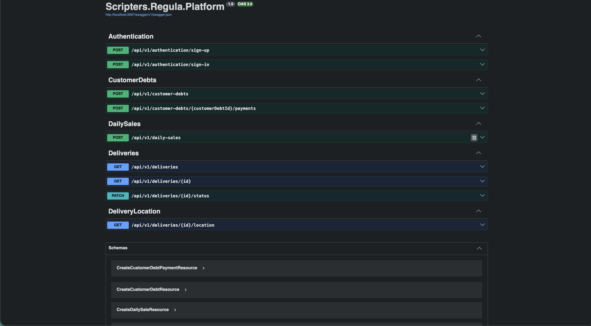
La interfaz **Swagger UI** disponible en `/swagger` expone la documentación interactiva de todos los endpoints implementados, agrupados por bounded context, con soporte de ejecución de peticiones de prueba directamente desde el navegador.

---

### Evidencia 2 — Endpoint POST `/api/v1/authentication/sign-up`

Este endpoint permite el registro de nuevos usuarios en la plataforma. El sistema valida los campos requeridos, aplica **BCrypt** para el hashing de contraseñas y genera automáticamente un **JWT** al completar el registro.

---

### Evidencia 3 — Endpoint POST `/api/v1/authentication/sign-in`


El endpoint de inicio de sesión valida las credenciales del usuario contra la base de datos MySQL, compara el hash BCrypt y, en caso de éxito, retorna un `AuthenticatedUserResource` con el token JWT necesario para acceder a recursos protegidos.

---

### Evidencia 4 — Endpoints de Commercial Management


El bounded context de **CommercialManagement** expone endpoints para registrar ventas diarias (`DailySalesController`) y gestionar deudas de clientes con sus respectivos pagos (`CustomerDebtsController`). Ambos controladores retornan las entidades creadas en el body de la respuesta con código HTTP 201.

---

### Evidencia 5 — Endpoints de Delivery Tracking


El bounded context de **DeliveryTracking** permite consultar el listado de entregas con filtros opcionales por fecha y estado, obtener el detalle de una entrega con información del repartidor y vehículo, actualizar el estado del ciclo de vida de la entrega, y consultar la ubicación GPS del conductor en tiempo real.

---

### Evidencia 6 — Base de datos MySQL (migración aplicada)

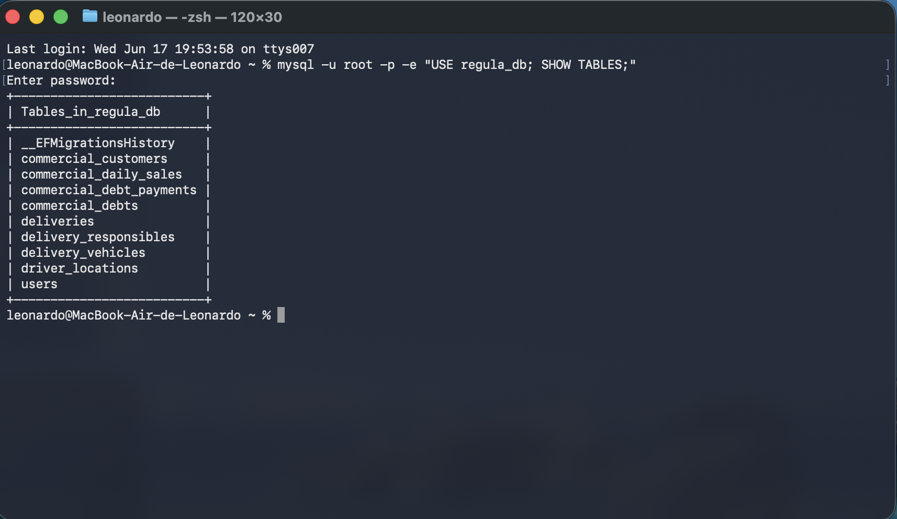

La migración `20260616224827_InitialCreate` fue ejecutada automáticamente al iniciar el servicio (`context.Database.Migrate()`), creando el esquema completo en **MySQL** con nomenclatura en snake_case. Las tablas generadas incluyen: `users`, `deliveries`, `delivery_responsibles`, `delivery_vehicles`, `driver_locations`, `commercial_daily_sales`, `commercial_debts`, `commercial_debt_payments` y `commercial_customers`.

---

### Video Demostrativo del Sprint 3

| Elemento | Información                                                                                                                      |
| :--- |:---------------------------------------------------------------------------------------------------------------------------------|
| 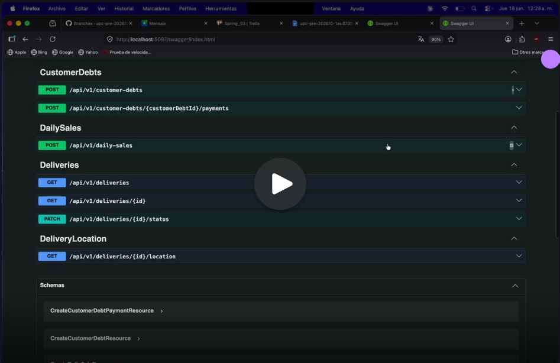| https://upcedupe-my.sharepoint.com/:v:/g/personal/u20241a649_upc_edu_pe/IQBF3FgEK3tfRbLrG9F6091WAcNRHuWJ2jWlWILxLy0_W_E?e=q1x5WS |
| **Plataforma** | Microsoft Stream                                                                                                                 |
| **Duración** | 1:52                                                                                                                              |

---

## 5.2.3.6. Services Documentation Evidence for Sprint Review

Durante el **Sprint 3** se implementó la primera versión del **RESTful Web Service de Regula** (`regula-platform`), desarrollado con **ASP.NET Core (.NET 10)** y documentado mediante **Swagger/OpenAPI**. A continuación se presenta la documentación técnica de los endpoints disponibles al cierre del sprint.

---

#ß## Información general del servicio

| Parámetro | Valor                                                        |
| :--- |:-------------------------------------------------------------|
| **Framework** | ASP.NET Core (.NET 10.0)                                     |
| **Base URL (local)** | `http://localhost:5097`                                      |
| **Base URL (producción)** |                                                              |
| **Documentación** | `http://localhost:5097/swagger`                                         |
| **Autenticación** | JWT Bearer — header: `Authorization: Bearer <token>`         |
| **Base de datos** | MySQL 8.x                                                    |
| **Formato de datos** | JSON (application/json)                                      |
| **Convención de rutas** | kebab-case (`/api/v1/customer-debts`, `/api/v1/daily-sales`) |

---

### Bounded Context: IAM — Autenticación

**Controller:** `AuthenticationController`
**Base route:** `/api/v1/authentication`

#### Endpoints

---

##### POST `/api/v1/authentication/sign-up`

**Descripción:** Registra un nuevo usuario en la plataforma. Aplica BCrypt para el hashing de la contraseña y retorna un JWT al completar el proceso.

**Request Body** (`application/json`):

```json
{
  "username": "string",
  "password": "string"
}
```

**Responses:**

| Código | Descripción | Body |
| :---: | :--- | :--- |
| 200 | Usuario registrado exitosamente | `AuthenticatedUserResource` |
| 400 | Datos inválidos o campos requeridos faltantes | `ProblemDetails` |

**Response Body (200 OK):**

```json
{
  "id": 1,
  "username": "operador_empresa",
  "token": "eyJhbGciOiJIUzI1NiIsInR5cCI6IkpXVCJ9..."
}
```

---

##### POST `/api/v1/authentication/sign-in`

**Descripción:** Autentica un usuario existente validando sus credenciales y retorna un JWT Bearer para acceso a recursos protegidos.

**Request Body** (`application/json`):

```json
{
  "username": "string",
  "password": "string"
}
```

**Responses:**

| Código | Descripción | Body |
| :---: | :--- | :--- |
| 200 | Autenticación exitosa | `AuthenticatedUserResource` |
| 400 | Credenciales inválidas o campos requeridos faltantes | `ProblemDetails` |

**Response Body (200 OK):**

```json
{
  "id": 1,
  "username": "operador_empresa",
  "token": "eyJhbGciOiJIUzI1NiIsInR5cCI6IkpXVCJ9..."
}
```


---

### Bounded Context: Commercial Management

**Controller 1:** `CustomerDebtsController`
**Base route:** `/api/v1/customer-debts`

**Controller 2:** `DailySalesController`
**Base route:** `/api/v1/daily-sales`

#### Endpoints

---

##### POST `/api/v1/customer-debts`

**Descripción:** Registra una nueva deuda de cliente para el distribuidor. El sistema crea el cliente si no existe previamente o lo asocia si ya está registrado.

**Request Body** (`application/json`):

```json
{
  "clientName": "string",
  "amount": 0.0,
  "cylinderType": "string",
  "quantity": 0,
  "paymentType": "string"
}
```

**Responses:**

| Código | Descripción | Body |
| :---: | :--- | :--- |
| 201 | Deuda registrada exitosamente | `CustomerDebtResource` |
| 400 | Datos inválidos | `ProblemDetails` |
| 404 | Cliente no encontrado (si aplica) | `ProblemDetails` |

**Response Body (201 Created):**

```json
{
  "id": 1,
  "clientName": "Juan Pérez",
  "amount": 45.00,
  "cylinderType": "10kg",
  "quantity": 3,
  "status": "Pending",
  "paymentType": "Credit",
  "createdAt": "2026-06-10T08:24:41Z"
}
```

---

##### POST `/api/v1/customer-debts/{customerDebtId}/payments`

**Descripción:** Registra un pago parcial o total sobre una deuda existente. El estado de la deuda se actualiza automáticamente según el monto pagado.

**Path Parameter:**

| Parámetro | Tipo | Descripción |
| :--- | :--- | :--- |
| `customerDebtId` | `int` | Identificador de la deuda de cliente |

**Request Body** (`application/json`):

```json
{
  "amount": 0.0,
  "paymentMethod": "string"
}
```

**Responses:**

| Código | Descripción | Body |
| :---: | :--- | :--- |
| 201 | Pago registrado exitosamente | `CustomerDebtPaymentResource` |
| 400 | Datos inválidos | `ProblemDetails` |
| 404 | Deuda no encontrada | `ProblemDetails` |

---

##### POST `/api/v1/daily-sales`

**Descripción:** Registra una venta diaria del distribuidor. El sistema crea el registro de venta y actualiza el estado correspondiente.

**Request Body** (`application/json`):

```json
{
  "clientName": "string",
  "cylinderType": "string",
  "quantity": 0,
  "totalAmount": 0.0,
  "saleDate": "2026-06-16"
}
```

**Responses:**

| Código | Descripción | Body |
| :---: | :--- | :--- |
| 201 | Venta registrada exitosamente | `DailySaleResource` |
| 400 | Datos inválidos | `ProblemDetails` |
| 404 | Recurso relacionado no encontrado | `ProblemDetails` |

**Response Body (201 Created):**

```json
{
  "id": 1,
  "clientName": "Bodega Los Andes",
  "cylinderType": "10kg",
  "quantity": 5,
  "totalAmount": 225.00,
  "saleDate": "2026-06-16",
  "status": "Completed"
}
```


---

### Bounded Context: Delivery Tracking

**Controller 1:** `DeliveriesController`
**Controller 2:** `DeliveryLocationController`
**Base route:** `/api/v1/deliveries`

#### Endpoints

---

##### GET `/api/v1/deliveries`

**Descripción:** Retorna el listado de entregas. Admite filtros opcionales por fecha y estado de entrega.

**Query Parameters:**

| Parámetro | Tipo | Requerido | Descripción |
| :--- | :--- | :---: | :--- |
| `date` | `string` (YYYY-MM-DD) | No | Filtra entregas por fecha |
| `status` | `string` | No | Filtra por estado (`Pending`, `OnRoute`, `Delivered`) |

**Responses:**

| Código | Descripción | Body |
| :---: | :--- | :--- |
| 200 | Listado de entregas | `DeliveryResource[]` |
| 400 | Parámetros de filtro inválidos | `ProblemDetails` |

**Response Body (200 OK):**

```json
[
  {
    "id": 1,
    "status": "Pending",
    "scheduledDate": "2026-06-17",
    "destinationAddress": "Av. Los Pinos 240, Lima"
  }
]
```

---

##### GET `/api/v1/deliveries/{id}`

**Descripción:** Retorna el detalle completo de una entrega incluyendo información del repartidor responsable y el vehículo asignado.

**Path Parameter:**

| Parámetro | Tipo | Descripción |
| :--- | :--- | :--- |
| `id` | `int` | Identificador de la entrega |

**Responses:**

| Código | Descripción | Body |
| :---: | :--- | :--- |
| 200 | Detalle de la entrega | `DeliveryDetailResource` |
| 404 | Entrega no encontrada | `ProblemDetails` |

**Response Body (200 OK):**

```json
{
  "id": 1,
  "status": "OnRoute",
  "scheduledDate": "2026-06-17",
  "destinationAddress": "Av. Los Pinos 240, Lima",
  "responsible": {
    "name": "Carlos Quispe",
    "dni": "45678901",
    "phone": "987654321"
  },
  "vehicle": {
    "plate": "ABC-123",
    "model": "Hyundai Porter",
    "capacity": 20
  }
}
```

---

##### PATCH `/api/v1/deliveries/{id}/status`

**Descripción:** Actualiza el estado de ciclo de vida de una entrega. Las transiciones válidas son: `Pending → OnRoute → Delivered`. La transición `Pending → OnRoute` fue explícitamente habilitada durante el Sprint 3.

**Path Parameter:**

| Parámetro | Tipo | Descripción |
| :--- | :--- | :--- |
| `id` | `int` | Identificador de la entrega |

**Request Body** (`application/json`):

```json
{
  "newStatus": "OnRoute"
}
```

**Responses:**

| Código | Descripción | Body |
| :---: | :--- | :--- |
| 200 | Estado actualizado exitosamente | `DeliveryDetailResource` |
| 400 | Transición de estado inválida | `ProblemDetails` |
| 404 | Entrega no encontrada | `ProblemDetails` |
| 422 | No se puede procesar la transición solicitada | `ProblemDetails` |

---

##### GET `/api/v1/deliveries/{id}/location`

**Descripción:** Retorna la ubicación GPS actual del conductor asignado a la entrega. En caso de ausencia de señal GPS, retorna un `NoSignalLocationResource`.

**Path Parameter:**

| Parámetro | Tipo | Descripción |
| :--- | :--- | :--- |
| `id` | `int` | Identificador de la entrega |

**Responses:**

| Código | Descripción | Body |
| :---: | :--- | :--- |
| 200 | Ubicación GPS del conductor | `DeliveryLocationResource` o `NoSignalLocationResource` |
| 404 | Entrega no encontrada | `ProblemDetails` |
| 500 | Error al consultar la ubicación | `ProblemDetails` |

**Response Body (200 OK — señal disponible):**

```json
{
  "deliveryId": 1,
  "latitude": -12.0464,
  "longitude": -77.0428,
  "gpsSignalStatus": "Good",
  "timestamp": "2026-06-17T19:00:00Z"
}
```

**Response Body (200 OK — sin señal):**

```json
{
  "deliveryId": 1,
  "message": "No GPS signal available for this delivery",
  "gpsSignalStatus": "NoSignal"
}
```


---

### Resumen de endpoints implementados en el Sprint 3

| # | Bounded Context | Controller | Método | Endpoint | Estado |
| :---: | :--- | :--- | :---: | :--- |:------:|
| 1 | IAM | AuthenticationController | POST | `/api/v1/authentication/sign-up` |  Done  |
| 2 | IAM | AuthenticationController | POST | `/api/v1/authentication/sign-in` |   Done    |
| 3 | CommercialManagement | CustomerDebtsController | POST | `/api/v1/customer-debts` |   Done    |
| 4 | CommercialManagement | CustomerDebtsController | POST | `/api/v1/customer-debts/{id}/payments` |   Done    |
| 5 | CommercialManagement | DailySalesController | POST | `/api/v1/daily-sales` |   Done    |
| 6 | DeliveryTracking | DeliveriesController | GET | `/api/v1/deliveries` |   Done    |
| 7 | DeliveryTracking | DeliveriesController | GET | `/api/v1/deliveries/{id}` |   Done    |
| 8 | DeliveryTracking | DeliveriesController | PATCH | `/api/v1/deliveries/{id}/status` |   Done    |
| 9 | DeliveryTracking | DeliveryLocationController | GET | `/api/v1/deliveries/{id}/location` |   Done    |

---

## 5.2.3.7. Software Deployment Evidence for Sprint Review

Durante el **Sprint 3**, las actividades de despliegue estuvieron enfocadas en publicar la primera versión del **RESTful Web Service de Regula** (`regula-platform`) en un entorno accesible desde internet, utilizando una estrategia basada en **contenedores Docker**.

---

### Infraestructura y herramientas de despliegue

| Herramienta / Tecnología | Propósito |
| :--- | :--- |
| **Docker** | Contenerización de la aplicación ASP.NET Core |
| **Dockerfile (multi-stage)** | Build de imagen optimizada (SDK → ASP.NET Runtime) |
| **MySQL** | Base de datos relacional para persistencia |
| **Variables de entorno** | Configuración de cadena de conexión y clave JWT en producción |
| **Swagger / OpenAPI** | Documentación del API publicada sin restricciones de entorno |

---

### Configuración del Dockerfile (multi-stage build)

El equipo implementó un **Dockerfile multi-stage** que separa la etapa de compilación de la etapa de ejecución, reduciendo el tamaño de la imagen final y eliminando dependencias de desarrollo en producción:

```dockerfile
FROM mcr.microsoft.com/dotnet/sdk:10.0 AS builder
WORKDIR /app
COPY Scripters.Regula.Platform/*.csproj Scripters.Regula.Platform/
RUN dotnet restore ./Scripters.Regula.Platform
COPY . .
RUN dotnet publish ./Scripters.Regula.Platform -c Release -o out

FROM mcr.microsoft.com/dotnet/aspnet:10.0
WORKDIR /app
COPY --from=builder /app/out .
EXPOSE 80
ENTRYPOINT ["dotnet", "Scripters.Regula.Platform.dll"]
```

Esta configuración garantiza imágenes ligeras y reproducibles, aptas para cualquier plataforma compatible con Docker (Railway, Azure App Service, DigitalOcean, etc.).

---

### Configuración de variables de entorno en producción

La cadena de conexión a MySQL y la clave secreta del JWT se inyectan en tiempo de ejecución mediante **variables de entorno**, siguiendo las convenciones de `appsettings.Production.json`:

```json
{
  "ConnectionStrings": {
    "DefaultConnection": "${DB_CONNECTION_STRING}"
  },
  "Jwt": {
    "Secret": "${JWT_SECRET_KEY}",
    "Issuer": "regula-platform",
    "Audience": "regula-clients"
  }
}
```

Esta estrategia permite desplegar la misma imagen en diferentes entornos sin recompilación, simplemente variando las variables de entorno.

---

### Pasos de despliegue aplicados durante el Sprint 3

1. **Configuración inicial del Dockerfile**

   El integrante Kevin Lopez implementó el Dockerfile y realizó múltiples iteraciones de corrección y prueba (commits del 2026-06-17) hasta lograr una imagen funcional.

2. **Configuración de variables de entorno**

   Se actualizó `Program.cs` para leer la cadena de conexión desde variables de entorno, eliminando credenciales hardcodeadas. La clave JWT también fue externalizada.

3. **Despliegue del servicio**

   > <span style="background-color:#d4edda; color:#155724; padding:4px 8px; border-radius:4px; font-weight:bold">🟢 EXTERNO — Insertar capturas del panel de la plataforma de despliegue (Railway / Azure / DigitalOcean) mostrando el servicio activo y la URL pública asignada.</span>

4. **Verificación del despliegue**

   > <span style="background-color:#d4edda; color:#155724; padding:4px 8px; border-radius:4px; font-weight:bold">🟢 EXTERNO — Insertar captura de Swagger UI accedida desde la URL pública del servicio desplegado, confirmando que el API está operativo.</span>

5. **Verificación de la base de datos**

   Al iniciar el contenedor, el sistema ejecuta automáticamente `context.Database.Migrate()`, creando el esquema completo en MySQL sin intervención manual.

---

### URL del servicio desplegado

> <span style="background-color:#d4edda; color:#155724; padding:4px 8px; border-radius:4px; font-weight:bold">🟢 EXTERNO — Insertar URL pública del Web Service (ejemplo: https://regula-platform-production.up.railway.app)</span>

---

### Estado del despliegue por producto

| Producto | Estado                                                              |
| :--- |:--------------------------------------------------------------------|
| **Landing Page** |  Desplegado y operativo desde el Sprint 1 (GitHub Pages)            |
| **Frontend Web Application** | Desplegado desde el Sprint 2                                        |
| **RESTful Web Services (ASP.NET Core)** | Primera versión desplegada en contenedor Docker durante el Sprint 3 |

---

## 5.2.3.8. Team Collaboration Insights during Sprint

Durante el **Sprint 3**, el trabajo de implementación se desarrolló principalmente sobre el repositorio **regula-platform**, siguiendo la estrategia **GitFlow** con ramas de tipo `feature/` por bounded context, integradas a `develop` mediante Pull Requests y posteriormente fusionadas a `master` a través de ramas `release/`.

---

### Herramientas de colaboración

| Herramienta | Propósito |
| :--- | :--- |
| **GitHub** | Control de versiones, gestión de ramas, Pull Requests y evidencia técnica del desarrollo. |
| **Trello** | Planificación, asignación y seguimiento de tareas del Sprint. |
| **Google Meet** | Reuniones de coordinación y seguimiento del avance. |

---

### Flujo de trabajo aplicado

```text
feature/<bounded-context>
        │
        ▼
   Pull Request
        │
        ▼
     develop
        │
        ▼
  release/X.Y.Z
        │
        ▼
      master
```

El equipo integró los bounded contexts mediante ramas `release/` antes de fusionar a `master`, permitiendo preparar versiones estables y aplicar correcciones de último momento (`fix(database)`) sin interrumpir el flujo de desarrollo en `develop`.

---

### Resumen de participación por integrante

| Integrante | GitHub | Bounded Context / Aporte | Commits representativos |
| :--- | :--- | :--- | :--- |
| **David Ignacio Vivar Cesar** | `DarkBeider20` | IAM — Sign-In y Sign-Up con JWT, configuración de MySQL keys | `feat(sign-up): add user registration with jwt generation`, `feat(sign-in): add jwt-based user authentication` |
| **Ramos Cerdan, Elias Daniel** | `eliocerdan` | CommercialManagement — Deudas de clientes, ventas diarias, gestión de releases | `feat(commercial-management): add daily sale domain`, `feat(commercial-management): define customer debt domain entities` |
| **Lopez Torres, Leonardo Gabriel** | `Deiko-138` | DeliveryTracking — Entidades Delivery, DeliveryResponsible, DeliveryVehicle, DriverLocation | `feat(DeliveryTracking): implement delivery tracking with responsible and vehicle entities` |
| **Lopez Montalvo, Kevin Edu** | `Lopescamos` | Infraestructura de despliegue — Dockerfile, variables de entorno, configuración de producción | `chore: add Dockerfile for deployment`, `fix: removed development conditional for swagger` |
| **Espinoza Lopez, Paul Alexandro Angel** | `R3memo` | Shared — ProblemDetailsFactory, recursos de mensajes, middleware compartido | `feat(shared): add common and error message resources` |
| **Tello Palacios, Fabrizio Rafael** | `F4bris` | Shared — Repositorios base y manejo de errores | `feat: add Repositories files and error handle` |

---

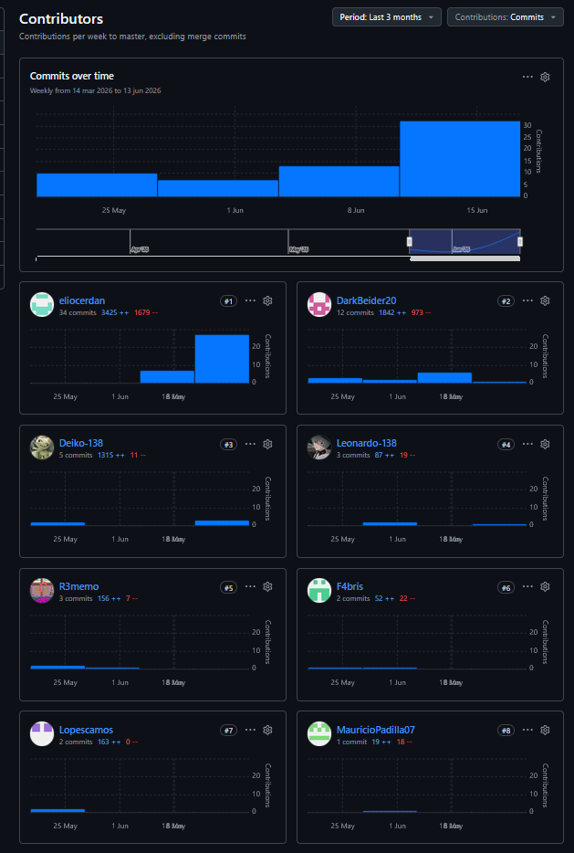

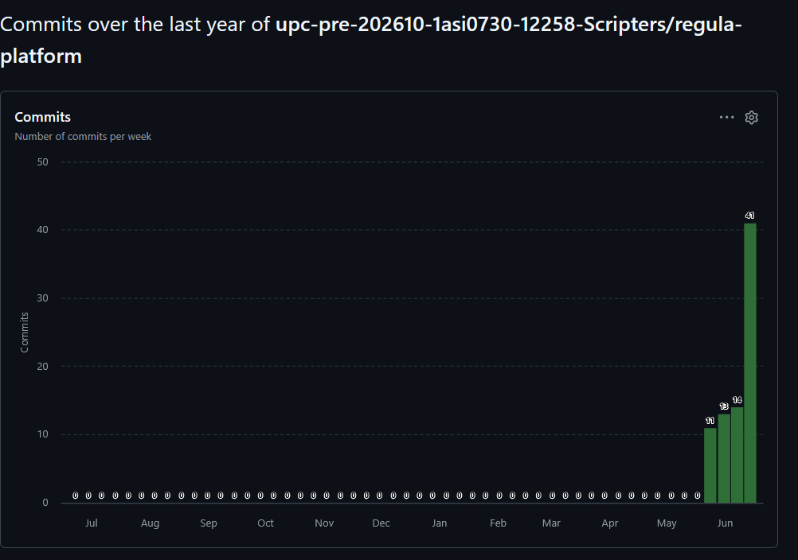

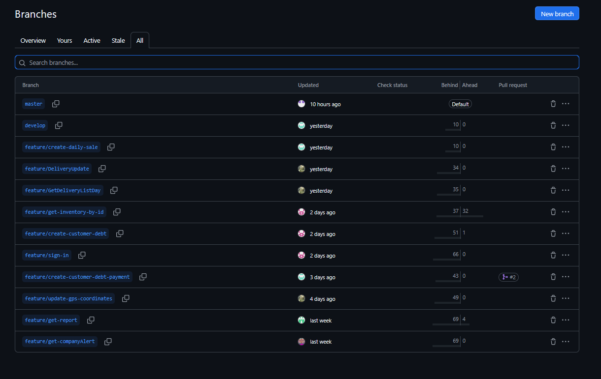
---

### Participación por producto

| Producto | Estado de colaboración                                                                    |
| :--- |:------------------------------------------------------------------------------------------|
| **Landing Page** | Mantenido y operativo desde el Sprint 1.                                                  |
| **Frontend Web Application** | Mantenida y operativa desde el Sprint 2.                                                  |
| **RESTful Web Services** |  Implementados colaborativamente durante el Sprint 3, distribuidos en 4 bounded contexts. |

---

# 5.3. Validation Interviews

Las entrevistas de validación tienen como objetivo verificar que la solución **Regula** responde efectivamente a las necesidades de los segmentos objetivo y que la interfaz de usuario es comprensible, eficiente y satisfactoria desde la perspectiva de los usuarios reales.

Para ello, el equipo diseñó y ejecutó un proceso estructurado de entrevistas con representantes de los dos segmentos identificados durante el análisis de requerimientos:

1. **Supervisores operativos / administrativos de empresas de gas** — responsables de la gestión operativa y el monitoreo de inventarios.
2. **Distribuidores de gas** — encargados del registro de ventas, deudas, inventario y entregas en sus puntos de distribución.

---

## 5.3.1. Diseño de Entrevistas

El diseño de las entrevistas de validación considera tanto la verificación funcional de los módulos implementados como la evaluación de la experiencia de usuario. Las sesiones combinan una demostración guiada del producto con preguntas abiertas y cerradas orientadas a recoger retroalimentación cualitativa y cuantitativa.

---

### Objetivo general

Verificar que las funcionalidades implementadas en Regula satisfacen los escenarios de uso descritos en los User Stories priorizados, y que la interfaz resulta intuitiva, confiable y valorada por los usuarios de los segmentos objetivo.

---

### Perfil de los entrevistados

#### Segmento 1 — Supervisor Operativo / Administrativo de Empresa de Gas

| Campo | Descripción |
| :--- | :--- |
| **Rol** | Supervisor operativo, jefe de inventario o administrador de empresa de distribución de gas |
| **Responsabilidades** | Monitoreo de inventario, gestión de alertas, supervisión de distribución y reportes operativos |
| **Nivel tecnológico** | Medio-alto; maneja herramientas digitales en su día a día |
| **Rango de edad** | 30 – 55 años |
| **Número de entrevistados objetivo** | 2 |

#### Segmento 2 — Distribuidor de Gas

| Campo | Descripción |
| :--- | :--- |
| **Rol** | Dueño o encargado de un punto de distribución de balones de gas |
| **Responsabilidades** | Registro de ventas, control de deudas de clientes, gestión de inventario y seguimiento de entregas |
| **Nivel tecnológico** | Bajo-medio; acostumbrado a registros en papel o Excel |
| **Rango de edad** | 25 – 60 años |
| **Número de entrevistados objetivo** | 2 |

---

### Estructura de la sesión de entrevista

| Etapa | Duración estimada | Descripción |
| :--- | :---: | :--- |
| **Presentación e introducción** | 3 min | Saludo, presentación del equipo y explicación del propósito de la sesión. |
| **Preguntas de contexto y hábitos actuales** | 7 min | Explorar cómo gestiona actualmente sus procesos (inventario, ventas, alertas). |
| **Demostración guiada del producto** | 15 min | El entrevistador navega por las vistas principales mientras el entrevistado observa y comenta. |
| **Exploración libre** | 7 min | El entrevistado interactúa directamente con la aplicación en su perfil correspondiente. |
| **Preguntas de cierre y valoración** | 8 min | Preguntas sobre satisfacción general, disposición de uso y sugerencias de mejora. |

---

### Preguntas para el Segmento 1 — Supervisor Operativo de Empresa de Gas

#### Bloque 1 — Contexto actual

1. ¿Cómo registra actualmente las entradas y salidas de cilindros de gas en su empresa?
2. ¿Con qué frecuencia revisa el estado del inventario y las alertas operativas?
3. ¿Ha tenido algún incidente de seguridad relacionado con fugas de gas o deficiencias en el inventario? ¿Cómo lo gestionó?
4. ¿Qué herramientas digitales utiliza actualmente para el seguimiento de operaciones?

#### Bloque 2 — Durante la demostración

5. Al ver la vista de inventario de empresa, ¿los paneles de stock, entradas, salidas e historial le resultan claros y suficientes?
6. ¿El módulo de alertas y seguridad operativa le daría la información que necesita para actuar rápido ante un incidente?
7. ¿Los reportes analíticos generados (exportables en CSV) le resultarían útiles para su trabajo diario o para auditorías?
8. ¿Cambiaría algún elemento del diseño o la organización de la información en las vistas que acaba de ver?

#### Bloque 3 — Cierre y valoración

9. Del 1 al 10, ¿qué tan fácil le resultó entender la navegación de la aplicación sin haber recibido capacitación previa?
10. ¿Utilizaría Regula en su empresa? ¿Qué funcionalidad le parece la más valiosa?
11. ¿Qué funcionalidades adicionales considera que harían de Regula una herramienta indispensable para su operación?

---

### Preguntas para el Segmento 2 — Distribuidor de Gas

#### Bloque 1 — Contexto actual

1. ¿Cómo lleva actualmente el registro de sus ventas diarias de balones de gas?
2. ¿De qué manera controla las deudas y pagos de sus clientes?
3. ¿Ha tenido problemas con el descontrol de inventario o clientes que no pagan? ¿Cómo los resolvió?
4. ¿Usa alguna aplicación o herramienta digital para gestionar su negocio actualmente?

#### Bloque 2 — Durante la demostración

5. Al ver la vista de inventario del distribuidor, ¿el registro de entradas y salidas de balones le parece sencillo de usar?
6. ¿El módulo de ventas y deudas (registro de venta, deuda de cliente, pago) representa de manera clara su proceso actual de negocio?
7. ¿La vista de historial de movimientos le daría la trazabilidad que necesita para revisar sus operaciones pasadas?
8. ¿Entendió inmediatamente cómo navegar entre las secciones de inventario, ventas y deudas?

#### Bloque 3 — Cierre y valoración

9. Del 1 al 10, ¿qué tan útil considera Regula para digitalizar la gestión de su negocio de distribución?
10. ¿Hay algo en la interfaz que le haya resultado confuso o que cambiaría?
11. ¿Recomendaría Regula a otros distribuidores de su zona? ¿Por qué?

---

## 5.3.2. Registro de Entrevistas

A continuación se presenta el registro de las entrevistas de validación realizadas con representantes de los segmentos objetivo. Cada registro incluye datos del entrevistado, resumen de las respuestas más relevantes y la evidencia audiovisual correspondiente.

---

### Segmento 1 — Supervisores Operativos de Empresa de Gas

---

#### Entrevista 1

| Campo | Información |
| :--- | :--- |
| **Nombre del entrevistado** | |
| **Cargo / Rol** |  |
| **Empresa** | |
| **Edad** | |
| **Fecha de entrevista** |  |
| **Duración** |  |
| **Enlace al video** |  |
| **Timestamp de inicio** | |

### Captura

**Resumen de la entrevista:**


---

#### Entrevista 2

| Campo | Información |
| :--- | :--- |
| **Nombre del entrevistado** | |
| **Cargo / Rol** | |
| **Empresa** |  |
| **Edad** | |
| **Fecha de entrevista** | |
| **Duración** | |
| **Enlace al video** ||
| **Timestamp de inicio** | |

### Captura

**Resumen de la entrevista:**


---

### Segmento 2 — Distribuidores de Gas

---

#### Entrevista 3

| Campo | Información |
| :--- | :--- |
| **Nombre del entrevistado** | |
| **Cargo / Rol** |  |
| **Empresa / Negocio** | |
| **Edad** | |
| **Fecha de entrevista** ||
| **Duración** | > |
| **Enlace al video** | |
| **Timestamp de inicio** | |

### Captura

**Resumen de la entrevista:**


---

#### Entrevista 4

| Campo | Información |
| :--- | :--- |
| **Nombre del entrevistado** | |
| **Cargo / Rol** | Distribuidor de gas / encargado de punto de distribución |
| **Empresa / Negocio** | |
| **Edad** | |
| **Fecha de entrevista** ||
| **Duración** | |
| **Enlace al video** | |
| **Timestamp de inicio** | |

### Captura

**Resumen de la entrevista:**


---

## 5.3.3. Evaluaciones según heurísticas

La evaluación heurística se realizó siguiendo el método propuesto por **Jakob Nielsen**, aplicando sus **10 heurísticas de usabilidad** sobre la **Frontend Web Application de Regula** implementada durante el Sprint 2. El objetivo es identificar problemas de usabilidad de forma sistemática, antes de las pruebas con usuarios, y proponer mejoras concretas.

---

### Información de la evaluación

| Campo | Valor                                                                                                                                                                        |
| :--- |:-----------------------------------------------------------------------------------------------------------------------------------------------------------------------------|
| **Producto evaluado** | Regula — Frontend Web Application                                                                                                                                            |
| **URL evaluada** | <span style="background-color:#d4edda; color:#155724; padding:4px 8px; border-radius:4px; font-weight:bold">🟢 EXTERNO — Insertar URL pública del frontend desplegado</span> |
| **Evaluadores** | Equipo Scripters (evaluación interna)                                                                                                                                        |
| **Fecha de evaluación** | 18/06/26                                                                                                                                                                     |
| **Escala de severidad** | 0 = No es problema / 1 = Cosmético / 2 = Problema menor / 3 = Problema mayor / 4 = Catástrofe de usabilidad                                                                  |

---

### Tareas evaluadas

Las siguientes tareas fueron utilizadas como guía durante la evaluación heurística:

1. Selección de rol (empresa / distribuidor) e inicio de sesión.
2. Registro de una entrada de cilindros de gas (perfil empresa).
3. Registro de una salida de cilindros de gas (perfil distribuidor).
4. Consulta del historial de movimientos con filtros.
5. Registro de una venta diaria y una deuda de cliente.
6. Revisión de alertas operativas y estado de almacenes.
7. Generación y descarga de un reporte operativo.
8. Cambio de idioma (Español / Inglés).

---

### Tabla de hallazgos heurísticos

| # | Tarea evaluada | Heurística (Nielsen) | Descripción del problema | Severidad | Recomendación |
| :---: | :--- | :--- | :--- | :---: | :--- |
| H01 | 1 — Selección de rol | **#1 — Visibilidad del estado del sistema** | La pantalla de selección de rol no indica visualmente cuál fue el último rol seleccionado en una sesión previa, forzando al usuario a elegir en cada acceso. | 2 | Persistir la preferencia de rol en `localStorage` y pre-seleccionarla al regresar. |
| H02 | 1 — Inicio de sesión | **#9 — Ayuda para reconocer, diagnosticar y recuperarse de errores** | Los mensajes de error en el formulario de Sign-In no especifican si el fallo se debe a un usuario incorrecto o a una contraseña incorrecta; se muestra un mensaje genérico. | 3 | Mostrar mensajes de error más específicos: "Usuario no encontrado" o "Contraseña incorrecta". |
| H03 | 2 — Registro de entradas | **#3 — Control y libertad del usuario** | En los paneles de registro de entradas y salidas de cilindros no existe un botón de "Cancelar" o "Limpiar formulario" visible, obligando al usuario a recargar la página si desea descartar los datos ingresados. | 2 | Agregar un botón de "Cancelar" o "Limpiar" en todos los formularios de registro. |
| H04 | 2 — Registro de entradas | **#5 — Prevención de errores** | El formulario de registro de entradas no valida en tiempo real que la cantidad ingresada sea un número positivo mayor a cero; el error solo se detecta al enviar el formulario. | 2 | Implementar validación reactiva en tiempo real sobre los campos numéricos para alertar al usuario antes del envío. |
| H05 | 3 — Registro de salidas (distribuidor) | **#6 — Reconocimiento en lugar de recuerdo** | El selector de tipo de cilindro ("cylinder type picker") en la vista del distribuidor no muestra la unidad (10 kg, 15 kg, 45 kg) de forma visible en el listado desplegable; el usuario debe recordar qué tipo corresponde a cada código. | 2 | Mostrar la descripción completa del tipo de cilindro (nombre + peso) en el selector. |
| H06 | 4 — Historial de movimientos | **#7 — Flexibilidad y eficiencia de uso** | El historial de movimientos no permite ordenar las columnas de la tabla haciendo clic en el encabezado, lo que dificulta encontrar registros específicos para usuarios avanzados. | 1 | Implementar ordenamiento ascendente/descendente haciendo clic en los encabezados de columna. |
| H07 | 5 — Registro de venta / deuda | **#4 — Consistencia y estándares** | El diálogo de registro de venta utiliza el botón de confirmación con la etiqueta "Registrar" mientras que el formulario de deuda utiliza "Guardar", generando inconsistencia en la nomenclatura de las acciones primarias. | 1 | Unificar la nomenclatura de los botones de acción primaria en todos los formularios: "Registrar" o "Guardar". |
| H08 | 5 — Gestión de deudas | **#1 — Visibilidad del estado del sistema** | Una vez registrada una deuda, no se muestra ninguna confirmación visual (toast, badge o indicador) que confirme que el registro fue exitoso. El usuario debe navegar al panel de deudas pendientes para verificarlo. | 2 | Mostrar un toast de confirmación inmediatamente después de cada operación exitosa (ya existe el componente de toast en el layout). |
| H09 | 6 — Revisión de alertas | **#8 — Diseño estético y minimalista** | La vista de alertas operativas muestra simultáneamente todos los campos de cada alerta (tipo, nivel, almacén, descripción, fecha, estado) en una lista densa, dificultando la lectura rápida en escenarios de urgencia. | 2 | Implementar una vista de tarjetas compactas con código de color por nivel de criticidad, mostrando solo los campos más relevantes y expandiendo el detalle bajo demanda. |
| H10 | 6 — Alertas de empresa | **#2 — Correspondencia entre el sistema y el mundo real** | El estado de las alertas se muestra en inglés (`Active`, `Resolved`, `Pending`) incluso cuando el usuario tiene seleccionado el idioma español, ya que los valores vienen del backend sin traducción. | 3 | Mapear los valores de estado del backend a etiquetas traducidas en la capa de presentación del frontend usando el sistema i18n existente. |
| H11 | 7 — Generación de reporte | **#3 — Control y libertad del usuario** | La vista de generación de reportes no ofrece previsualización del contenido antes de ejecutar la descarga en CSV, lo que puede generar reportes vacíos o con filtros incorrectos sin retroalimentación previa. | 2 | Agregar un paso de previsualización o un conteo de registros que se incluirán en el reporte antes de confirmar la descarga. |
| H12 | 8 — Cambio de idioma | **#4 — Consistencia y estándares** | El selector de idioma se encuentra en la barra de navegación superior, pero en la vista de selección de rol (pantalla inicial) no es visible, lo que puede confundir a usuarios que prefieren comenzar en inglés. | 1 | Incluir el selector de idioma también en la vista de selección de rol / pantalla de bienvenida. |
| H13 | General — Navegación | **#7 — Flexibilidad y eficiencia de uso** | No existe un mecanismo de búsqueda global que permita encontrar rápidamente registros específicos (clientes, cilindros, entregas) sin navegar manualmente por cada módulo. | 2 | Incorporar un campo de búsqueda global en la barra de navegación para filtrar registros entre módulos. |
| H14 | General — Responsive | **#8 — Diseño estético y minimalista** | En pantallas de resolución inferior a 768px, algunas tablas de inventario y de ventas presentan desbordamiento horizontal, obligando al usuario a desplazarse lateralmente para ver todas las columnas. | 2 | Aplicar diseño responsivo adaptativo en las tablas con columnas prioritarias visibles y el resto accesibles mediante expansión o scroll horizontal controlado. |
| H15 | General — Accesibilidad | **#10 — Ayuda y documentación** | La aplicación no cuenta con mensajes de onboarding, tooltips explicativos ni un módulo de ayuda contextual que oriente a usuarios que ingresen por primera vez sin capacitación previa. | 2 | Implementar un tour guiado de primer acceso (usando PrimeVue Steps o similar) y tooltips descriptivos en los botones de acción principal. |

---

### Resumen de hallazgos por severidad

| Severidad | Descripción | Cantidad de hallazgos |
| :---: | :--- | :---: |
| **0** | No es problema | 0 |
| **1** | Problema cosmético — no requiere acción inmediata | 3 (H06, H07, H12) |
| **2** | Problema menor — baja prioridad de corrección | 9 (H01, H03, H04, H05, H08, H09, H11, H13, H14, H15) |
| **3** | Problema mayor — alta prioridad de corrección | 2 (H02, H10) |
| **4** | Catástrofe de usabilidad | 0 |

---

### Conclusiones de la evaluación heurística

La evaluación heurística identifica que la aplicación Regula presenta un nivel de usabilidad adecuado para una primera versión funcional, sin catástrofes de usabilidad y con problemas en su mayoría de severidad baja o media.

Los dos problemas de mayor prioridad de corrección (severidad 3) son:
- **H02:** Los mensajes de error en el inicio de sesión no son suficientemente específicos, lo que aumenta la fricción en el flujo más crítico de la aplicación.
- **H10:** Los valores de estado de alertas no se traducen al idioma seleccionado por el usuario, rompiendo la experiencia de internacionalización.

Ambos hallazgos deben abordarse en el próximo sprint como parte de la mejora continua de la interfaz.

---

# 5.4. Video About-the-Product

El **Video About-the-Product** presenta una visión general de la solución **Regula**, mostrando el problema que resuelve, los segmentos objetivo a los que está dirigida y una demostración de las principales funcionalidades desarrolladas a lo largo de los sprints del proyecto.

El video está dirigido tanto a potenciales clientes como a evaluadores académicos, con el objetivo de comunicar de manera clara y concisa el valor de la plataforma y el nivel de avance del producto al cierre del proyecto.

---

## Contenido del video

| Sección | Descripción |
| :--- | :--- |
| **Introducción** | Presentación del problema: gestión manual e ineficiente de cilindros de gas en empresas y distribuidores. |
| **Propuesta de valor** | Cómo Regula digitaliza y centraliza el monitoreo, inventario, gestión comercial y distribución. |
| **Demostración — Landing Page** | Recorrido por las secciones del Landing Page: Hero, About Us, Benefits, Plans, FAQ. |
| **Demostración — Web Application (Empresa)** | Flujo de autenticación, inventario de empresa, alertas operativas y generación de reportes. |
| **Demostración — Web Application (Distribuidor)** | Inventario del distribuidor, registro de ventas, gestión de deudas y seguimiento de entregas. |
| **Cierre** | Resumen del impacto esperado y siguientes pasos del producto. |

---

## Enlace al video

| Elemento | Información |
| :--- | :--- |
| **Preview** | <span style="background-color:#d4edda; color:#155724; padding:4px 8px; border-radius:4px; font-weight:bold">🟢 EXTERNO — Insertar captura del video (thumbnail).</span> |
| **Archivo / Enlace** | <span style="background-color:#d4edda; color:#155724; padding:4px 8px; border-radius:4px; font-weight:bold">🟢 EXTERNO — Insertar URL del video About-the-Product (Microsoft Stream / YouTube / SharePoint).</span> |
| **Plataforma** | Microsoft Stream |
| **Duración** | <span style="background-color:#d4edda; color:#155724; padding:4px 8px; border-radius:4px; font-weight:bold">🟢 EXTERNO — Indicar duración del video.</span> |

> El video demuestra el estado actual del producto **Regula** al cierre del proyecto académico, mostrando el recorrido completo por las funcionalidades implementadas a lo largo de los tres sprints y evidenciando la propuesta de valor de la plataforma para los segmentos objetivo.
